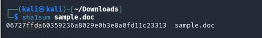
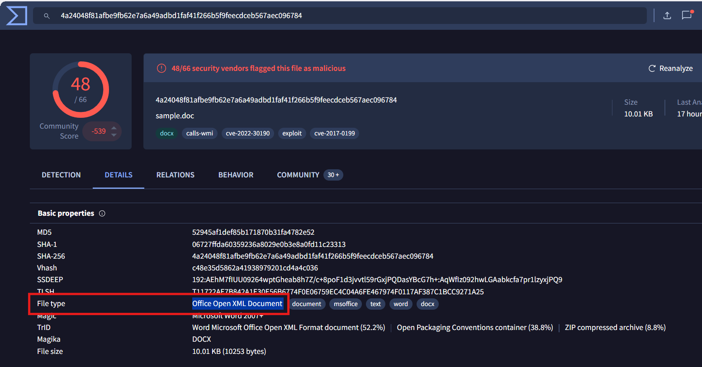
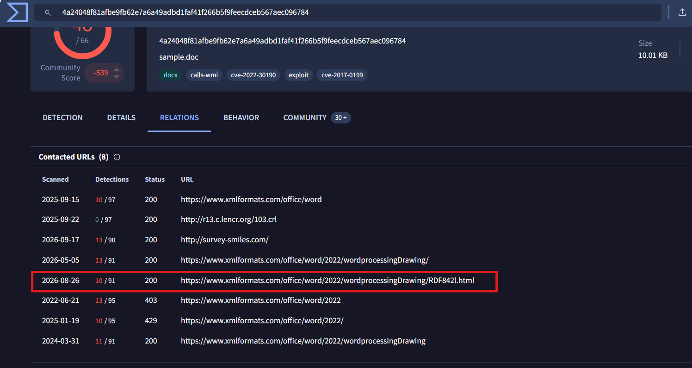
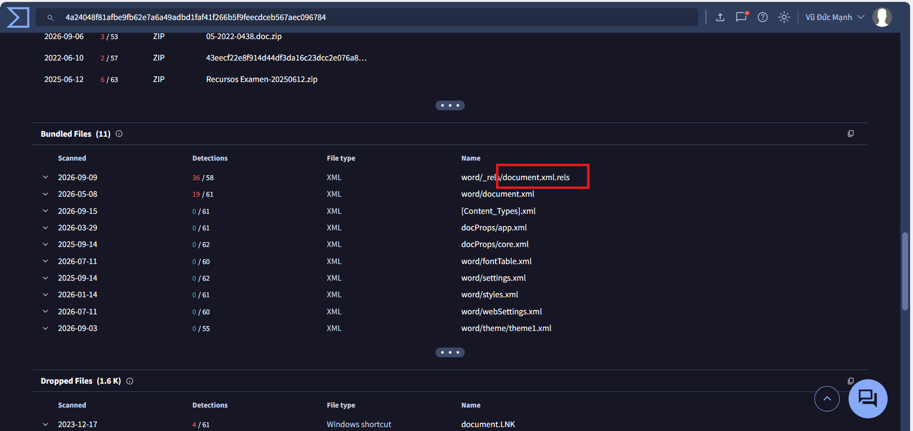
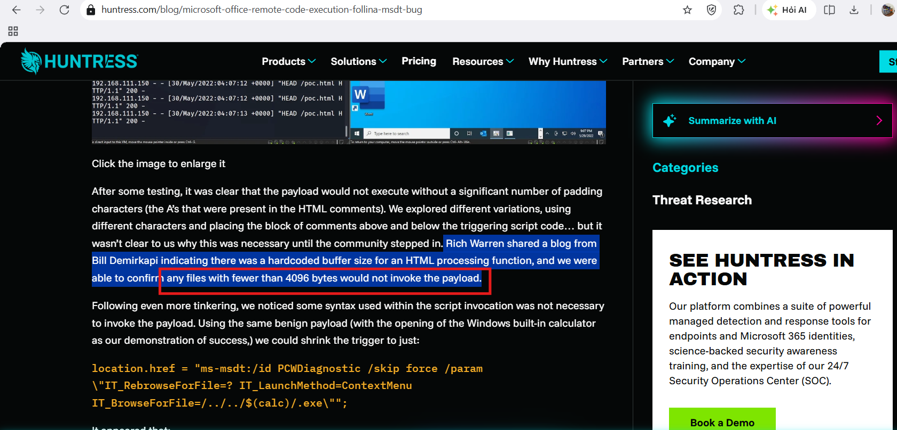
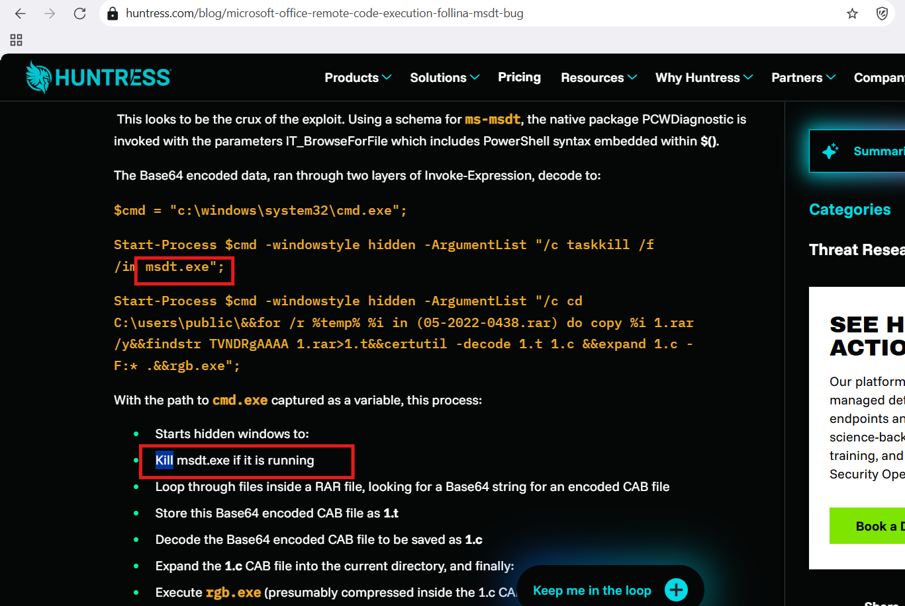
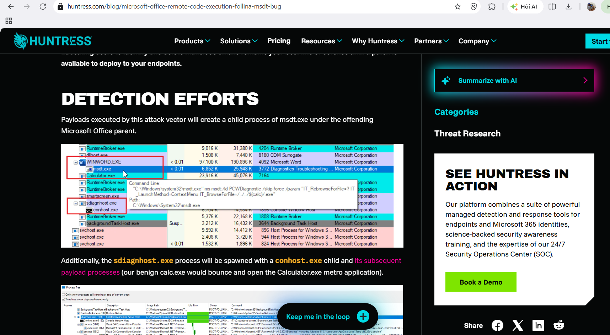
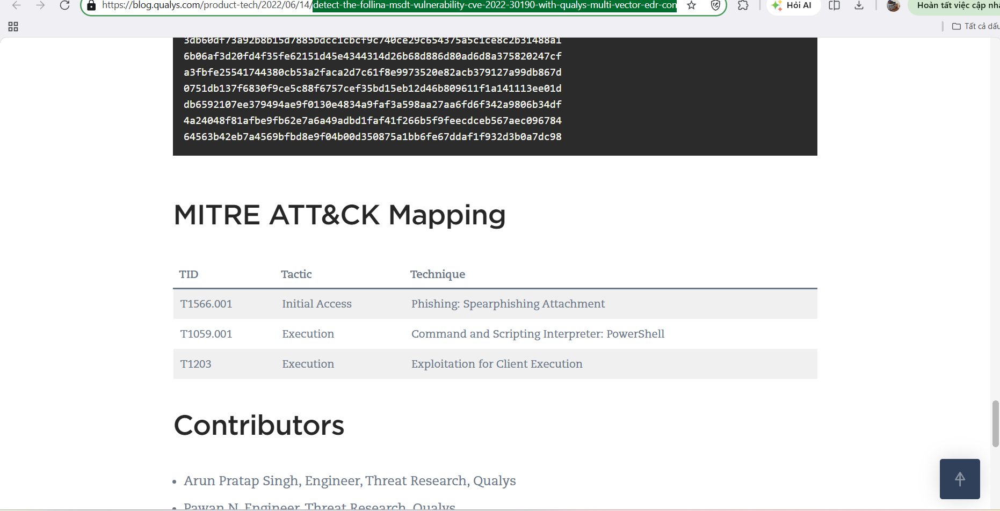

# Blue Team Labs Online: Follina Writeup

**Category:** Threat Intelligence / Malware Analysis | **Difficulty:** Easy
**Tactic:** Initial Access / Execution / Defense Evasion
**CVE:** CVE-2022-30190
**Tools:** Kali Linux (sha1sum, unzip), VirusTotal, OSINT Threat Intel (Huntress, Qualys)

**Scenario:** 
On a Friday evening when you were in a mood to celebrate your weekend, your team was alerted with a new RCE vulnerability actively being exploited in the wild. You have been tasked with analyzing and researching the sample to collect information for the weekend team.

---

### Q1: What is the SHA1 hash value of the sample?
*   **Approach:** Compute the cryptographic SHA1 hash of the provided malicious document inside the Linux analysis environment.
*   **Steps Taken:**
    *   Opened a terminal on Kali Linux and navigated to the directory containing `sample.doc`.
    *   Executed the command `sha1sum sample.doc` to calculate the checksum.
*   **Evidence:**
    
*   **Flag:** `06727ffda60359236a8029e0b3e8a0fd11c23313`

### Q2: According to VirusTotal, what is the full filetype of the provided sample?
*   **Approach:** Query the sample's cryptographic hash on VirusTotal to inspect the detailed file metadata parsed by file-identification engines.
*   **Steps Taken:**
    *   Queried the SHA256/SHA1 hash of `sample.doc` on VirusTotal.
    *   Navigated to the **Details** tab and located the **File type** parameter under the **Basic properties** section.
*   **Evidence:**
    
*   **Flag:** `Office Open XML Document`

### Q3: Extract the URL that is used within the sample and submit it
*   **Approach:** Identify external network indicators and remote template staging URLs contacted by the malicious sample.
*   **Steps Taken:**
    *   Navigated to the **Relations** tab on VirusTotal under the **Contacted URLs** section.
    *   Identified the outbound staging link ending with the `.html` extension flagged malicious by multiple endpoint security vendors.
*   **Evidence:**
    
*   **Flag:** `https://www.xmlformats.com/office/word/2022/wordprocessingDrawing/RDF842l.html`

### Q4: What is the name of the XML file that is storing the extracted URL?
*   **Approach:** Inspect the internal Open Packaging Conventions (OPC) structure of the document to pinpoint where remote relationships are defined.
*   **Steps Taken:**
    *   Inspected the **Bundled Files** list on VirusTotal (or unzipped the document archive).
    *   Located the relationship file `word/_rels/document.xml.rels`, which declares the external target URL for document rendering.
*   **Evidence:**
    
*   **Flag:** `document.xml.rels`

### Q5: The extracted URL accesses a HTML file that triggers the vulnerability to execute a malicious payload. According to the HTML processing functions, any files with fewer than <Number> bytes would not invoke the payload. Submit the <Number>
*   **Approach:** Perform OSINT threat research on the execution prerequisites and buffer constraints of the MSHTML/MSDT parser.
*   **Steps Taken:**
    *   Reviewed technical vulnerability analysis reports published by Huntress regarding CVE-2022-30190 mechanics.
    *   Found that Windows diagnostic host routines implement a hardcoded buffer requirement where files under 4096 bytes fail to execute the payload.
*   **Evidence:**
    
*   **Flag:** `4096`

### Q6: After execution, the sample will try to kill a process if it is already running. What is the name of this process?
*   **Approach:** Analyze the decoded second-stage PowerShell routine to identify cleanup and defense evasion commands.
*   **Steps Taken:**
    *   Analyzed the deobfuscated payload commands executed through the `ms-msdt:` protocol scheme.
    *   Identified the command `taskkill /f /im msdt.exe` intended to terminate existing diagnostic host instances and suppress error windows.
*   **Evidence:**
    
*   **Flag:** `msdt.exe`

### Q7: You were asked to write a process-based detection rule using Windows Event ID 4688. What would be the ProcessName and ParentProcessname used in this detection rule?
*   **Approach:** Examine endpoint process lineage from dynamic execution analysis to identify abnormal parent-child relationships.
*   **Steps Taken:**
    *   Analyzed the process execution tree generated during exploitation.
    *   Observed that Microsoft Word (`WINWORD.EXE`) directly spawns the Microsoft Support Diagnostic Tool (`msdt.exe`), forming an anomalous execution chain logged by Event ID 4688.
*   **Evidence:**
    
*   **Flag:** `msdt.exe, WINWORD.EXE`

### Q8: Submit the MITRE technique ID used by the sample for Execution
*   **Approach:** Correlate threat intelligence reports and dynamic sandbox behavior to extract the primary MITRE ATT&CK Execution technique.
*   **Steps Taken:**
    *   Referenced Qualys threat research and sandbox telemetry analyzing CVE-2022-30190 activity.
    *   Mapped the execution of embedded PowerShell payloads invoked through the command interpreter to MITRE technique `T1059` (Command and Scripting Interpreter).
*   **Evidence:**
    
*   **Flag:** `T1059`

### Q9: Submit the CVE associated with the vulnerability that is being exploited
*   **Approach:** Match the zero-day Microsoft Office MSDT remote code execution vulnerability with its official Common Vulnerabilities and Exposures identifier.
*   **Steps Taken:** Correlated the campaign characteristics and diagnostic tool vector to the documented vulnerability CVE-2022-30190 (Follina).
*   **Flag:** `CVE-2022-30190`
