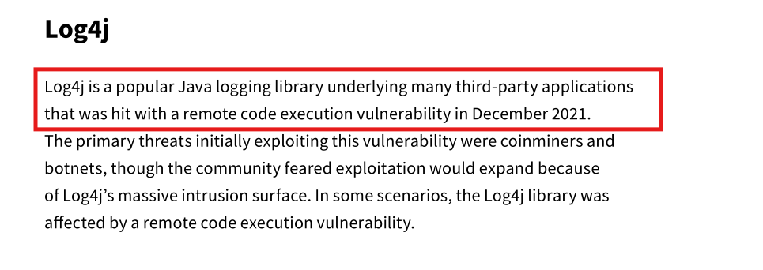
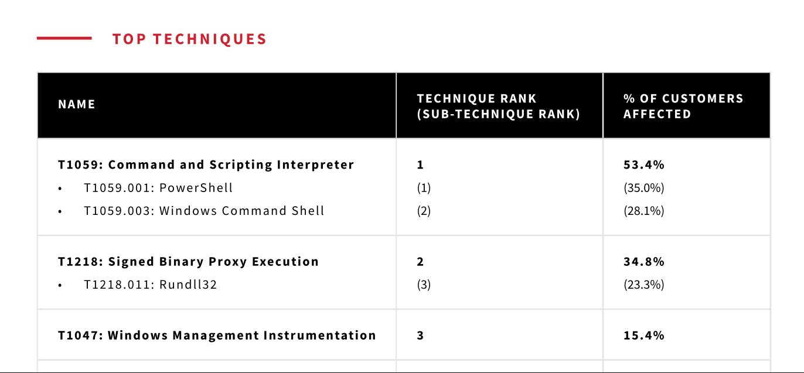
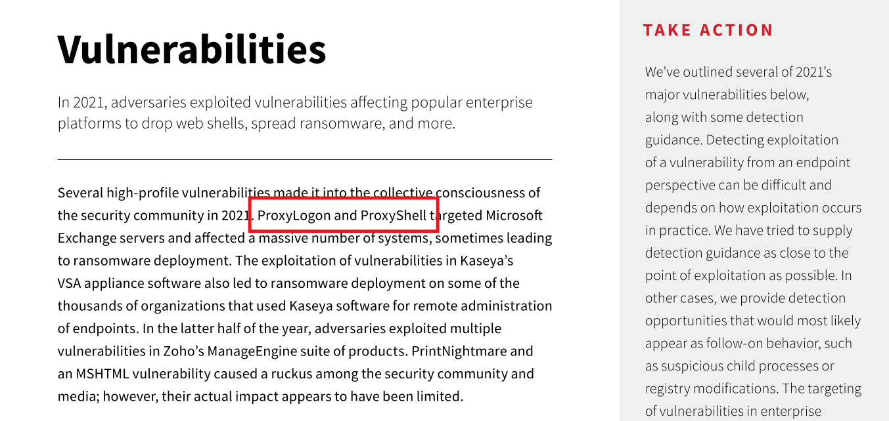
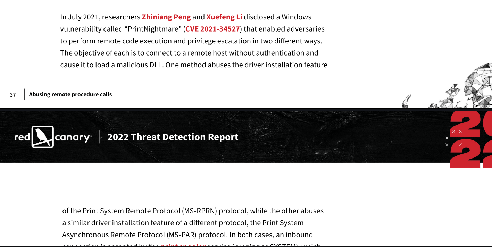
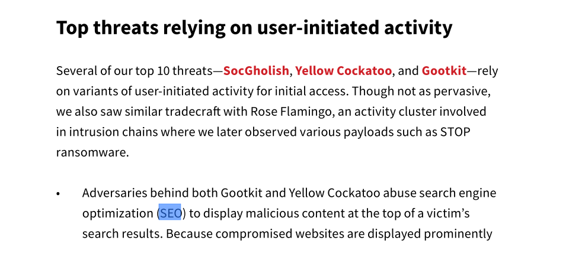
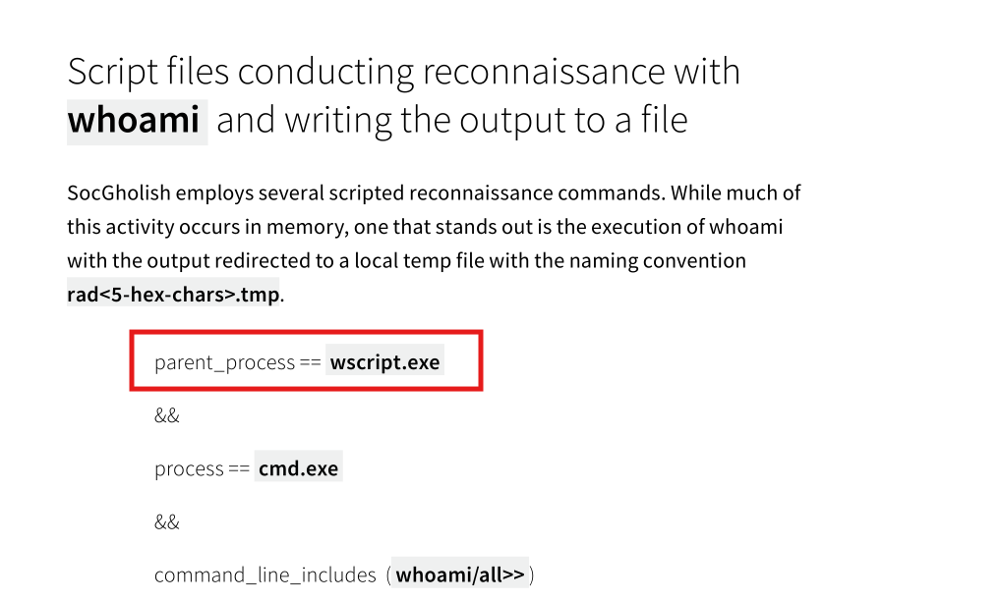
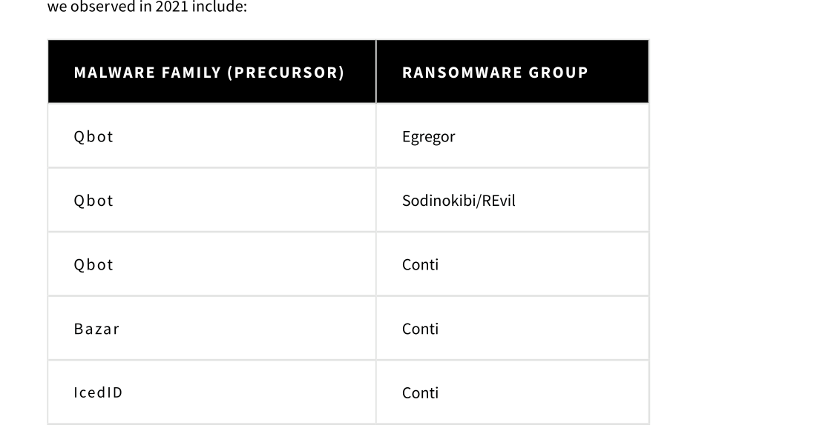
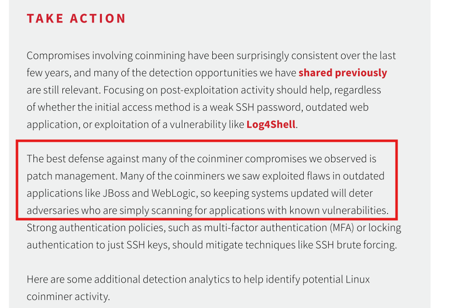
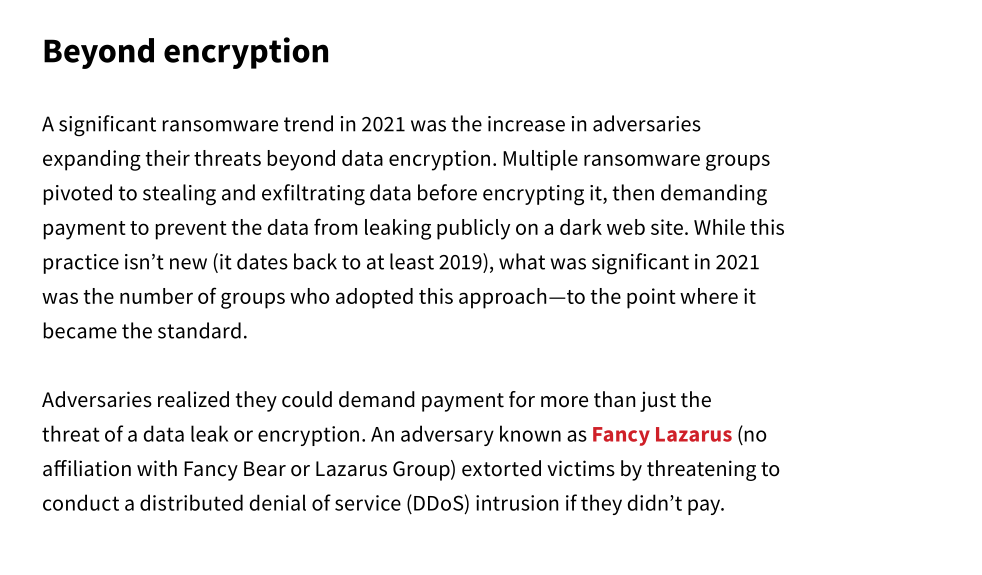
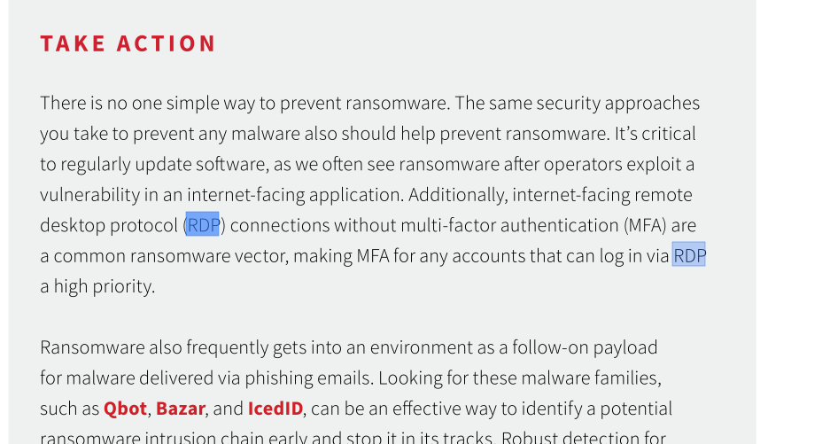

# Blue Team Labs Online: The Report Writeup

**Category:** Threat Intelligence / Security Operations | **Difficulty:** Easy

---

### Q1: Name the supply chain attack related to Java logging library in the end of 2021 (Format: AttackNickname)
*   **Approach:** Identify the supply chain attack targeting a popular Java logging library in late 2021 based on the provided threat report.
*   **Steps Taken:**
    *   Reviewed the summary of critical security incidents occurring in December 2021.
    *   Identified the open-source Java logging library affected by a massive Remote Code Execution (RCE) vulnerability as `Log4j`.
*   **Evidence:**
    
*   **Flag:** `log4j`

### Q2: Mention the MITRE Technique ID which effected more than 50% of the customers (Format: TXXXX)
*   **Approach:** Analyze the top techniques table showing the percentage of affected customers.
*   **Steps Taken:**
    *   Examined the **TOP TECHNIQUES** data matrix.
    *   Identified that `T1059: Command and Scripting Interpreter` is the top-ranked technique, affecting 53.4% of organizations.
*   **Evidence:**
    
*   **Flag:** `T1059`

### Q3: Submit the names of 2 vulnerabilities belonging to Exchange Servers (Format: VulnNickname, VulnNickname)
*   **Approach:** Scan the vulnerabilities section for flaws directly impacting Microsoft Exchange Servers.
*   **Steps Taken:**
    *   Read the **Vulnerabilities** section detailing flaws used to drop web shells and deploy ransomware.
    *   Noted the two major vulnerabilities targeting Microsoft Exchange servers: `ProxyLogon` and `ProxyShell`.
*   **Evidence:**
    
*   **Flag:** `ProxyLogon,ProxyShell`

### Q4: Submit the CVE of the zero day vulnerability of a driver which led to RCE and gain SYSTEM privileges (Format: CVE-XXXX-XXXXX)
*   **Approach:** Look up the CVE identifier for the zero-day driver vulnerability allowing RCE and SYSTEM privilege escalation.
*   **Steps Taken:**
    *   Analyzed the research section regarding the PrintNightmare vulnerability disclosed in July 2021.
    *   Identified that the vulnerability abusing the Print Spooler service's driver installation feature is tracked as `CVE-2021-34527`.
*   **Evidence:**
    
*   **Flag:** `CVE-2021-34527`

### Q5: Mention the 2 adversary groups that leverage SEO to gain initial access (Format: Group1, Group2)
*   **Approach:** Identify the threat groups abusing Search Engine Optimization (SEO) to lure users into downloading malware.
*   **Steps Taken:**
    *   Reviewed the **Top threats relying on user-initiated activity** section.
    *   Identified that the adversaries behind `Gootkit` and `Yellow Cockatoo` abuse SEO poisoning to display malicious content at the top of search results.
*   **Evidence:**
    
*   **Flag:** `Gootkit,Yellow Cockatoo`

### Q6: In the detection rule, what should be mentioned as parent process if we are looking for execution of malicious js files [Hint: Not CMD] (Format: ParentProcessName.exe)
*   **Approach:** Inspect the detection rule logic for malicious JavaScript file execution.
*   **Steps Taken:**
    *   Reviewed the SocGholish reconnaissance detection analytic under the **Detection opportunities** section.
    *   Identified that the direct parent process executing the `.js` script and spawning `cmd.exe` to run `whoami` is `wscript.exe`.
*   **Evidence:**
    
*   **Flag:** `wscript.exe`

### Q7: Ransomware gangs started using affiliate model to gain initial access. Name the precursors used by affiliates of Conti ransomware group (Format: Affiliate1, Affiliate2, Afilliate3)
*   **Approach:** Cross-reference the table mapping precursor malware families to specific ransomware groups.
*   **Steps Taken:**
    *   Examined the table showing the relationship between **Malware Family (Precursor)** and **Ransomware Group**.
    *   Listed the 3 precursor malware families used by the Conti ransomware affiliates: `Qbot`, `Bazar`, and `IcedID`.
*   **Evidence:**
    
*   **Flag:** `Qbot,Bazar,IcedID`

### Q8: The main target of coin miners was outdated software. Mention the 2 outdated software mentioned in the report (Format: Software1, Software2)
*   **Approach:** Find the specific outdated server applications frequently targeted by coinminers.
*   **Steps Taken:**
    *   Read the patch management recommendations in the coinminer defense section.
    *   Identified the two explicitly mentioned outdated applications exploited by adversaries: `JBoss` and `WebLogic`.
*   **Evidence:**
    
*   **Flag:** `JBoss,WebLogic`

### Q9: Name the ransomware group which threatened to conduct DDoS if they didn't pay ransom (Format: GroupName)
*   **Approach:** Locate the threat group that expanded extortion tactics to include Distributed Denial of Service (DDoS) threats.
*   **Steps Taken:**
    *   Reviewed the **Beyond encryption** section detailing extended extortion methods.
    *   Identified the group threatening victims with DDoS intrusions if they didn't pay as `Fancy Lazarus`.
*   **Evidence:**
    
*   **Flag:** `Fancy Lazarus`

### Q10: What is the security measure we need to enable for RDP connections in order to safeguard from ransomware attacks? (Format: XXX)
*   **Approach:** Identify the core security measure recommended for securing Remote Desktop Protocol (RDP) connections.
*   **Steps Taken:**
    *   Read the **Take Action** section regarding ransomware defense strategies.
    *   Identified that enabling Multi-Factor Authentication (`MFA`) is a high priority for any accounts logging in via internet-facing RDP.
*   **Evidence:**
    
*   **Flag:** `MFA`
