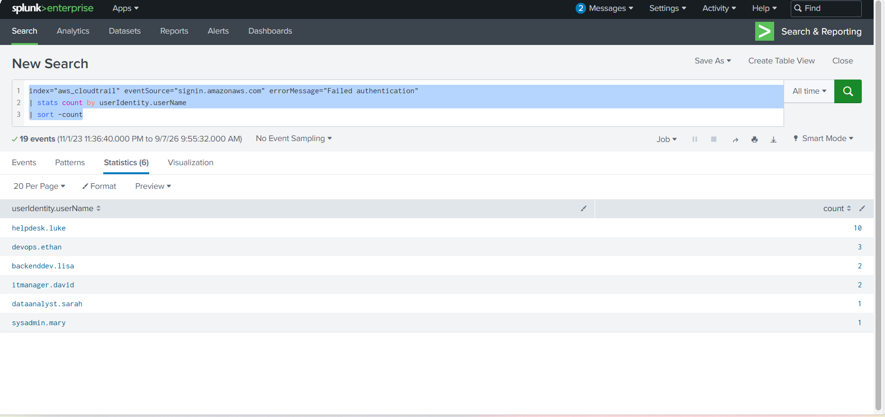
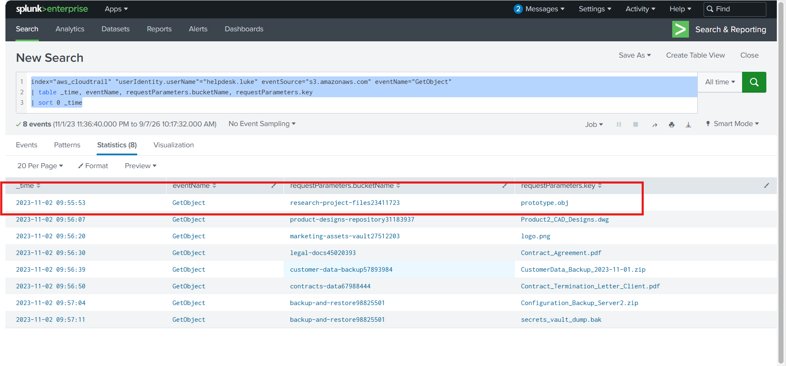
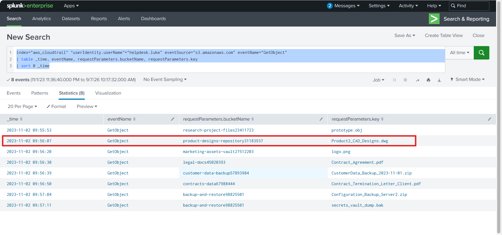
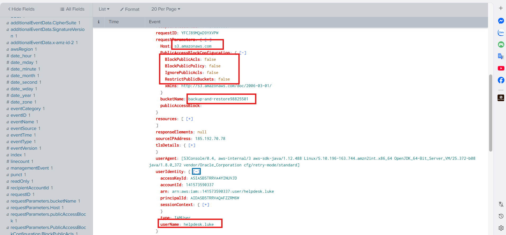
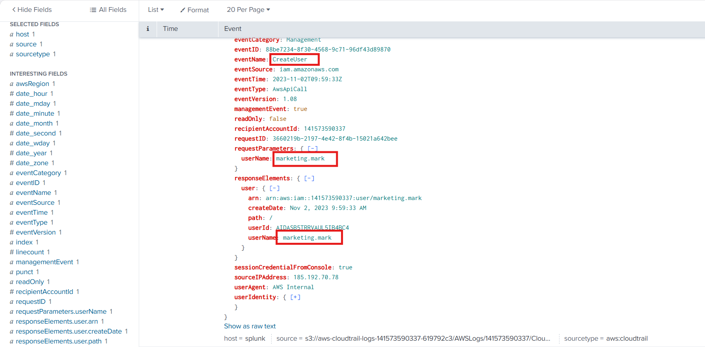
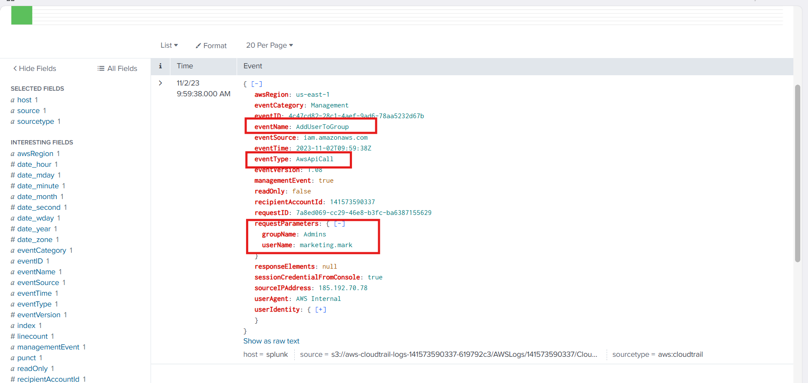

# CyberDefenders Lab: AWSRaid Writeup

**Category:** Cloud Forensics | **Difficulty:** Easy | **Tools:** Splunk
**Tactics:** Persistence, Privilege Escalation, Credential Access

**Scenario:** Investigate AWS CloudTrail logs using Splunk to identify unauthorized access, analyze configuration changes, and detect persistence mechanisms.

---

### Q1: Knowing which user account was compromised is essential for understanding the attacker's initial entry point into the environment. What is the username of the compromised user?

*   **Approach:** To determine which user account was compromised, investigate authentication events targeting `signin.amazonaws.com` to identify patterns of failed logins.
*   **Steps Taken:** 
    *   Execute the Splunk query: `index="aws_cloudtrail" eventSource="signin.amazonaws.com" errorMessage="Failed authentication" | stats count by userIdentity.userName | sort -count`.
    *   This rule helps identify the username with the highest number of failed authentication attempts, highlighting the suspicious account that may have been compromised.
    *   The search results reveal that the account `helpdesk.luke` experienced up to 10 failed login attempts.
*   **Evidence:**
    
*   **Flag:** `helpdesk.luke`

---

### Q2: We must investigate the events following the initial compromise to understand the attacker's motives. What is the timestamp for the first access to an S3 object by the attacker?

*   **Approach:** Build upon the findings from Q1 to track the compromised user's activity and identify the exact timestamp of their first interaction with an S3 object.
*   **Steps Taken:** 
    *   Knowing the compromised username is `helpdesk.luke`, filter the logs for S3 object retrieval events.
    *   Use the following query: `index="aws_cloudtrail" "userIdentity.userName"="helpdesk.luke" eventSource="s3.amazonaws.com" eventName="GetObject" | table _time, eventName, requestParameters.bucketName, requestParameters.key | sort 0 _time`.
    *   The output displays the chronological order of accessed files, showing that the attacker's first S3 object access occurred at `2023-11-02 09:55:53`.
*   **Evidence:**
    
*   **Flag:** `2023-11-02 09:55`

---

### Q3: Among the S3 buckets accessed by the attacker, one contains a DWG file. What is the name of this bucket?

*   **Approach:** Analyze the results from the previous S3 access query to locate a specific CAD design file and its corresponding storage location.
*   **Steps Taken:** 
    *   Continue reviewing the output generated by the rule used in Q2.
    *   The logs indicate that the attacker accessed a file named `Product2_CAD_Designs.dwg`.
    *   This specific file was retrieved from the bucket named `product-designs-repository31183937`.
*   **Evidence:**
    
*   **Flag:** `product-designs-repository31183937`

---

### Q4: We've identified changes to a bucket's configuration that allowed public access, a significant security concern. What is the name of this particular S3 bucket?

*   **Approach:** Monitor CloudTrail for specific API events that alter bucket permissions and expose them to public access.
*   **Steps Taken:** 
    *   Execute the query: `index="aws_cloudtrail" "userIdentity.userName"="helpdesk.luke" eventSource="s3.amazonaws.com" eventName=PutBucketPublicAccessBlock`.
    *   This rule filters for `PutBucketPublicAccessBlock` events originating from the attacker within the S3 service.
    *   The results demonstrate that the attacker removed public access restrictions by modifying multiple restriction settings to `false`.
    *   The affected bucket that was made public is identified as `backup-and-restore98825501`.
*   **Evidence:**
    
*   **Flag:** `backup-and-restore98825501`

---

### Q5: Creating a new user account is a common tactic attackers use to establish persistence in a compromised environment. What is the username of the account created by the attacker?

*   **Approach:** Search for persistence mechanisms by looking for events where the attacker provisions new IAM user accounts.
*   **Steps Taken:** 
    *   To find unauthorized account creations, utilize the query: `index="aws_cloudtrail" "userIdentity.userName"="helpdesk.luke" eventName=CreateUser`.
    *   The log details confirm that the attacker (operating via the compromised `helpdesk.luke` account) successfully created a new user.
    *   The `userName` for this newly created account is `marketing.mark`.
*   **Evidence:**
    
*   **Flag:** `marketing.mark`

---

### Q6: Following account creation, the attacker added the account to a specific group. What is the name of the group to which the account was added?

*   **Approach:** Investigate privilege escalation activities by checking if the newly created persistence account was assigned to any privileged groups.
*   **Steps Taken:** 
    *   To monitor user privilege elevation, apply the rule: `index="aws_cloudtrail" "userIdentity.userName"="helpdesk.luke" eventName=AddUserToGroup`.
    *   The resulting output indicates that the attacker escalated the privileges of the newly created account (`marketing.mark`) via an AWS API call.
    *   The account was added to the `admins` group.
*   **Evidence:**
    
*   **Flag:** `admins`
