# CyberDefenders: BRabbit Lab Writeup

**Category:** Threat Intel
**Tactics:** Execution, Persistence, Privilege Escalation, Command and Control, Impact
**Tools:** Malpedia, VirusTotal, ANY.RUN, Email Header Analyzer, MalwareURL

---

## Scenario

You are an investigator assigned to assist Drumbo, a company that recently fell victim to a ransomware attack. The attack began when an employee received an email that appeared to be from the boss. It featured the company's logo and a familiar email address. Believing the email was legitimate, the employee opened the attachment, which compromised the system and deployed ransomware, encrypting sensitive files. Your task is to investigate and analyze the artifacts to uncover information about the attacker.

---

### Q1: What is the suspicious email address that sent the attachment?
*   **Approach:** Extract the raw email headers from the phishing attachment and analyze them using a header-analysis tool.
*   **Steps Taken:**
    *   Extracted the lab files and found the phishing email: **`Urget Contract Action.eml`**.
    *   Viewed the first 100 lines of the raw email in the terminal: `head --n 100 'Urget Contract Action.eml'`.
    *   Copied the raw header content into **mxtoolbox.com**'s Email Header Analyzer.
    *   The analysis revealed the sending address as `theceojamessmith@Drurnbo.com` — a spoofed "CEO" display name paired with a suspicious, unrelated domain, a classic social-engineering/BEC indicator.
*   **Evidence:**
    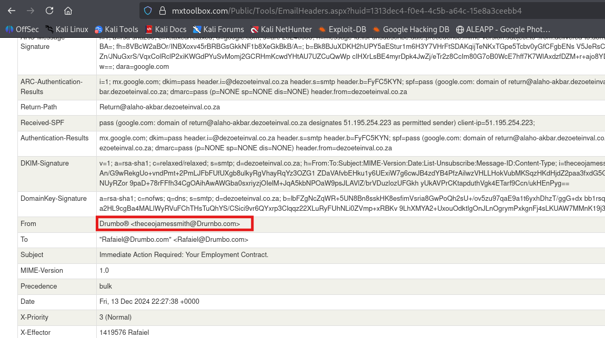
*   **Flag:** `theceojamessmith@Drurnbo.com`

### Q2: What is the family name of the ransomware identified during the investigation?
*   **Approach:** Submit the malicious attachment/sample to VirusTotal for AV vendor classification.
*   **Steps Taken:**
    *   Uploaded the sample to VirusTotal.
    *   Multiple AV engines converged on the same family classification: **BadRabbit**.
*   **Evidence:**
    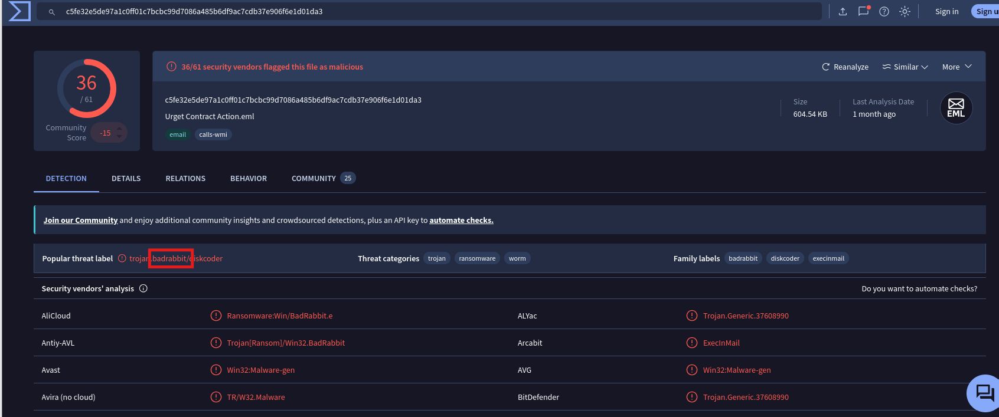
*   **Flag:** `Badrabbit`

### Q3: What is the name of the first file dropped by the ransomware?
*   **Approach:** Review a sandboxed detonation report of the malicious email to trace the infection chain.
*   **Steps Taken:**
    *   Reviewed an **Any.Run** report for the malicious email attachment.
    *   Identified that the ransomware dropped **`infpub.dat`** as the first-stage payload, which was then executed via `rundll32.exe`.
*   **Evidence:**
    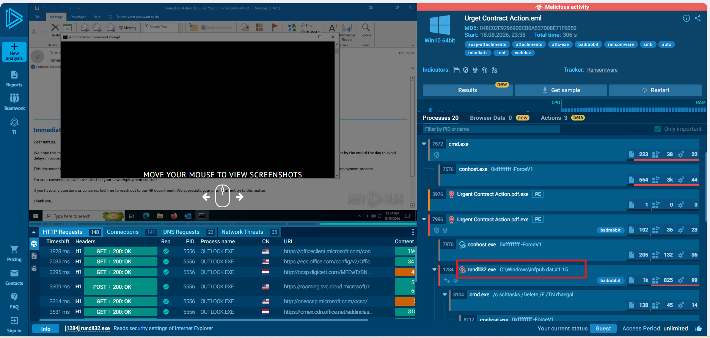
*   **Flag:** `infpub.dat`

### Q4: What is the only person's username found within the dropped file?
*   **Approach:** Research published threat intelligence on `infpub.dat` for embedded hardcoded artifacts.
*   **Steps Taken:**
    *   Searched for threat intelligence write-ups on BadRabbit's `infpub.dat` (hash `1D724F95C61F1055F0D02C2154BBCCD3`).
    *   Found a section titled **"Embedded usernames from infpub.dat"** in a published TI report.
    *   The only username listed was **`alex`**.
*   **Evidence:**
    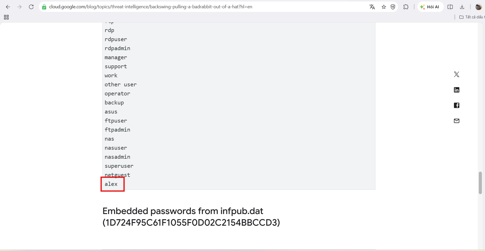
*   **Flag:** `alex`

### Q5: What MITRE ATT&CK sub-technique describes the ransomware's use of web protocols for sending and receiving data?
*   **Approach:** Review the MITRE ATT&CK mapping provided by Any.Run's behavioral analysis.
*   **Steps Taken:**
    *   Reviewed the ATT&CK mapping section of the Any.Run report.
    *   Identified the sub-technique for C2 communication over standard web protocols (HTTP/HTTPS) as **T1071.001 (Application Layer Protocol: Web Protocols)**.
*   **Evidence:**
    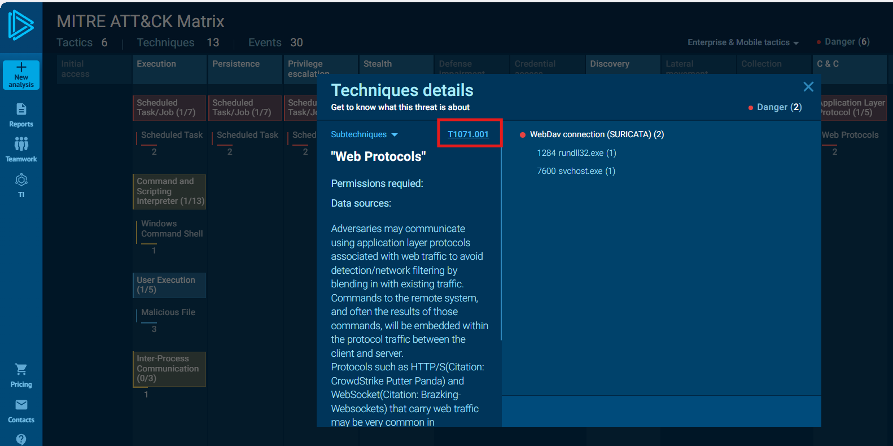
*   **Flag:** `T1071.001`

### Q6: What is the MITRE ATT&CK Sub-Technique ID associated with the ransomware's persistence technique?
*   **Approach:** Review the Persistence section of the MITRE ATT&CK mapping.
*   **Steps Taken:**
    *   Reviewed the **Persistence** tactic mapping in the Any.Run report.
    *   Identified the sub-technique as **T1053.005 (Scheduled Task/Job: Scheduled Task)**.
*   **Evidence:**
    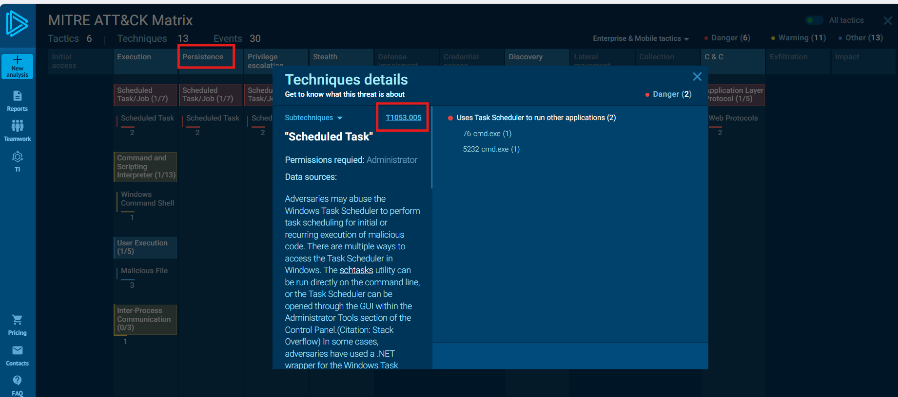
*   **Flag:** `T1053.005`

### Q7: What are the names of the tasks created by the ransomware during execution?
*   **Approach:** Trace the process execution chain in the sandbox report for scheduled task creation.
*   **Steps Taken:**
    *   Reviewed the process chain in the Any.Run report.
    *   Identified two scheduled tasks created during execution, named after characters from Game of Thrones: **`rhaegal`** and **`drogon`**.
*   **Evidence:**
    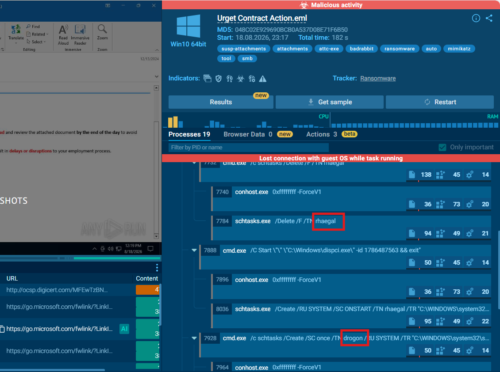
*   **Flag:** `rhaegal, drogon`

### Q8: What suspicious message was displayed in the Console upon executing dispci.exe?
*   **Approach:** Review threat intelligence documenting the binary's console output.
*   **Steps Taken:**
    *   Reviewed a Talos Intelligence write-up on BadRabbit's `dispci.exe` binary.
    *   The binary displayed the message: **"Disable your anti-virus and anti-malware programs"** — a social-engineering prompt attempting to get the victim to disable their own defenses.
*   **Evidence:**
    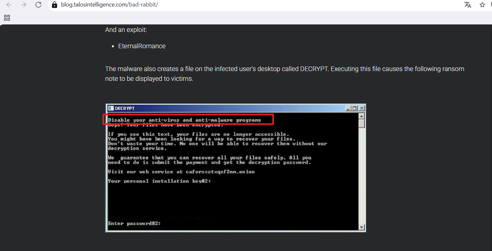
*   **Flag:** `Disable your anti-virus and anti-malware programs`

### Q9: What is the name of the driver used to encrypt the hard drive and modify the MBR?
*   **Approach:** Research dynamic/threat-intel analysis on how BadRabbit achieves full-disk encryption and MBR modification.
*   **Steps Taken:**
    *   `dispci.exe` interacts with the system at a low level to perform full-disk encryption and overwrite the Master Boot Record (MBR).
    *   To operate on raw disk partitions at the kernel level without being blocked by Driver Signature Enforcement, the attacker abused a legitimately signed driver — a **BYOVD (Bring Your Own Vulnerable Driver)** technique.
    *   According to Cisco Talos and Kaspersky Securelist reporting, the ransomware drops a driver file named `cscc.dat` into `C:\Windows\`. This file is in fact the legitimately signed driver belonging to the open-source disk encryption software **DiskCryptor**.
    *   The malware registers a service named `cscc` pointing to `cscc.dat`, using the DiskCryptor driver to encrypt raw disk partitions and replace the original Windows bootloader with the BadRabbit ransom screen.
*   **Evidence:**
    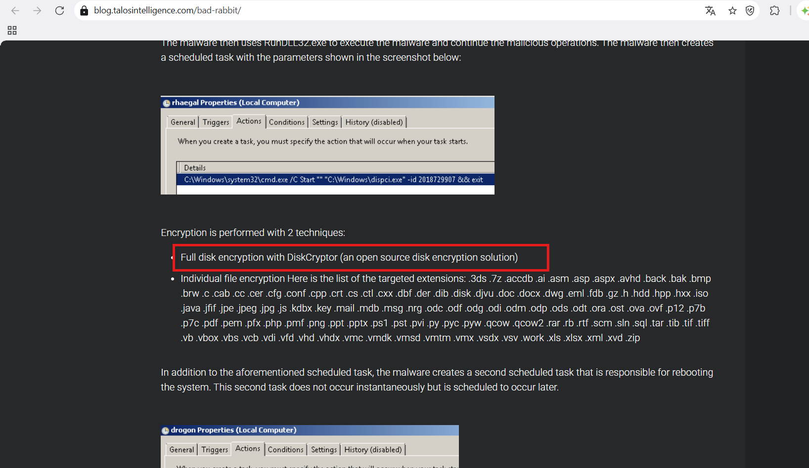
*   **Flag:** `Diskcryptor`

### Q10: What is the name of the threat actor responsible for this ransomware campaign?
*   **Approach:** Research threat actor attribution for BadRabbit using Malpedia.
*   **Steps Taken:**
    *   Searched Malpedia for threat actors associated with BadRabbit.
    *   Identified two related names: **TeleBots** and **Sandworm** — TeleBots is actually an alias used for the same APT group officially tracked as **Sandworm**.
    *   Malpedia also links BadRabbit to the broader malware family that includes **EternalPetya** (ExPetr/NotPetya/Diskcoder.C), both attributed to Sandworm — a notorious APT group known for cyber sabotage against critical infrastructure.
*   **Evidence:**
    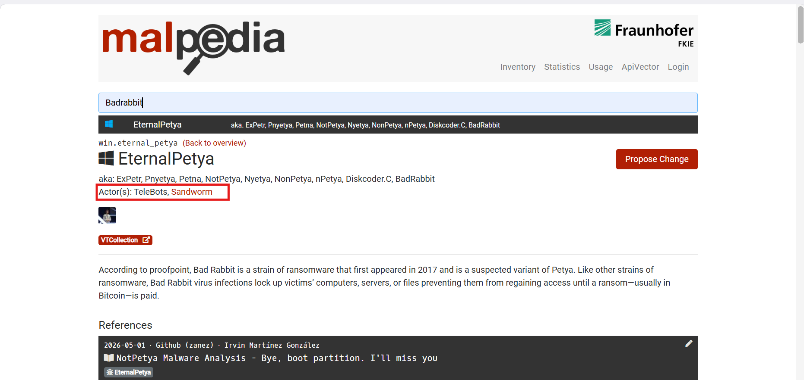
*   **Flag:** `Sandworm`

### Q11: What is the MITRE ATT&CK ID for the technique used to corrupt the system firmware and prevent booting?
*   **Approach:** Map BadRabbit's destructive MBR/bootloader corruption behavior to the corresponding MITRE ATT&CK technique.
*   **Steps Taken:**
    *   After encrypting user data, BadRabbit also tampers with the MBR and low-level boot components, rendering the operating system unable to reload after reboot (unbootable).
    *   This firmware/boot-component sabotage behavior maps to the **Impact** tactic (TA0040), under the technique **Firmware Corruption**.
*   **Evidence:**
    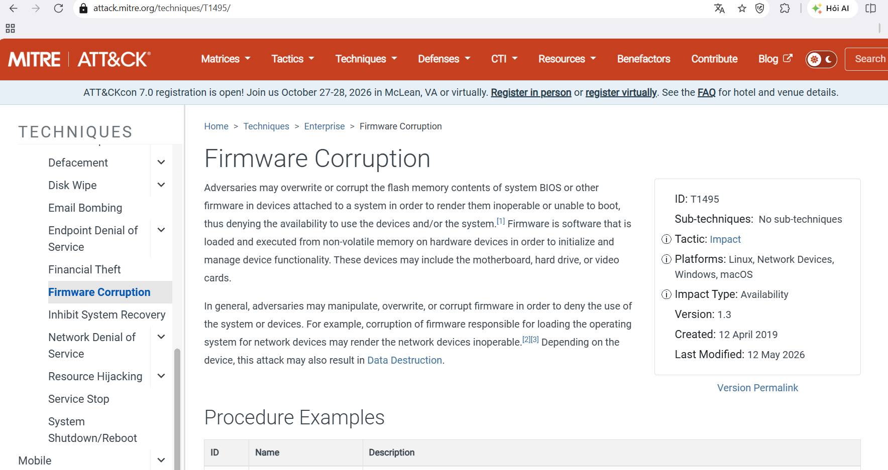
*   **Flag:** `T1495`

---

## Summary

The infection began with a spoofed-CEO phishing email (`theceojamessmith@Drurnbo.com`) delivering a **BadRabbit** ransomware attachment. Upon execution, the dropper `infpub.dat` (embedding the hardcoded username `alex`) launched via `rundll32.exe`, establishing C2 communication over standard web protocols (**T1071.001**) and achieving persistence through scheduled tasks named `rhaegal` and `drogon` (**T1053.005**). The payload `dispci.exe` prompted victims to disable their antivirus, then abused the legitimately signed **DiskCryptor** driver (BYOVD technique) to perform full-disk encryption and overwrite the MBR, corrupting system firmware and rendering the machine unbootable (**T1495**). The campaign has been attributed to the **Sandworm** APT group (aka TeleBots), known for its history of destructive attacks against critical infrastructure.
