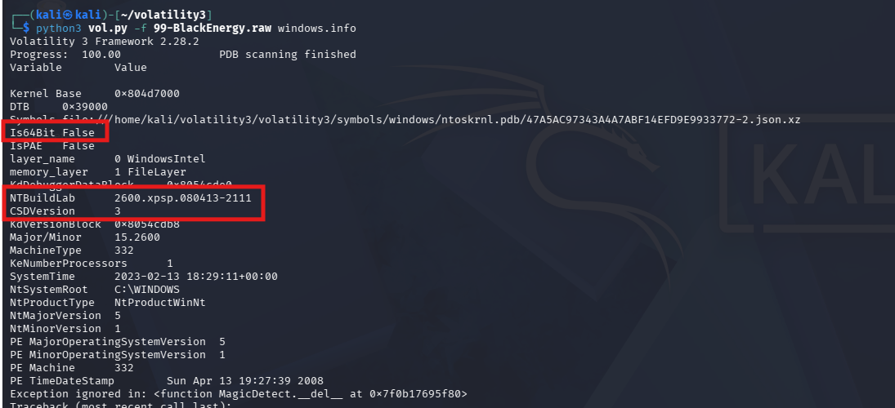
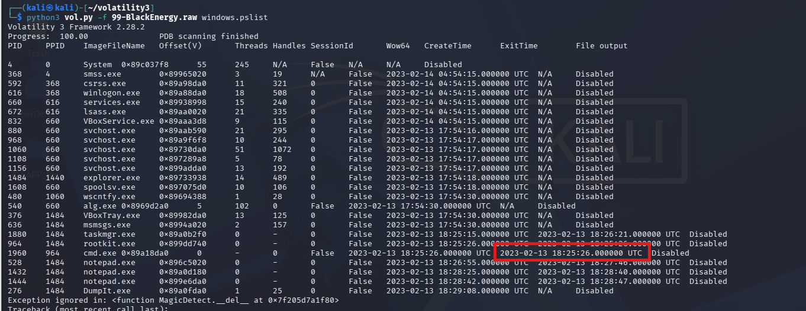
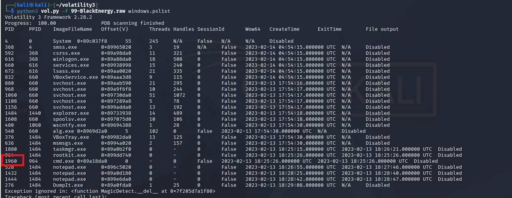
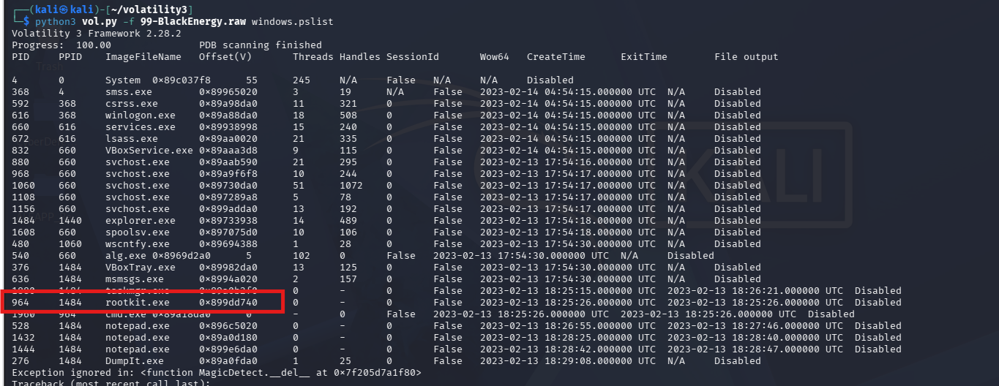
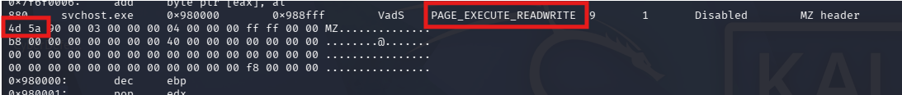
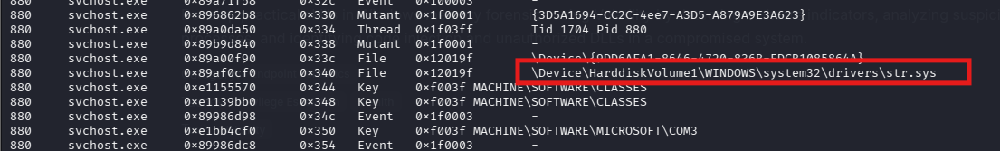
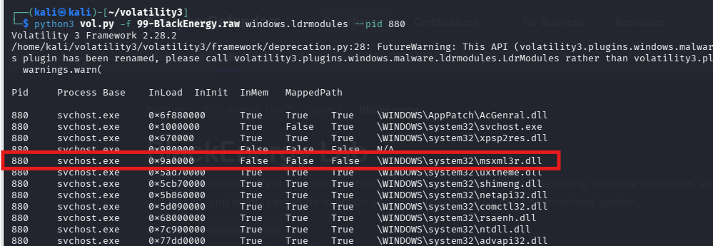
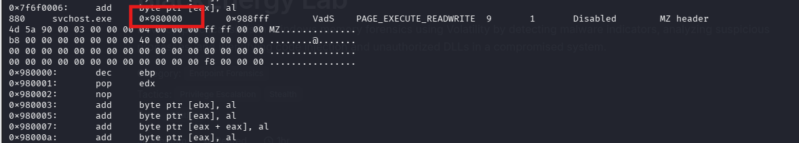

# CyberDefenders Lab: BlackEnergy Writeup[cite: 2]

**Category:** Endpoint Forensics | **Difficulty:** Medium | **Tools:** Volatility[cite: 2]
**Tactics:** Privilege Escalation, Stealth[cite: 2]

**Scenario:** A multinational corporation has suffered a cyber attack, resulting in the theft of sensitive data[cite: 2]. The attack employed a previously unseen variant of the BlackEnergy v2 malware[cite: 2]. The company's security team has obtained a memory dump from the infected machine and is seeking your expertise as a SOC analyst to analyze the dump in order to understand the scope and impact of the attack[cite: 2].

---

### Q1: Which volatility profile would be best for this machine?

*   **Approach:** Analyze the memory dump image using Volatility's identification plugin to determine the OS architecture and the most suitable profile.
*   **Steps Taken:** 
    *   Execute the command: `volatility -f <memory_dump> imageinfo`
    *   Review suggested profiles from the output.
*   **Evidence:**
    
*   **Flag:** `[Insert Flag]`

---

### Q2: How many processes were running when the image was acquired?

*   **Approach:** List all active processes running at the time of capture using process listing plugins.
*   **Steps Taken:** 
    *   Run the command: `volatility -f <memory_dump> --profile=<profile> pslist`
    *   Count the total active processes running during image acquisition.
*   **Evidence:**
    
*   **Flag:** `[Insert Flag]`

---

### Q3: What is the process ID of cmd.exe?

*   **Approach:** Identify the execution of the Windows Command Prompt (`cmd.exe`) and retrieve its corresponding Process Identifier (PID).
*   **Steps Taken:** 
    *   Filter the `pslist` or `pstree` output for `cmd.exe`.
    *   Locate the specific PID associated with this process.
*   **Evidence:**
    
*   **Flag:** `[Insert Flag]`

---

### Q4: What is the name of the most suspicious process?

*   **Approach:** Inspect process hierarchy, unusual paths, or known malicious indicators to isolate the suspicious executable.
*   **Steps Taken:** 
    *   Analyze parent-child relationships and process names via `pstree` or `psscan`.
    *   Identify anomalies such as typosquatted names or processes running from unusual directories.
*   **Evidence:**
    
*   **Flag:** `[Insert Flag]`

---

### Q5: Which process shows the highest likelihood of code injection?

*   **Approach:** Scan for memory sections flagged with executable permissions and signs of code injection (such as shellcode or hidden DLLs).
*   **Steps Taken:** 
    *   Run the `malfind` plugin: `volatility -f <memory_dump> --profile=<profile> malfind`
    *   Correlate results with high-entropy memory segments and `PAGE_EXECUTE_READWRITE` permissions.
*   **Evidence:**
    
*   **Flag:** `[Insert Flag]`

---

### Q6: There is an odd file referenced in the recent process. Provide the full path of that file.

*   **Approach:** Inspect file handles and referenced paths associated with the suspicious process to locate anomalies.
*   **Steps Taken:** 
    *   Query open handles using the `handles` plugin filtered by process ID and object type `File`.
    *   Identify unusual file extensions or paths referenced by the target process.
*   **Evidence:**
    
*   **Flag:** `[Insert Flag]`

---

### Q7: What is the name of the injected DLL file loaded from the recent process?

*   **Approach:** Review the dynamic-link libraries loaded into memory by the compromised process.
*   **Steps Taken:** 
    *   Execute `dlllist` targeting the suspicious PID: `volatility -f <memory_dump> --profile=<profile> dlllist -p <PID>`
    *   Identify unauthorized or hidden DLLs injected into memory.
*   **Evidence:**
    
*   **Flag:** `[Insert Flag]`

---

### Q8: What is the base address of the injected DLL?

*   **Approach:** Determine the memory base address where the malicious DLL was loaded.
*   **Steps Taken:** 
    *   Cross-reference output from `dlllist` or `ldrmodules` for the identified DLL.
    *   Extract the starting/base virtual memory address of the loaded module.
*   **Evidence:**
    
*   **Flag:** `[Insert Flag]`
