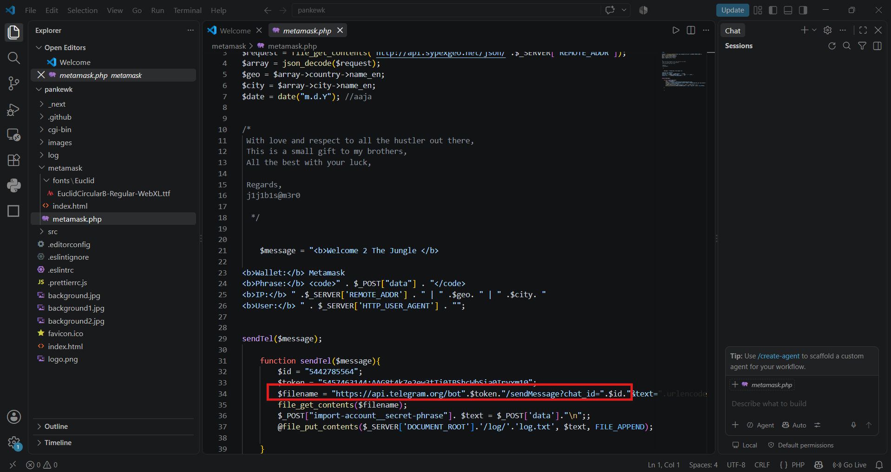
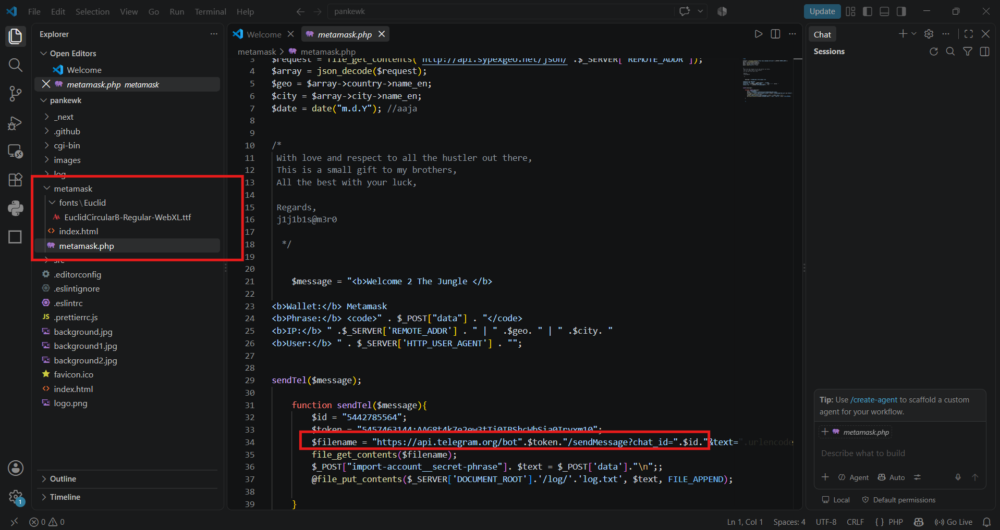
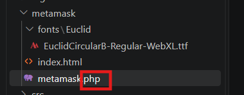
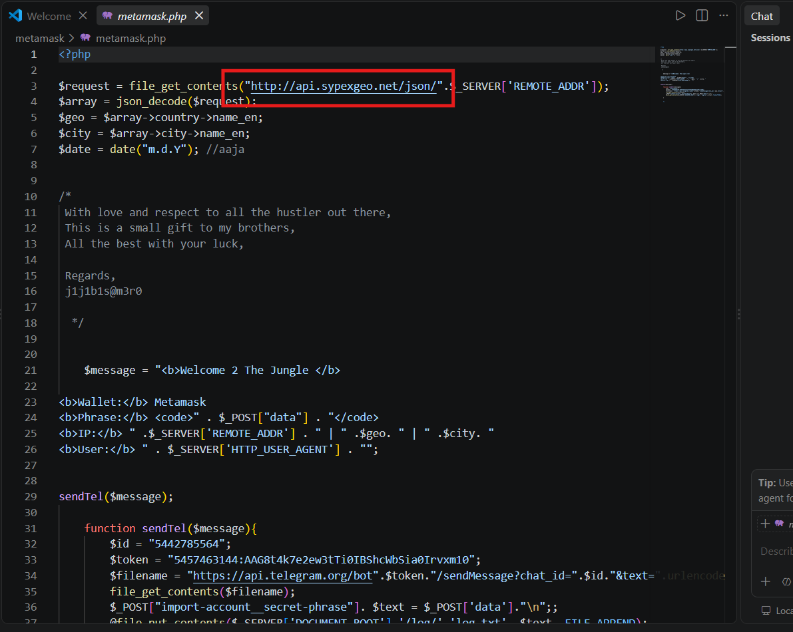
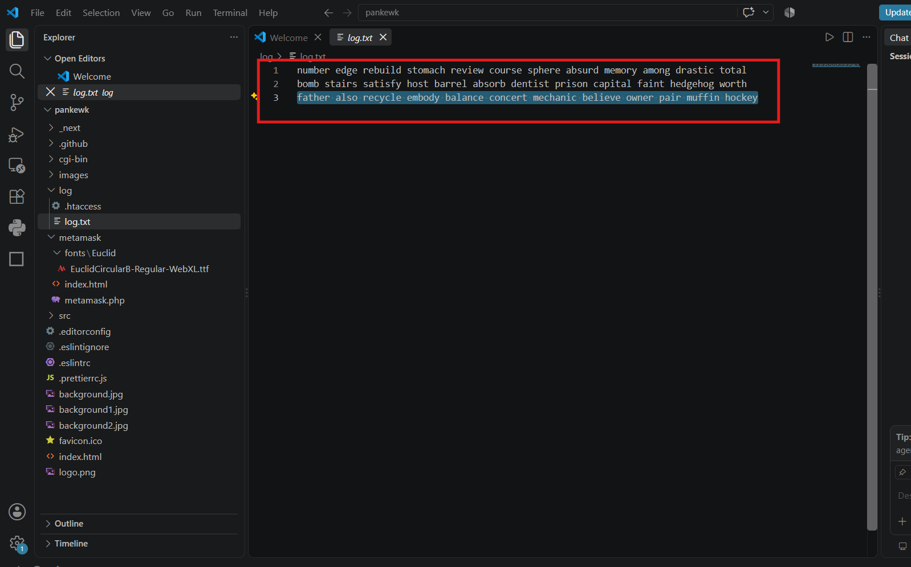
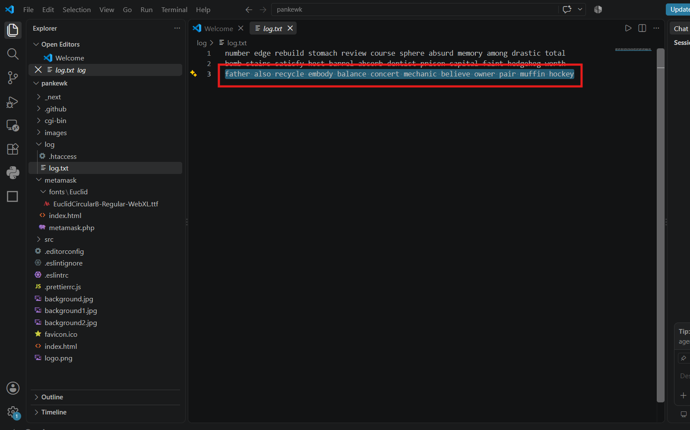
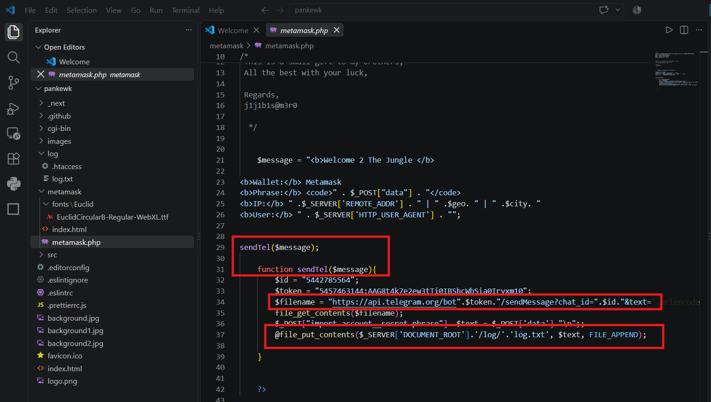
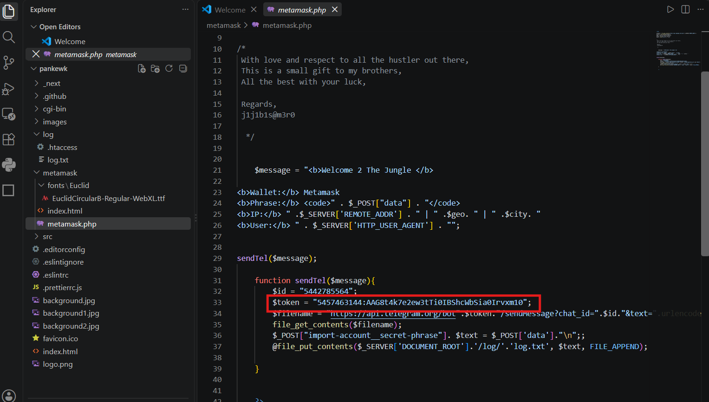
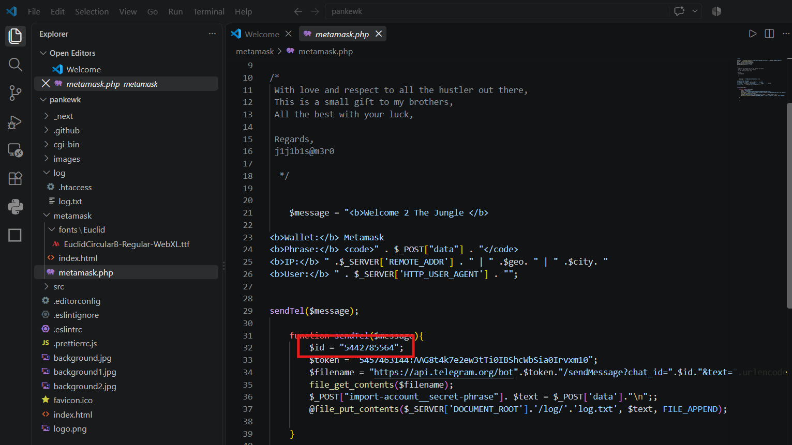
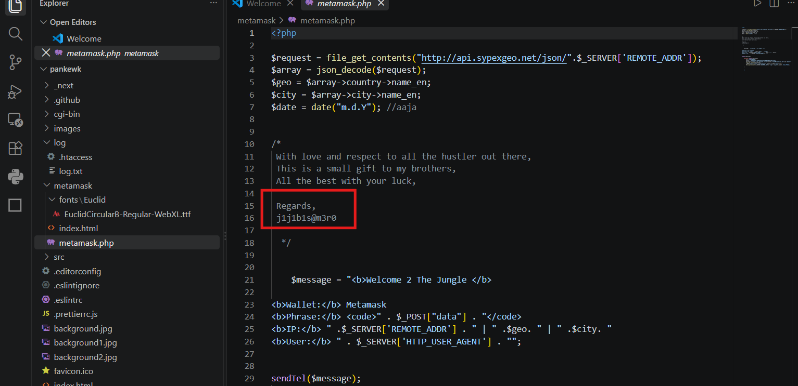

# CyberDefenders Lab: GrabThePhisher Writeup

**Category:** Threat Intel | **Difficulty:** Easy | **Tactics:** Initial Access, Exfiltration | **Tools:** Text Editor (VS Code)

**Scenario:** A decentralized finance (DeFi) platform recently reported multiple user complaints about unauthorized fund withdrawals. A forensic review uncovered a phishing site impersonating the legitimate PancakeSwap exchange, luring victims into entering their wallet seed phrases. The phishing kit was hosted on a compromised server and exfiltrated credentials via a Telegram bot. Your task is to conduct threat intelligence analysis on the phishing infrastructure, identify indicators of compromise (IoCs), and gather threat actor intelligence.

---

### Q1: Which wallet is used for asking the seed phrase?

*   **Approach:** Identify the target cryptocurrency wallet by examining the directory structure and frontend assets of the phishing kit.
*   **Steps Taken:** Open the phishing kit's directory in VS Code and review the folder structure. A dedicated folder named `metamask` is discovered within the workspace, indicating that the phishing campaign specifically targets users of this popular browser extension wallet.
*   **Evidence:**
    
*   **Flag:** `MetaMask`

---

### Q2: What is the file name that has the code for the phishing kit?

*   **Approach:** Identify the server-side script responsible for processing the phishing data by examining the files inside the target folder.
*   **Steps Taken:** Inside the `metamask` directory visible in the workspace, locate the core processing script written in PHP that handles form submissions and exfiltration logic. The file responsible for executing the phishing kit's main functionality is named `metamask.php`.
*   **Evidence:**
    
*   **Flag:** `metamask.php`

---

### Q3: In which language was the kit written?

*   **Approach:** Determine the programming language of the backend phishing script by analyzing its file extension and code structure.
*   **Steps Taken:** Review the file name identified in Q2 (`metamask.php`). The `.php` extension indicates that the script is written in PHP (Hypertext Preprocessor), which handles server-side logic, processes form data, and interacts with external APIs like Telegram.
*   **Evidence:**
    
*   **Flag:** `PHP`

---

### Q4: What service does the kit use to retrieve the victim's machine information?

*   **Approach:** Scan the source code of the backend script for external API endpoints or URLs responsible for gathering IP and location details.
*   **Steps Taken:** Open `metamask.php` in VS Code and look at the top lines of the script. A request is made to `http://api.sypexgeo.net/json/` combined with the user's remote address (`$_SERVER['REMOTE_ADDR']`). This confirms that the kit uses the Sypex Geo service to query and retrieve the victim's geographical and machine connection details based on their IP address.
*   **Evidence:**
    
*   **Flag:** `Sypex Geo`

---

### Q5: How many seed phrases were already collected?

*   **Approach:** Examine the local log files generated by the phishing kit to check for redundant data storage of captured credentials.
*   **Steps Taken:** Navigate to the `log` directory within the workspace and open `log.txt`. Reviewing the contents reveals multiple recorded entries of stolen victim credentials, indicating that local logging was active as a backup exfiltration method. Counting the distinct entries shows a total of 3 collected seed phrases.
*   **Evidence:**
    
*   **Flag:** `3`

---

### Q6: Write down the seed phrase of the most recent phishing incident?

*   **Approach:** Inspect the most recent entry within the local log file (`log.txt`) to extract the latest captured seed phrase.
*   **Steps Taken:** Scroll to the bottom of the `log.txt` file to view the latest appended record. Extract the recovery phrase associated with the most recent victim interaction.
*   **Evidence:**
    
*   **Flag:** `father also recycle embody balance concert mechanic believe owner pair muffin hockey`

---

### Q7: Which medium was used for credential dumping?

*   **Approach:** Analyze the data exfiltration methods implemented in the backend PHP script.
*   **Steps Taken:** Review `metamask.php` to identify how captured victim inputs are handled. The script utilizes two distinct methods: local file logging (`log.txt`) for redundancy and real-time data exfiltration via the Telegram messaging platform API.
*   **Evidence:**
    
*   **Flag:** `Telegram`

---

### Q8: What is the token for accessing the channel?

*   **Approach:** Extract the hardcoded Telegram bot token from the exfiltration function inside the backend script.
*   **Steps Taken:** Locate the `sendTel` function within `metamask.php`. Inspect the variable assignment for `$token`, which contains the unique Telegram Bot API credential used to authenticate requests to the Telegram server.
*   **Evidence:**
    
*   **Flag:** `5457463144:AAG8t4k7e2ew3tTi0IBShcWbSia0Irvxm10`

---

### Q9: What is the Chat ID for the phisher's channel?

*   **Approach:** Locate the destination chat identifier parameter used alongside the bot token in the exfiltration script.
*   **Steps Taken:** Examine the `sendTel` function block in `metamask.php`. The variable `$id` represents the target chat identifier where exfiltrated seed phrases are automatically forwarded.
*   **Evidence:**
    
*   **Flag:** `5442785564`

---

### Q10: What are the allies of the phish kit developer?

*   **Approach:** Search the codebase comments for any developer signatures, handles, or credits left behind.
*   **Steps Taken:** Inspect the comment block at the top of `metamask.php` (`/* ... Regards, j1j1b1s@m3r0 ... */`). The developer leaves an alias handle as a signature or attribution within the code.
*   **Evidence:**
    
*   **Flag:** `j1j1b1s@m3r0`
