# CyberDefenders Lab: HawkEye Writeup

**Category:** Network Forensics | **Difficulty:** Medium  
**Tactic:** Initial Access, Execution, Stealth, Credential Access, Discovery, Collection, Command and Control, Exfiltration  
**Tools:** Wireshark, Brim, Apackets, MaxMind Geo IP, VirusTotal, CyberChef  

**Scenario:**   
An accountant at your organization received an email regarding an invoice with a download link. Suspicious network traffic was observed shortly after opening the email. As a SOC analyst, investigate the network trace and analyze exfiltration attempts.

---

### Q1: How many packets does the capture have?
*   **Approach:** Inspect the total packet count metadata in the network capture file.
*   **Steps Taken:** 
    *   Loaded `Hawkeye.pcap` in Wireshark.
    *   Checked the packet count displayed in the bottom-right status bar.
    *   Confirmed the total packet count captured across all protocols is 4003.
*   **Evidence:**
    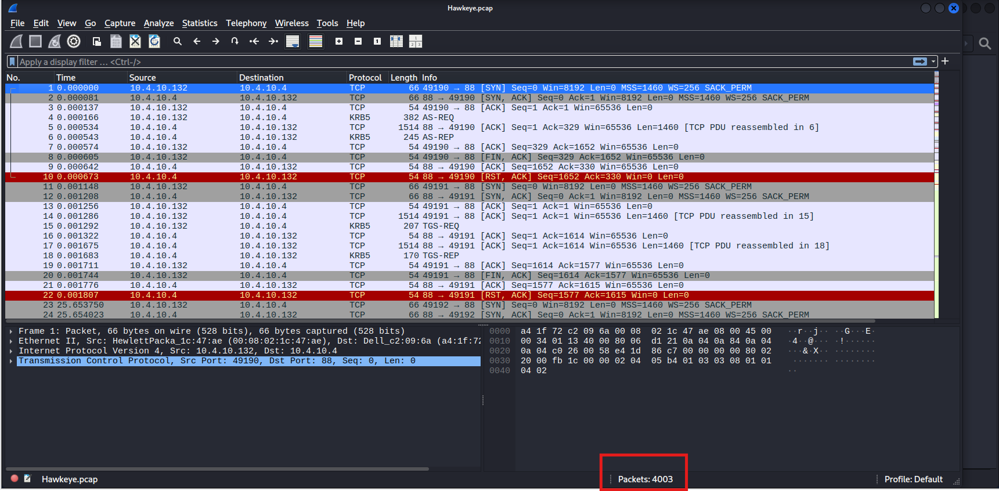
*   **Flag:** `4003`

### Q2: At what time was the first packet captured (UTC)?
*   **Approach:** Extract the UTC timestamp of the first captured frame.
*   **Steps Taken:**
    *   Adjusted the Wireshark time display format to UTC date and time (`View` -> `Time Display Format` -> `UTC Date and Time of Day`).
    *   Inspected packet number 1, which represents the initial SYN packet.
    *   Recorded the timestamp: `2019-04-10 20:37:07 UTC` and formatted as `YYYY-MM-DD HH:MM`.
*   **Evidence:**
    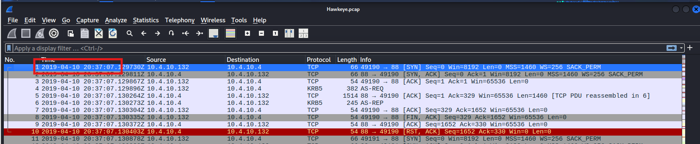
*   **Flag:** `2019-04-10 20:37`

### Q3: What is the duration of the capture?
*   **Approach:** Determine the total elapsed time of the capture file.
*   **Steps Taken:**
    *   Navigated to `Statistics` -> `Capture File Properties` in Wireshark.
    *   Reviewed the capture time range: First packet at `2019-04-10 16:37:07` and Last packet at `2019-04-10 17:40:48`.
    *   Calculated the total capture duration as 1 hour, 3 minutes, and 41 seconds.
*   **Evidence:**
    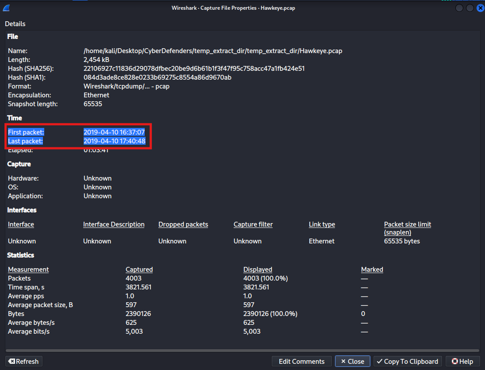
*   **Flag:** `01:03:41`

### Q4: What is the most active computer at the link level?
*   **Approach:** Identify the MAC address with the highest transmission volume at Layer 2 (Data Link layer).
*   **Steps Taken:**
    *   Navigated to `Statistics` -> `Endpoints` and selected the `Ethernet` tab.
    *   Sorted the endpoints by packet count.
    *   Identified that MAC address `00:08:02:1c:47:ae` accounts for all 4,003 packets in the capture session.
*   **Evidence:**
    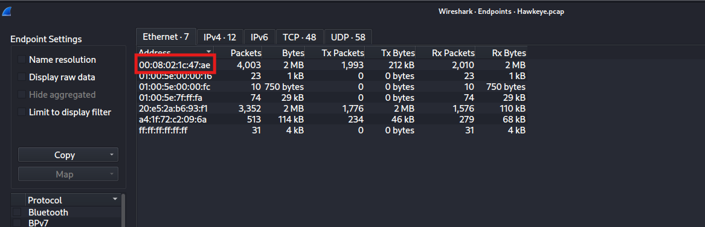
*   **Flag:** `00:08:02:1c:47:ae`

### Q5: Manufacturer of the NIC of the most active system at the link level?
*   **Approach:** Perform an Organizationally Unique Identifier (OUI) lookup on the active MAC address.
*   **Steps Taken:**
    *   Extracted the MAC prefix / OUI `00:08:02` from `00:08:02:1c:47:ae`.
    *   Queried an online MAC vendor database lookup tool.
    *   Identified the registered manufacturer as Hewlett Packard.
*   **Evidence:**
    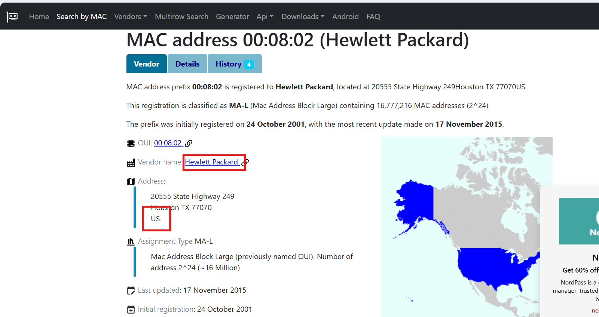
*   **Flag:** `Hewlett-Packard`

### Q6: Where is the headquarter of the company that manufactured the NIC of the most active computer at the link level?
*   **Approach:** Conduct OSINT to identify the corporate headquarters of Hewlett-Packard.
*   **Steps Taken:**
    *   Researched corporate history and filings for Hewlett-Packard.
    *   Identified that the company's corporate headquarters is established in Palo Alto, California.
*   **Evidence:**
    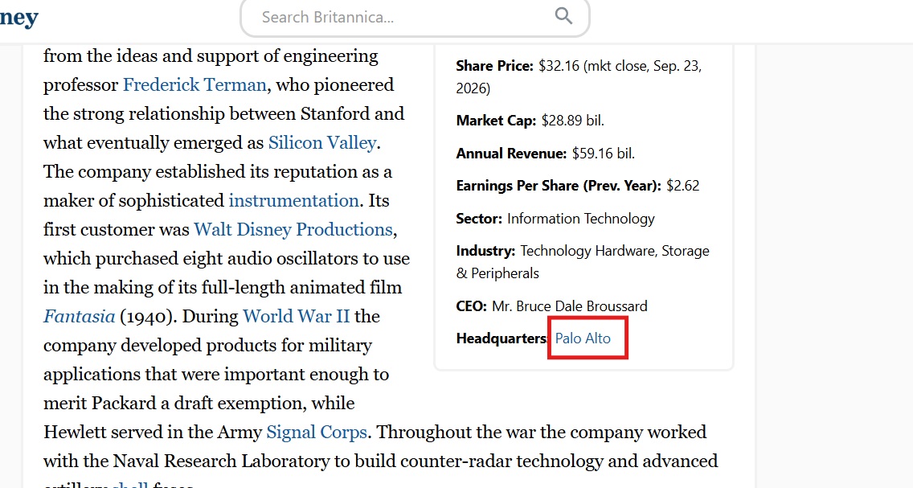
*   **Flag:** `Palo Alto`

### Q7: The organization works with private addressing and netmask /24. How many computers in the organization are involved in the capture?
*   **Approach:** Enumerate active host IP addresses belonging to the internal `/24` subnet.
*   **Steps Taken:**
    *   Navigated to `Statistics` -> `Endpoints` and switched to the `IPv4` tab.
    *   Filtered the internal private addresses within the `10.4.10.0/24` subnet.
    *   Identified three distinct host machines: `10.4.10.2`, `10.4.10.4`, and `10.4.10.132` (excluding the subnet broadcast address `10.4.10.255`).
*   **Evidence:**
    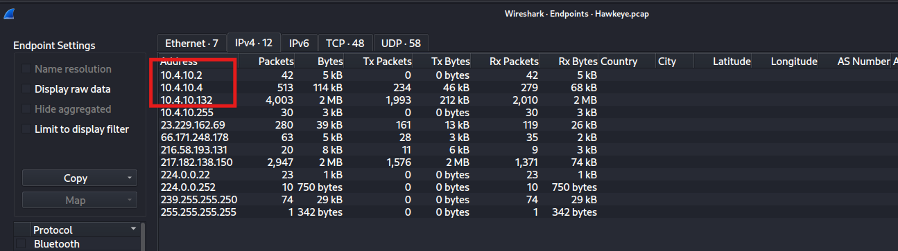
*   **Flag:** `3`

### Q8: What is the name of the most active computer at the network level?
*   **Approach:** Identify the most active internal IPv4 address and extract its NetBIOS or DHCP hostname declaration.
*   **Steps Taken:**
    *   Identified `10.4.10.132` as the most active IP endpoint with 4,003 packets from the `Statistics` -> `IPv4` endpoints list.
    *   Applied the display filter: `ip.addr==10.4.10.132 and dhcp`.
    *   Inspected packet 3263 (`DHCP Inform`) and expanded `Option: (12) Host Name`, extracting the computer name `Beijing-5cd1-PC`.
*   **Evidence:**
    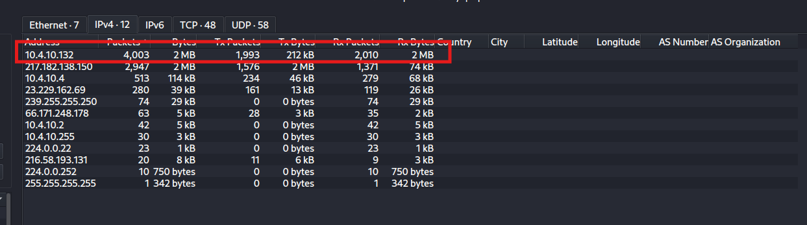
    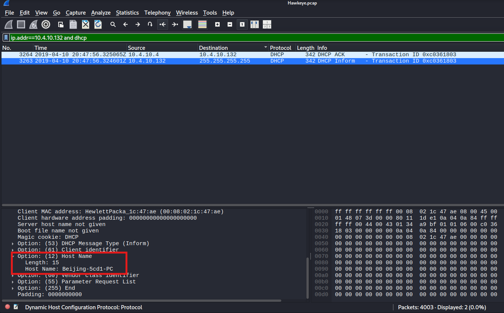
*   **Flag:** `Beijing-5cd1-PC`

### Q9: What is the IP of the organization's DNS server?
*   **Approach:** Filter DNS queries and server responses directed to the victim workstation.
*   **Steps Taken:**
    *   Applied the filter: `ip.addr==10.4.10.132 and dns`.
    *   Observed recurrent DNS query responses originating from internal host `10.4.10.4`.
    *   Inspected the DNS SOA record authority name pointing to `pizzajukebox-dc.pizzajukebox.com` hosted at `10.4.10.4`, confirming it serves as the organization's internal DNS server.
*   **Evidence:**
    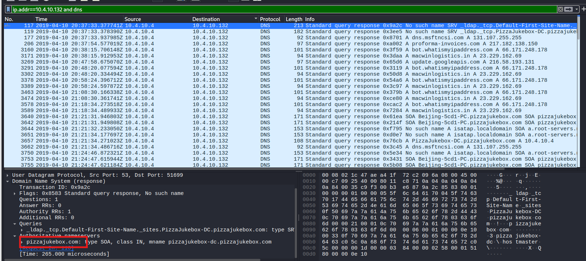
*   **Flag:** `10.4.10.4`

### Q10: What domain is the victim asking about in packet 204?
*   **Approach:** Examine the domain query name within DNS packet frame 204.
*   **Steps Taken:**
    *   Applied the filter: `frame.number==204`.
    *   Expanded the `Domain Name System (query)` layer.
    *   Extracted the queried domain string: `proforma-invoices.com`.
*   **Evidence:**
    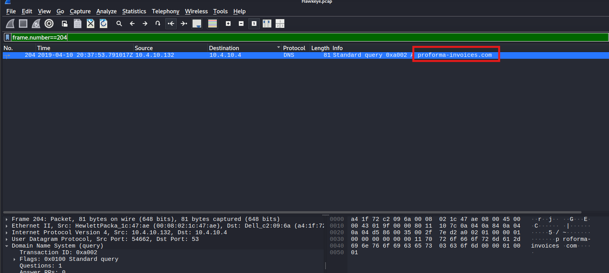
*   **Flag:** `proforma-invoices.com`

### Q11: What is the IP of the domain in the previous question?
*   **Approach:** Correlate domain resolution records via passive DNS threat intelligence platforms.
*   **Steps Taken:**
    *   Submitted `proforma-invoices.com` to VirusTotal.
    *   Inspected the `Relations` tab under `Passive DNS Replication`.
    *   Identified that `proforma-invoices.com` resolves directly to IP `217.182.138.150`.
*   **Evidence:**
    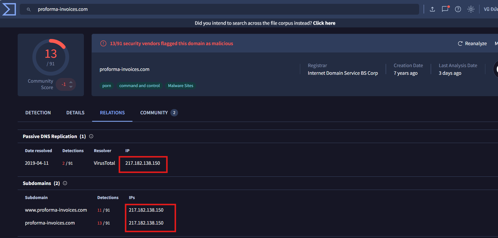
*   **Flag:** `217.182.138.150`

### Q12: Indicate the country to which the IP in the previous section belongs.
*   **Approach:** Perform a GeoIP intelligence lookup on the malicious server IP.
*   **Steps Taken:**
    *   Queried IP `217.182.138.150` on AbuseIPDB.
    *   Analyzed the geolocation attributes associated with ISP `OVH SAS`.
    *   Identified the hosting country as France.
*   **Evidence:**
    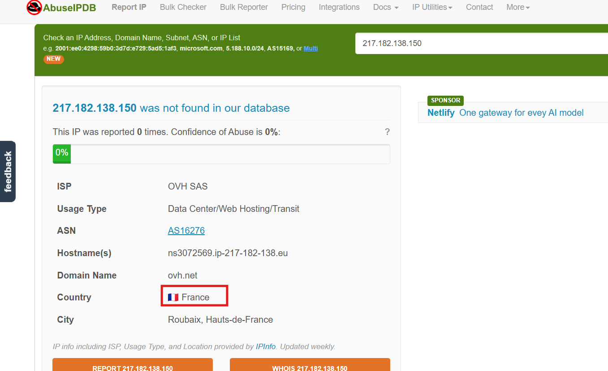
*   **Flag:** `France`

### Q13: What operating system does the victim's computer run?
*   **Approach:** Inspect User-Agent strings transmitted in outbound HTTP client requests.
*   **Steps Taken:**
    *   Applied filter: `ip.addr==10.4.10.132 and http`.
    *   Followed the HTTP stream for packet 210.
    *   Inspected the `User-Agent` header, which specifies: `Mozilla/4.0 (compatible; MSIE 7.0; Windows NT 6.1; WOW64; ...)`.
    *   Identified the operating system as Windows NT 6.1 (Windows 7).
*   **Evidence:**
    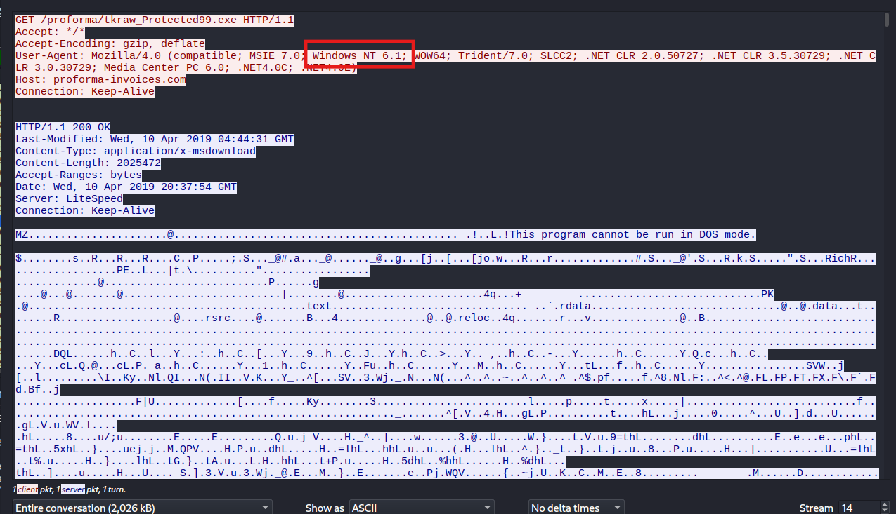
*   **Flag:** `Windows NT 6.1`

### Q14: What is the name of the malicious file downloaded by the accountant?
*   **Approach:** Inspect outbound HTTP GET requests requesting executable payloads.
*   **Steps Taken:**
    *   Examined the HTTP GET request line inside packet 210.
    *   Observed the URI request path: `GET /proforma/tkraw_Protected99.exe HTTP/1.1`.
    *   Extracted the malicious executable filename: `tkraw_Protected99.exe`.
*   **Evidence:**
    
*   **Flag:** `tkraw_Protected99.exe`

### Q15: What is the md5 hash of the downloaded file?
*   **Approach:** Carve the downloaded executable object from Wireshark and calculate its MD5 hash.
*   **Steps Taken:**
    *   Navigated to `File` -> `Export Objects` -> `HTTP` in Wireshark.
    *   Selected `tkraw_Protected99.exe` and exported it to the local filesystem.
    *   Ran `md5sum tkraw_Protected99.exe` in the terminal to obtain the cryptographic hash.
*   **Evidence:**
    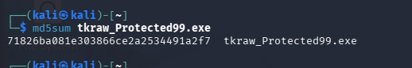
*   **Flag:** `71826ba081e303866ce2a2534491a2f7`

### Q16: What software runs the webserver that hosts the malware?
*   **Approach:** Inspect server response banner headers for web server identification.
*   **Steps Taken:**
    *   Reviewed the HTTP response headers in packet 210 (`HTTP/1.1 200 OK`).
    *   Inspected the `Server` header field.
    *   Identified that the web server hosting the malware runs LiteSpeed.
*   **Evidence:**
    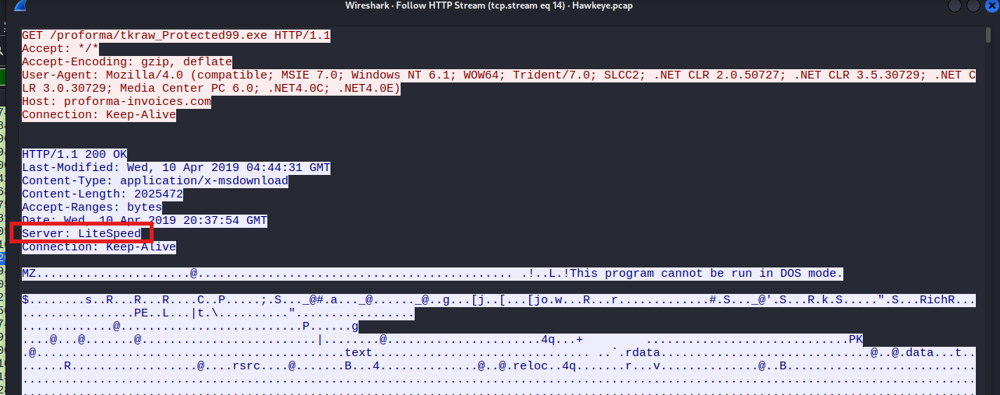
*   **Flag:** `LiteSpeed`

### Q17: What is the public IP of the victim's computer?
*   **Approach:** Identify outbound IP discovery requests to external what-is-my-ip services.
*   **Steps Taken:**
    *   Filtered HTTP traffic with `ip.addr==10.4.10.132` and inspected frame 3166.
    *   Followed TCP Stream 15, which showed a request to `bot.whatismyipaddress.com`.
    *   Extracted the IP address string returned in the HTTP response body: `173.66.146.112`.
*   **Evidence:**
    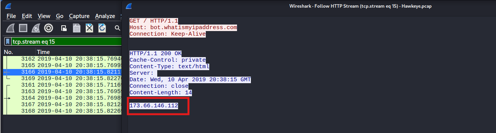
*   **Flag:** `173.66.146.112`

### Q18: In which country is the email server to which the stolen information is sent?
*   **Approach:** Identify the destination mail server IP address and perform GeoIP reconnaissance.
*   **Steps Taken:**
    *   Applied the filter: `ip.addr==10.4.10.132 and smtp`.
    *   Identified that outbound SMTP sessions connect to external mail server IP `23.229.162.69`.
    *   Queried the mail server IP on AbuseIPDB / WHOIS database, confirming it belongs to GoDaddy infrastructure in the United States.
*   **Evidence:**
    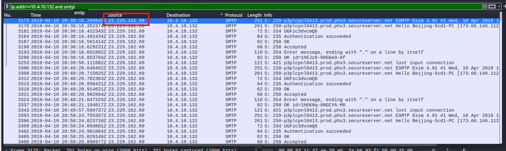
    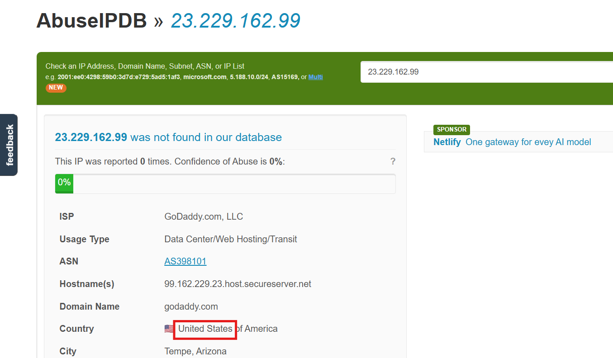
*   **Flag:** `United States`

### Q19: Analyzing the first extraction of information. What software runs the email server to which the stolen data is sent?
*   **Approach:** Inspect the initial SMTP greeting banner returned by the receiving mail server.
*   **Steps Taken:**
    *   Followed TCP Stream 16 for packet 3175.
    *   Inspected the server greeting response: `220-p3plcpnl0413.prod.phx3.secureserver.net ESMTP Exim 4.91 ...`.
    *   Identified the mail server software as Exim 4.91.
*   **Evidence:**
    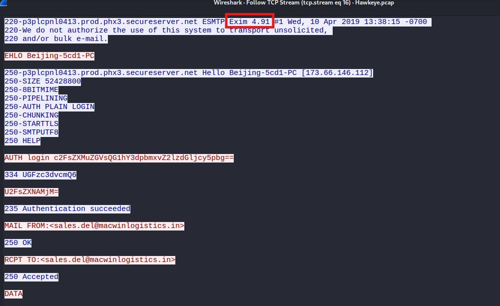
*   **Flag:** `Exim 4.91`

### Q20: To which email account is the stolen information sent?
*   **Approach:** Inspect the recipient mail address within the SMTP envelope and email headers.
*   **Steps Taken:**
    *   Followed TCP Stream 16 from packet 3175.
    *   Examined the `RCPT TO` command and the `To:` header line.
    *   Identified the destination mailbox as `sales.del@macwinlogistics.in`.
*   **Evidence:**
    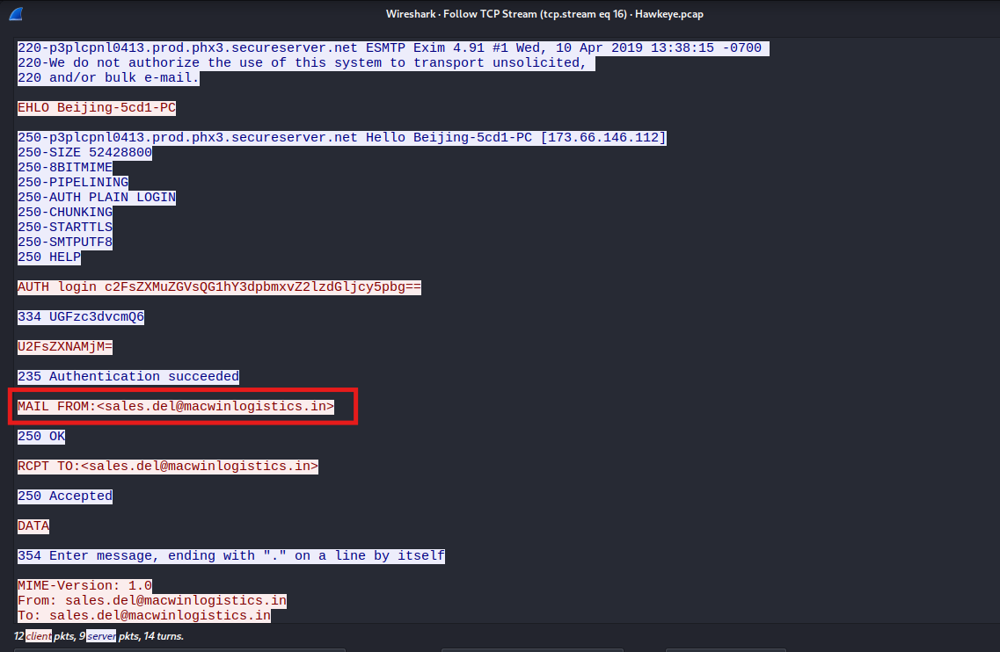
*   **Flag:** `sales.del@macwinlogistics.in`

### Q21: What is the password used by the malware to send the email?
*   **Approach:** Decode the Base64-encoded credentials provided during the SMTP `AUTH LOGIN` sequence.
*   **Steps Taken:**
    *   Located the authentication handshake in TCP Stream 16.
    *   Observed the server challenge `334 UGFzc3dvcmQ6` (Base64 for `Password:`) followed by client response `U2FsZXNAMjM=`.
    *   Pasted string `U2FsZXNAMjM=` into CyberChef using the `From Base64` recipe to reveal the cleartext password `Sales@23`.
*   **Evidence:**
    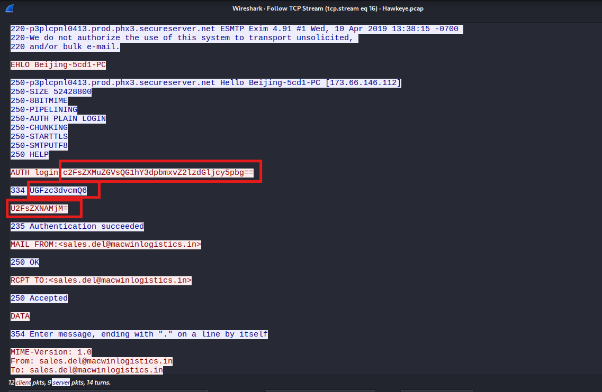
    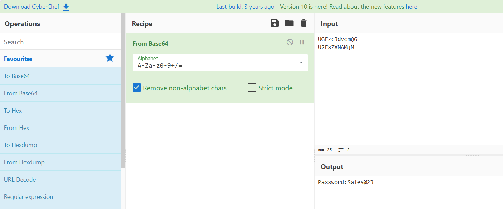
*   **Flag:** `Sales@23`

### Q22: Which malware variant exfiltrated the data?
*   **Approach:** Decode the Base64 email body to identify the malware version string.
*   **Steps Taken:**
    *   Inspected the message payload in TCP Stream 16, noting `Content-Transfer-Encoding: base64`.
    *   Extracted and loaded the Base64 payload into CyberChef with the `From Base64` recipe.
    *   Located the header line in the decoded log: `HawkEye Keylogger - Reborn v9`, identifying the variant as Reborn v9.
*   **Evidence:**
    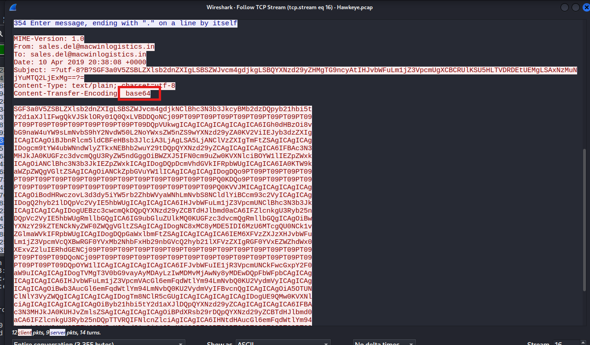
    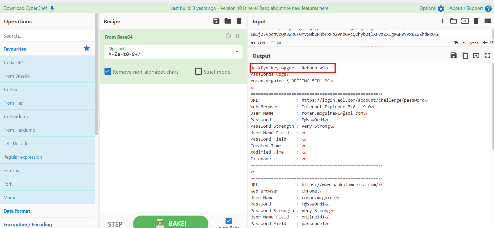
*   **Flag:** `Reborn v9`

### Q23: What are the bankofamerica access credentials? (username:password)
*   **Approach:** Search the decoded keylogger log for stolen banking credentials.
*   **Steps Taken:**
    *   Searched for `bankofamerica.com` within the decoded CyberChef output from Q22.
    *   Located the captured credentials: `User Name : roman.mcguire` and `Password : P@ssw0rd$`.
    *   Concatenated the values into the required `username:password` format.
*   **Evidence:**
    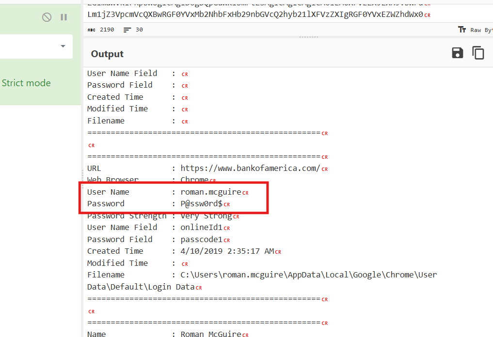
*   **Flag:** `roman.mcguire:P@ssw0rd$`

### Q24: Every how many minutes does the collected data get exfiltrated?
*   **Approach:** Calculate the time interval between consecutive SMTP exfiltration sessions.
*   **Steps Taken:**
    *   Applied filter: `ip.addr==10.4.10.132 and smtp`.
    *   Observed the first SMTP data transmission burst occurring at `20:38:16` (frame 3196).
    *   Observed the subsequent exfiltration burst occurring at `20:48:21` (frame 3325).
    *   Calculated the time difference between bursts as 10 minutes.
*   **Evidence:**
    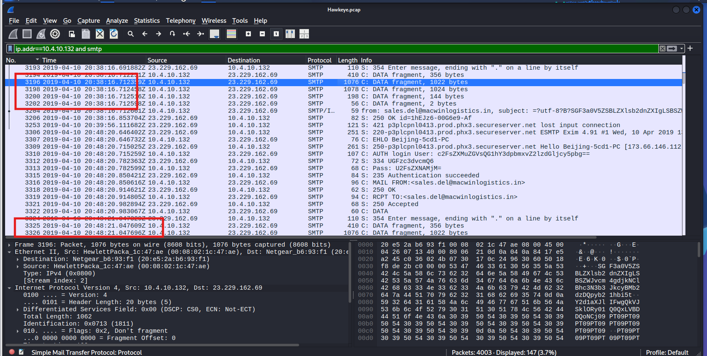
*   **Flag:** `10`
