# CyberDefenders: Insider Lab Writeup

**Category:** Endpoint Forensics (Disk Forensics) | **Difficulty:** Easy
**Tactics:** Execution, Credential Access
**Tool:** FTK Imager

---

## Scenario

After Karen started working for 'TAAUSAI,' she began doing illegal activities inside the company. 'TAAUSAI' hired you as a SOC analyst to kick off an investigation on this case.

You acquired a disk image and found that Karen uses Linux OS on her machine. Analyze the disk image of Karen's computer and answer the provided questions.

---

### Q1: Which Linux distribution is being used on this machine?
*   **Approach:** Browse to `[root] → boot` in the disk image and inspect boot-related files for distro identification strings.
*   **Steps Taken:**
    *   Navigated to `[root] → boot` in FTK Imager's Evidence Tree.
    *   Identified boot artifacts confirming the machine runs **Kali Linux**.
*   **Evidence:**
    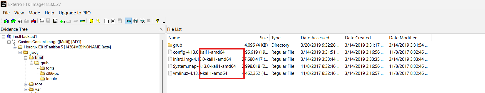
*   **Flag:** `Kali`

### Q2: What is the MD5 hash of the Apache access.log file?
*   **Approach:** Export the `access.log` file from the image and compute its MD5 hash on a Windows workstation.
*   **Steps Taken:**
    *   Located and exported `access.log` from `/var/log/apache2/`.
    *   Ran `Get-FileHash "access.log" -Algorithm MD5` in PowerShell.
    *   The file was empty (0 KB), producing the well-known empty-file MD5 hash.
*   **Evidence:**
    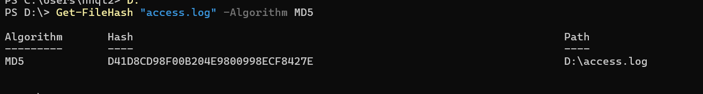
*   **Flag:** `D41D8CD98F00B204E9800998ECF8427E`

### Q3: It is suspected that a credential dumping tool was downloaded. What is the name of the downloaded file?
*   **Approach:** Browse the user's Downloads folder for suspicious tooling.
*   **Steps Taken:**
    *   Navigated to `[root] → root → Downloads`.
    *   Found a file named `mimikatz_trunk.zip` — **Mimikatz** is a well-known credential dumping tool used to extract passwords, NTLM hashes, and Kerberos tickets directly from the `lsass.exe` process memory on Windows systems.
*   **Evidence:**
    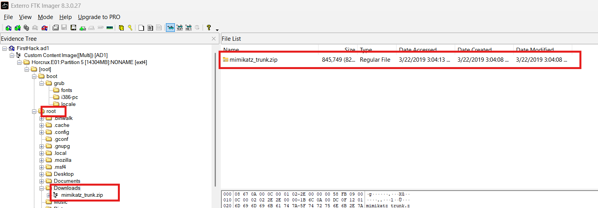
*   **Flag:** `mimikatz_trunk.zip`

### Q4: A super-secret file was created. What is the absolute path to this file?
*   **Approach:** Review the user's bash history for file creation commands.
*   **Steps Taken:**
    *   Inspected `/root/.bash_history`.
    *   Found that the attacker created a file named `SuperSecretFile.txt` inside `/root/Desktop`.
*   **Evidence:**
    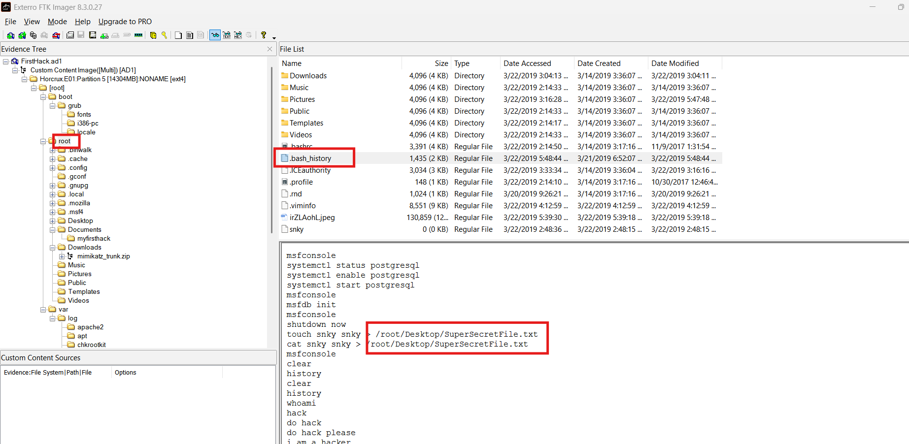
*   **Flag:** `/root/Desktop/SuperSecretFile.txt`

### Q5: What program used the file didyouthinkwedmakeiteasy.jpg during its execution?
*   **Approach:** Continue reviewing bash history for commands referencing this file.
*   **Steps Taken:**
    *   Still within `/root/.bash_history`, found that `didyouthinkwedmakeiteasy.jpg` — a filename associated with Mimikatz's source code easter egg — was processed using **binwalk**, a tool used to detect and extract embedded files/data hidden inside another file (consistent with steganographically hiding the Mimikatz binary inside a JPG).
*   **Evidence:**
    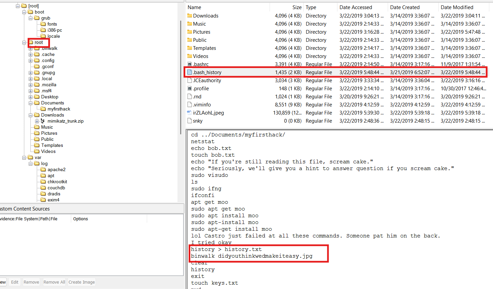
*   **Flag:** `binwalk`

### Q6: What is the third goal from the checklist Karen created?
*   **Approach:** Locate and read Karen's checklist file on the Desktop.
*   **Steps Taken:**
    *   Found and opened a checklist file at `/root/Desktop/Checklist`.
    *   The third listed goal was identified as **profit**.
*   **Evidence:**
    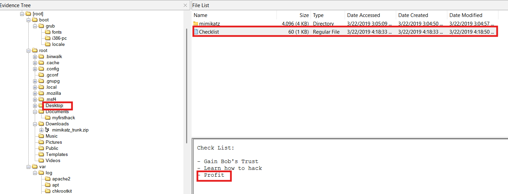
*   **Flag:** `profit`

### Q7: How many times was Apache run?
*   **Approach:** Check the size/contents of Apache's log files.
*   **Steps Taken:**
    *   Inspected `/var/log/apache2/` and found both `access.log` and `error.log` to be **0 KB** — indicating Apache was never actually started on this machine.
*   **Evidence:**
    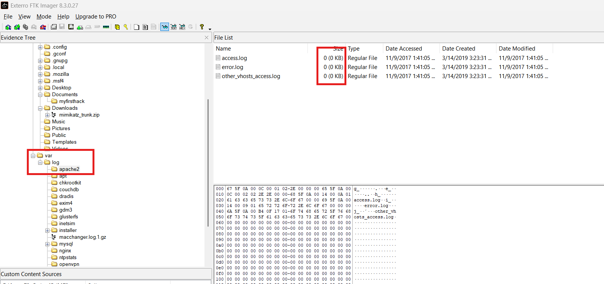
*   **Flag:** `0`

### Q8: This machine was used to launch an attack on another. Which file contains the evidence for this?
*   **Approach:** Search the `root` home directory for image/evidence files related to an external attack.
*   **Steps Taken:**
    *   Found an image file named `irZLAohL.jpeg` in the `root` directory.
    *   The image showed a command prompt belonging to a user named **Bob**, while the current machine is Karen's own Kali box — strongly suggesting Karen successfully compromised Bob's machine and saved a screenshot as proof.
    *   The screenshot shows an executable `aylmao.exe` being run, launching a tool called **flightsim** — a tool used to generate malicious network traffic for security testing/simulation purposes.
*   **Evidence:**
    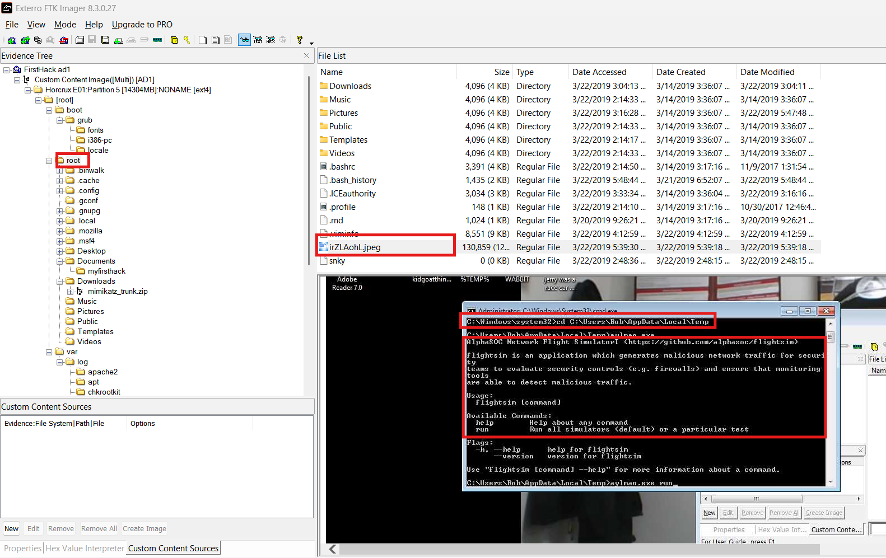
*   **Flag:** `irZLAohL.jpeg`

### Q9: It is believed that Karen was taunting a fellow computer expert through a bash script within the Documents directory. Who was the expert that Karen was taunting?
*   **Approach:** Review bash scripts inside the Documents folder for taunting comments.
*   **Steps Taken:**
    *   Found a file named `firstscript_fixed` in `/root/Documents/myfirsthack`.
    *   The script's content included the line: `echo "Heck yeah! I can write bash too Young"` — taunting someone named **Young**.
*   **Evidence:**
    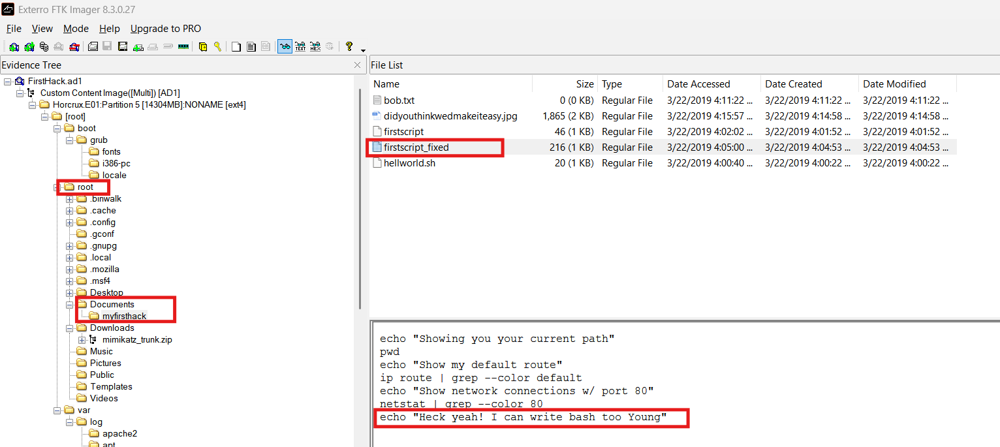
*   **Flag:** `Young`

### Q10: A user executed the su command to gain root access multiple times at 11:26. Who was the user?
*   **Approach:** Review the authentication log around the specified timestamp.
*   **Steps Taken:**
    *   Inspected `/var/log/auth.log`, around **March 20, 11:26**.
    *   Found repeated entries: `Successful su for postgres by root` — indicating the **postgres** account was repeatedly elevated via `su` by root.
*   **Evidence:**
    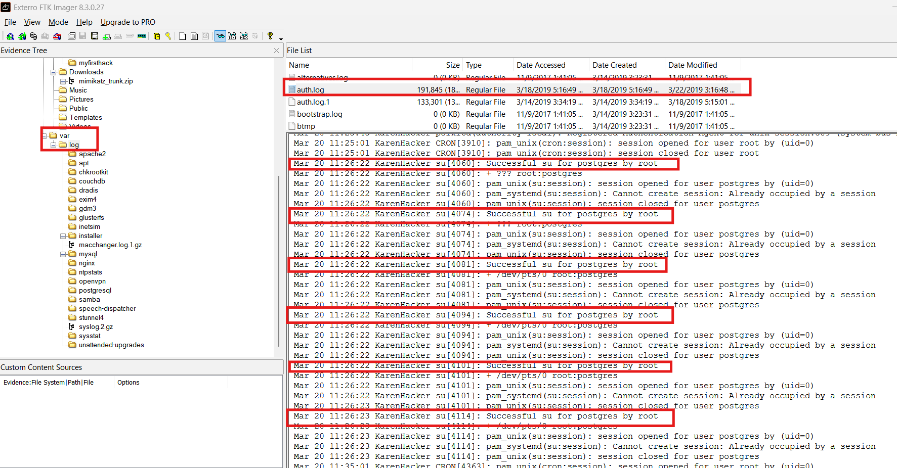
*   **Flag:** `postgres`

### Q11: Based on the bash history, what is the current working directory?
*   **Approach:** Trace the last `cd` command in the bash history to determine the final working directory.
*   **Steps Taken:**
    *   Reviewed `/root/.bash_history` and found the last directory-change command: `cd ../Documents/myfirsthack/`.
    *   Resolved this to the absolute path.
*   **Evidence:**
    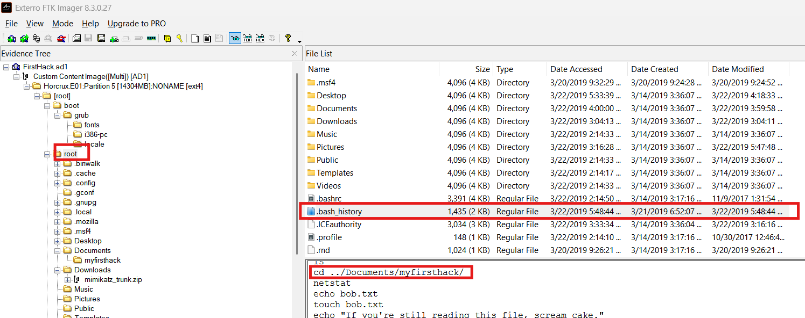
*   **Flag:** `/root/Documents/myfirsthack/`

---

## Summary / Timeline

1. Karen's machine runs **Kali Linux**, used both as her personal workstation and as an attack platform.
2. She downloaded **Mimikatz** (`mimikatz_trunk.zip`) for credential dumping, and used **binwalk** to extract a hidden payload from a steganographic JPG (`didyouthinkwedmakeiteasy.jpg`).
3. She created a file called `SuperSecretFile.txt` on her Desktop and maintained a personal goals checklist (ending in "profit").
4. Apache was installed but **never actually run** on this machine (0 KB logs).
5. Evidence (`irZLAohL.jpeg`) shows Karen successfully compromised a machine belonging to **Bob**, running a tool called `flightsim` via `aylmao.exe` to simulate/generate malicious network traffic.
6. A bash script in her Documents folder taunted a fellow expert named **Young**.
7. Repeated `su` escalations to the **postgres** account occurred at 11:26 via root.
8. Her last recorded working directory, per bash history, was `/root/Documents/myfirsthack/`.
