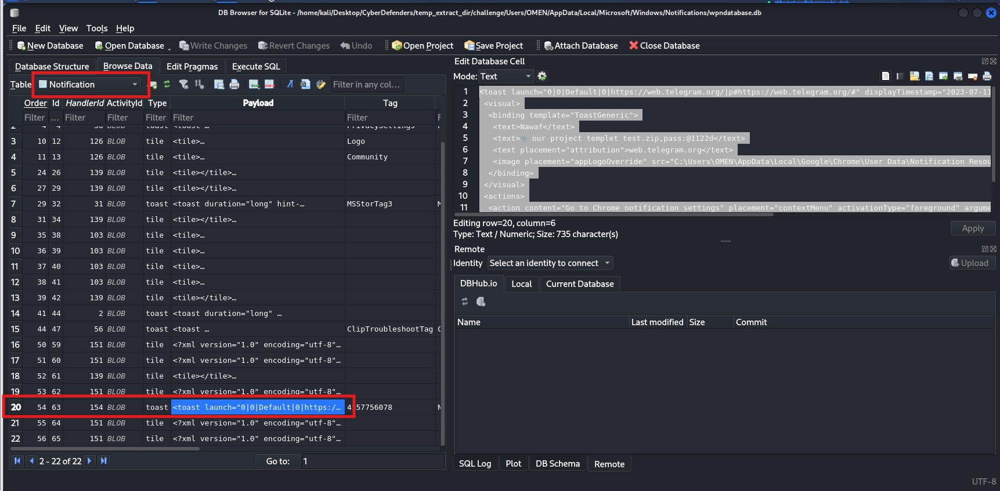
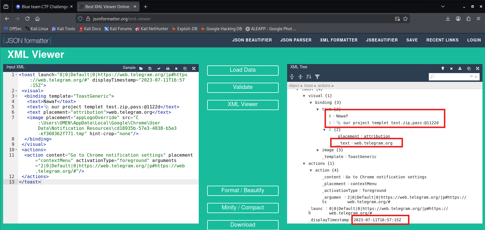
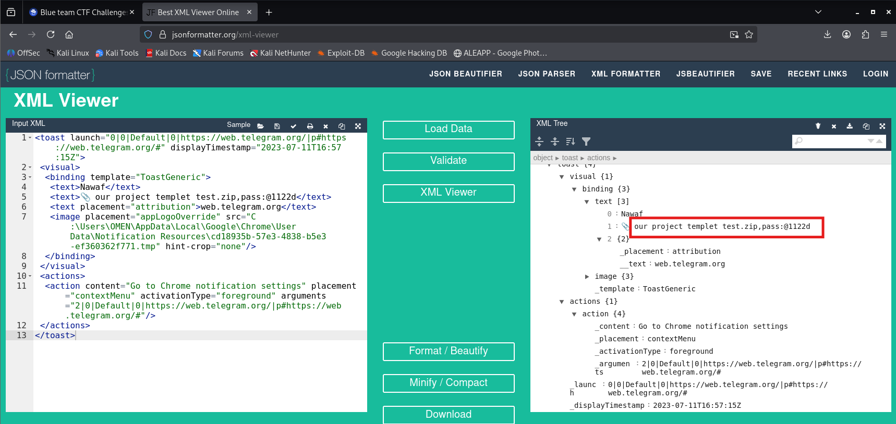
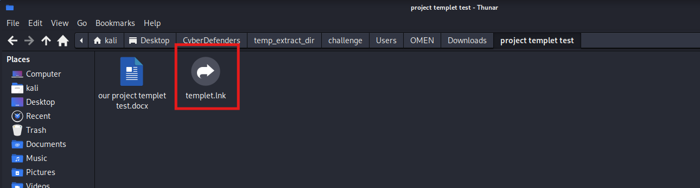
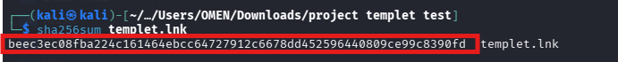
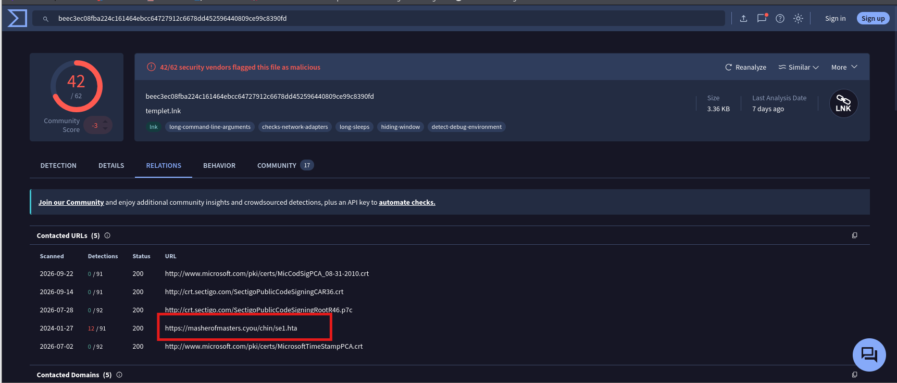
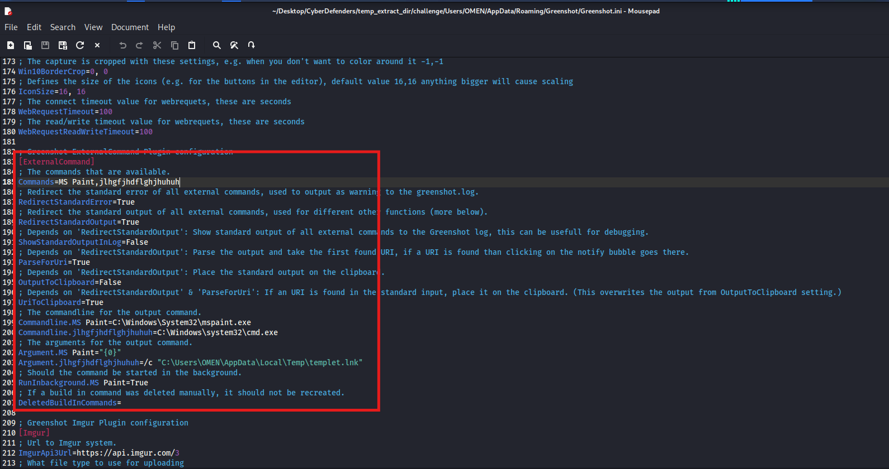
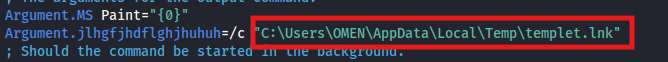
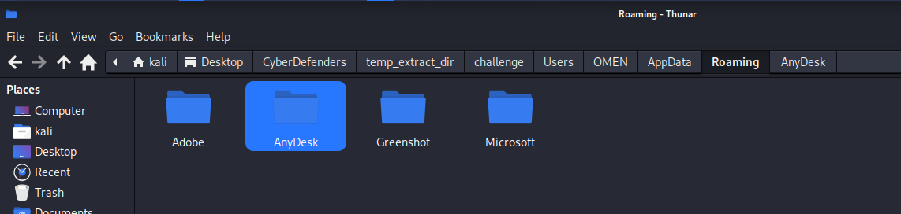
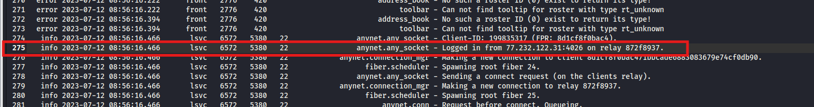

# CyberDefenders: KrakenKeyLogger Lab Writeup

**Category:** Endpoint Forensics | **Difficulty:** Medium
**Tools:** DB Browser for SQLite, LECmd, Timeline Explorer, VirusTotal

---

## Scenario

An employee at a large company was assigned a task with a two-day deadline. Realizing that he could not complete the task in that timeframe, he sought help from someone else. After one day, he received a notification from that person who informed him that he had managed to finish the assignment and sent it to the employee as a test. However, the person also sent a message to the employee stating that if he wanted the completed assignment, he would have to pay $160.

The helper's demand for payment revealed that he was a threat actor. The company's digital forensics team was called in to investigate and identify the attacker, determine the extent of the attack, and assess potential data breaches. The team must analyze the employee's computer and communication logs to prevent similar attacks in the future.

---

### Q1: What is the the web messaging app the employee used to talk to the attacker?
*   **Approach:** Inspect the Windows Push Notification database (`wpndatabase.db`) to uncover chat artifacts and identify the messaging platform used.
*   **Steps Taken:**
    *   Opened `wpndatabase.db` using DB Browser for SQLite and inspected the `Notification` table.
    *   Reviewed record entry #20, which stored an XML notification payload inside the `Payload` column.
    *   Parsed the XML payload to reveal an incoming message from "Nawaf" referencing `our project templet test.zip`.
    *   Identified the attribution URL domain `web.telegram.org`, confirming that the communication took place via Telegram.
*   **Evidence:**
    
    
*   **Flag:** `telegram`

### Q2: What is the password for the protected ZIP file sent by the attacker to the employee?
*   **Approach:** Extract the archive decryption password embedded inside the notification message body.
*   **Steps Taken:**
    *   Examined the text strings inside the parsed notification XML from Question 1.
    *   Located the text field specifying `our project templet test.zip,pass:@1122d`.
    *   Extracted the password required to unpack the ZIP file as `@1122d`.
*   **Evidence:**
    
*   **Flag:** `@1122d`

### Q3: What domain did the attacker use to download the second stage of the malware?
*   **Approach:** Analyze the extracted malicious shortcut (`.lnk`) file and query its external network connections.
*   **Steps Taken:**
    *   Navigated to the victim's extracted folder `Downloads/project templet test` and located `templet.lnk`.
    *   Calculated the SHA256 checksum of `templet.lnk`, obtaining `beec3ec08fba224c161464ebcc64727912c6678dd452596440809ce99c8390fd`.
    *   Queried the hash on VirusTotal and checked the **Relations** tab under **Contacted URLs**.
    *   Identified the contacted staging URL `https://masherofmasters.cyou/chin/se1.hta`, isolating the second-stage domain `masherofmasters.cyou`.
*   **Evidence:**
    
    
    
*   **Flag:** `masherofmasters.cyou`

### Q4: What is the name of the command that the attacker injected using one of the installed LOLAPPS on the machine to achieve persistence?
*   **Approach:** Audit configuration files of installed third-party utilities (LOLAPPS) to uncover abused external execution directives.
*   **Steps Taken:**
    *   Examined the victim's `AppData\Roaming` folder and identified an installed screenshot application named Greenshot.
    *   Inspected the `Greenshot.ini` configuration file under the `[ExternalCommand]` section.
    *   Discovered an anomalous command entry named `jlhgfjhdflghjhuhuh` defined alongside `MS Paint`.
    *   Identified that this command executes `cmd.exe` to trigger the malicious shortcut for persistence.
*   **Evidence:**
    
*   **Flag:** `jlhgfjhdflghjhuhuh`

### Q5: What is the complete path of the malicious file that the attacker used to achieve persistence?
*   **Approach:** Identify the target binary/shortcut path passed as a command argument in the persistence mechanism.
*   **Steps Taken:**
    *   Inspected the argument parameters for the injected command inside `Greenshot.ini`.
    *   Located the configuration key `Argument.jlhgfjhdflghjhuhuh=/c "C:\Users\OMEN\AppData\Local\Temp\templet.lnk"`.
    *   Retrieved the absolute file path used to achieve persistence as `C:\Users\OMEN\AppData\Local\Temp\templet.lnk`.
*   **Evidence:**
    
*   **Flag:** `C:\Users\OMEN\AppData\Local\Temp\templet.lnk`

### Q6: What is the name of the application the attacker utilized for data exfiltration?
*   **Approach:** Inspect application directories within user roaming data for remote administration tools utilized in unauthorized exfiltration.
*   **Steps Taken:**
    *   Reviewed installed directories in `AppData\Roaming`.
    *   Identified the installation directory for `AnyDesk`, which was leveraged by the attacker to establish remote access and exfiltrate data.
*   **Evidence:**
    
*   **Flag:** `AnyDesk`

### Q7: What is the IP address of the attacker?
*   **Approach:** Analyze remote session trace logs to extract the attacker's source IP address.
*   **Steps Taken:**
    *   Navigated to the AnyDesk application folder and opened the connection log file `ad1.trace`.
    *   Searched for established session events and incoming connections.
    *   Located log entry #275: `anynet.any_socket - Logged in from 77.232.122.31:4026 on relay 872f8937.`.
    *   Extracted the attacker's public IP address as `77.232.122.31`.
*   **Evidence:**
    
*   **Flag:** `77.232.122.31`
