# CyberDefenders Lab: Lespion Writeup

**Category:** Threat Intel | **Tools:** Sherlock, Google Lens, GitHub

---

### Q1: File -> Github.txt: What API key did the insider add to his GitHub repositories?

*   **Approach:** Analyze the provided GitHub link to locate the specific repository and file containing the API key.
*   **Steps Taken:**
    *   Open the GitHub link provided in the `Github.txt` file, which is `https://github.com/EMarseille99`.
    *   Observe that most repositories are forked, but one named `Project-Build---Custom-Login-Page` was created and worked on by the insider.
    *   Inspect the files within this repository and locate a file named `Login Page.js`.
    *   Inside this file, find the declared API Key.
*   **Evidence:**
    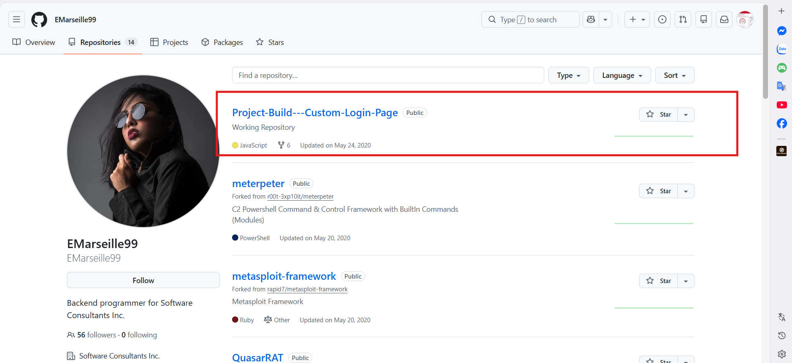
    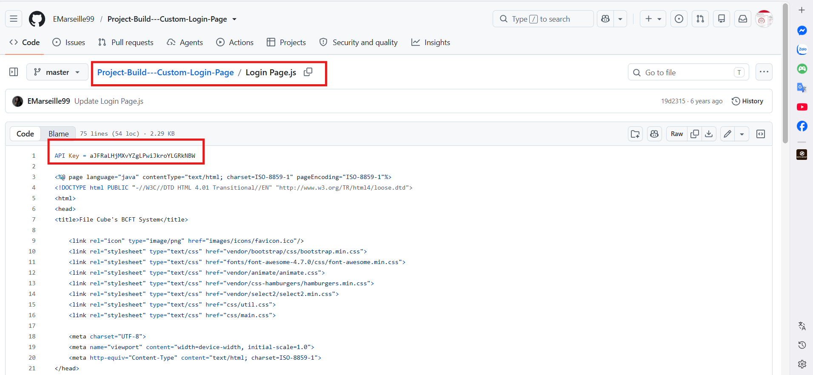
*   **Flag:** `aJFRaLHjMXvYZgLPwiJkroYLGRkNBW`

---

### Q2: File -> Github.txt: What plaintext password did the insider add to his GitHub repositories?

*   **Approach:** Examine the same JavaScript file to find and decode the hidden password.
*   **Steps Taken:**
    *   Within the `Login Page.js` file found in Q1, identify a base64 encoded password added by the insider.
    *   The encoded string is `UGljYXNzb0JhZ3VldHRlOTk=`.
    *   Decode this base64 string to reveal the plaintext password.
*   **Evidence:**
    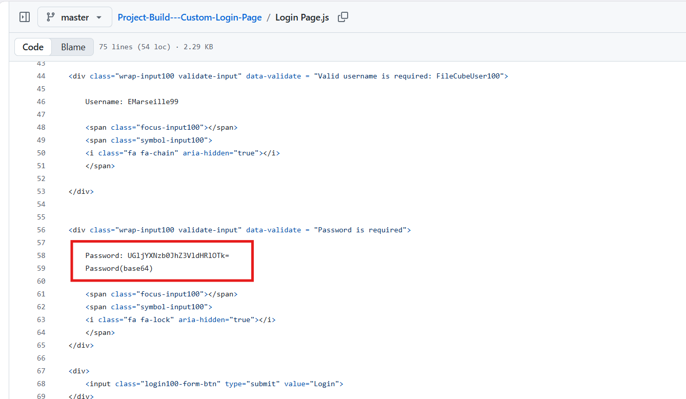
    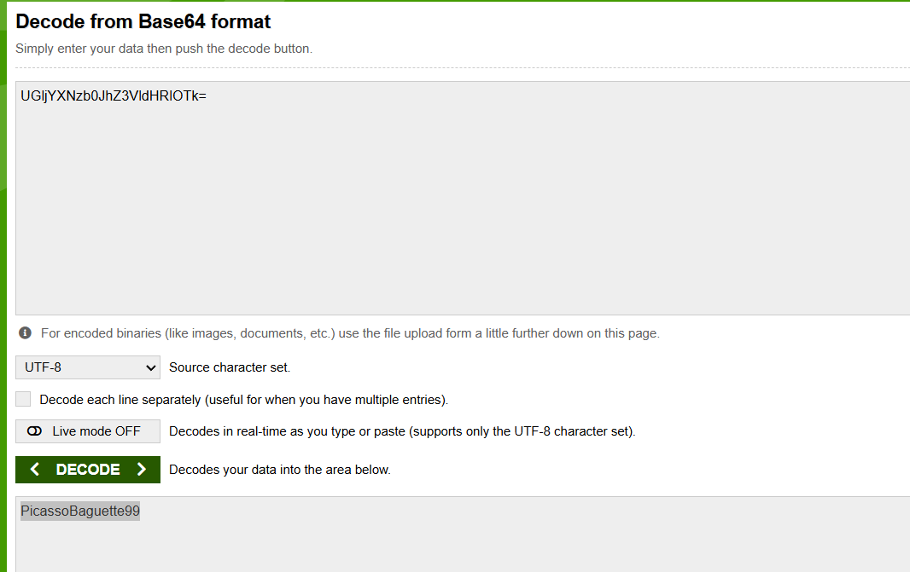
*   **Flag:** `PicassoBaguette99`

---

### Q3: File -> Github.txt: What cryptocurrency mining tool did the insider use?

*   **Approach:** Search the insider's repository list for known cryptocurrency mining software.
*   **Steps Taken:**
    *   Review the list of repositories on the insider's GitHub profile.
    *   Identify a repository named `xmrig`, which was forked from `xmrig/xmrig`.
    *   Note that XMRig is an open-source cryptocurrency mining tool often used to mine Monero (XMR) and frequently utilized in illegal cryptojacking activities.
*   **Evidence:**
    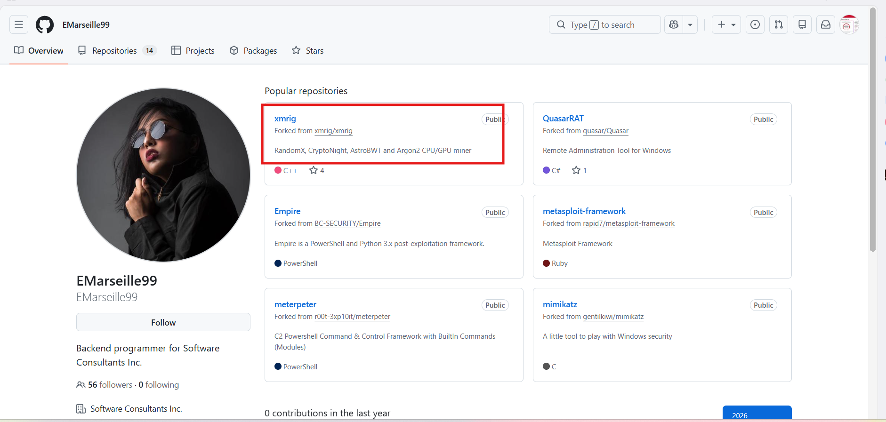
*   **Flag:** `xmrig`

---

### Q4: On which gaming website did the insider have an account?

*   **Approach:** Utilize OSINT tools to find other online accounts associated with the insider's username.
*   **Steps Taken:**
    *   Use the OSINT tool Sherlock to search for information related to the insider's username, `EMarseille99`.
    *   Analyze the output from Sherlock to find an account on a gaming website.
    *   The tool successfully locates an account on Steam, with the full profile URL being `https://steamcommunity.com/id/EMarseille99/`.
*   **Evidence:**
    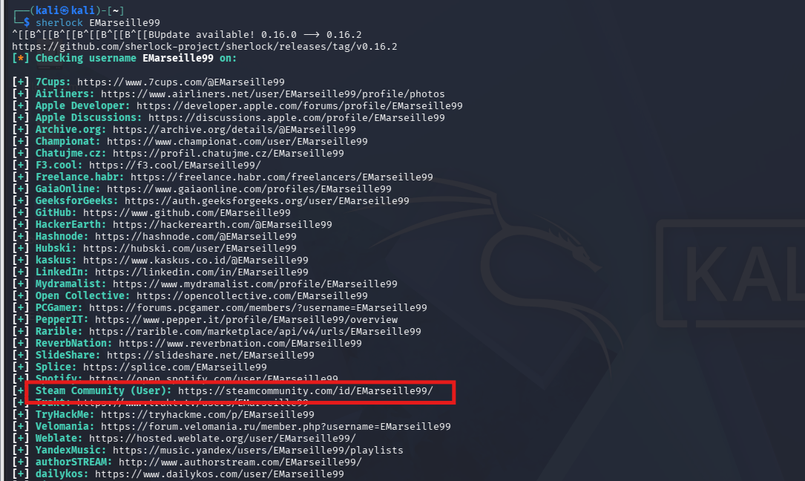
*   **Flag:** `steam`

---

### Q5: What is the link to the insider Instagram profile?

*   **Approach:** Extract the Instagram profile link from the previous OSINT search results.
*   **Steps Taken:**
    *   Review the results generated by the Sherlock tool in the previous step.
    *   Identify the URL for the insider's Instagram profile.
    *   The identified link is `https://www.instagram.com/EMarseille99`.
*   **Flag:** `https://www.instagram.com/EMarseille99/`

---

### Q6: Which country did the insider visit on her holiday?

*   **Approach:** Analyze the insider's Instagram posts to determine their holiday destination.
*   **Steps Taken:**
    *   Visit the discovered Instagram profile link to view the insider's uploads regarding a holiday.
    *   Use Google Lens to perform a reverse image search on the holiday photo.
    *   The search results identify the location as Marina Bay Sands in Singapore.
*   **Evidence:**
    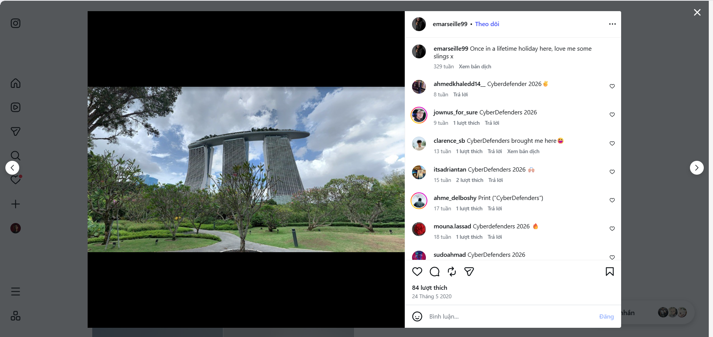
    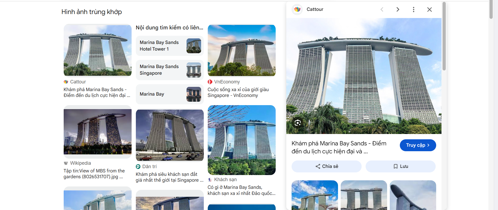
*   **Flag:** `Singapore`

---

### Q7: Which city does the insider family live in?

*   **Approach:** Review the insider's Instagram profile for clues about their residence.
*   **Steps Taken:**
    *   Examine the images uploaded by the insider on their Instagram account.
    *   Identify a photo that indicates the insider's family lives in a city in Dubai.
*   **Evidence:**
    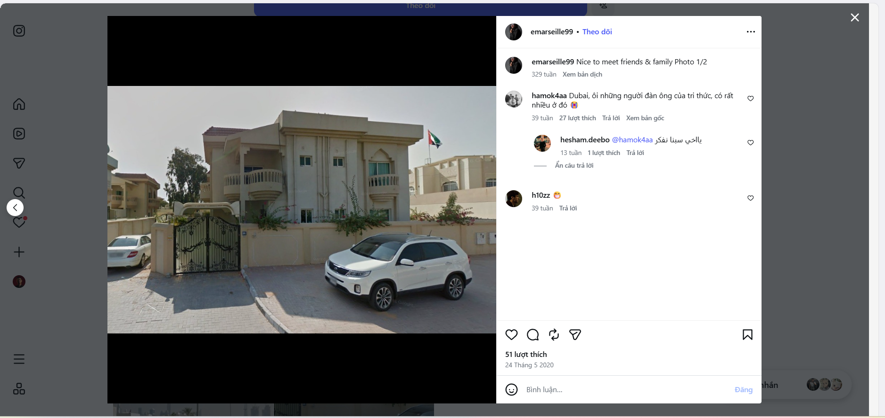
*   **Flag:** `Dubai`

---

### Q8: File -> office.jpg: You have been provided with a picture of the building in which the company has an office. Which city is the company located in?

*   **Approach:** Use reverse image searching to identify the city from the provided `office.jpg` file.
*   **Steps Taken:**
    *   Analyze the provided `office.jpg` image file.
    *   Perform a reverse image search using Google Lens.
    *   The results reveal that the image is from the city of Birmingham, England.
*   **Evidence:**
    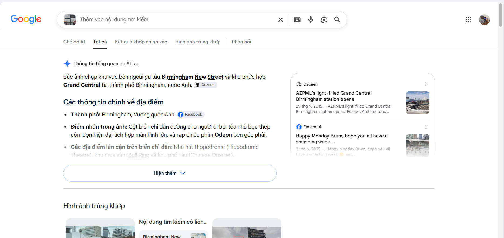
*   **Flag:** `Birmingham`

---

### Q9: File -> Webcam.png: With the intel, you have provided, our ground surveillance unit is now overlooking the person of interest suspected address... Which state is this camera in?

*   **Approach:** Identify the state of the webcam using reverse image search on the `Webcam.png` file.
*   **Steps Taken:**
    *   Use Google Lens to analyze the `Webcam.png` image.
    *   Determine that the camera is located at the Main Building of the University of Notre Dame.
    *   Identify that this university is situated in the state of Indiana, USA.
*   **Evidence:**
    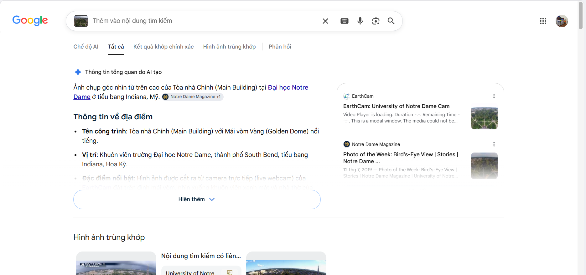
*   **Flag:** `Indiana`
