# CyberDefenders: Lockdown Lab Writeup

**Category:** Network Forensics | **Difficulty:** Easy
**Tactics:** Execution, Persistence, Privilege Escalation, Stealth, Discovery, Lateral Movement, Command and Control
**Tools:** Wireshark, Volatility 3, FLOSS/Strings, VirusTotal, MemProcFS

---

## Scenario

TechNova Systems' SOC has detected suspicious outbound traffic from a public-facing IIS server in its cloud platform—activity suggestive of a web-shell drop and covert connections to an unknown host.

As the forensic examiner, you have three critical artefacts in hand: a PCAP capturing the initial traffic, a full memory image of the server, and a malware sample recovered from disk. Reconstruct the intrusion and all of the attacker's activities so TechNova can contain the breach and strengthen its defenses.

---

## PCAP Analysis

### Q1: After flooding the IIS host with rapid-fire probes, the attacker reveals their origin. Which IP address generated this reconnaissance traffic?
*   **Approach:** Use Wireshark's Conversations statistics to spot a traffic spike between two hosts, then isolate that traffic to identify the scanning pattern.
*   **Steps Taken:**
    *   Opened the PCAP and navigated to **Statistics → Conversations → IPv4**.
    *   Identified a sudden traffic spike between `10.0.2.4` and `10.0.2.15`.
    *   Applied the filter `ip.addr==10.0.2.4` to isolate all packets involving the suspected attacker IP.
    *   Observed `10.0.2.4` sending a flood of TCP SYN packets to numerous ports on `10.0.2.15` (113, 5900, 143, 587, 1025, 110, 445, 80, 256, 111, 22, 443, …) — a classic TCP SYN port scan.
*   **Evidence:**
    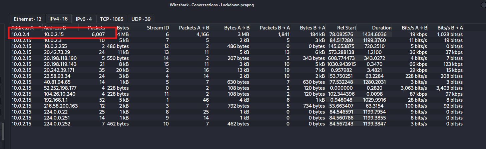
    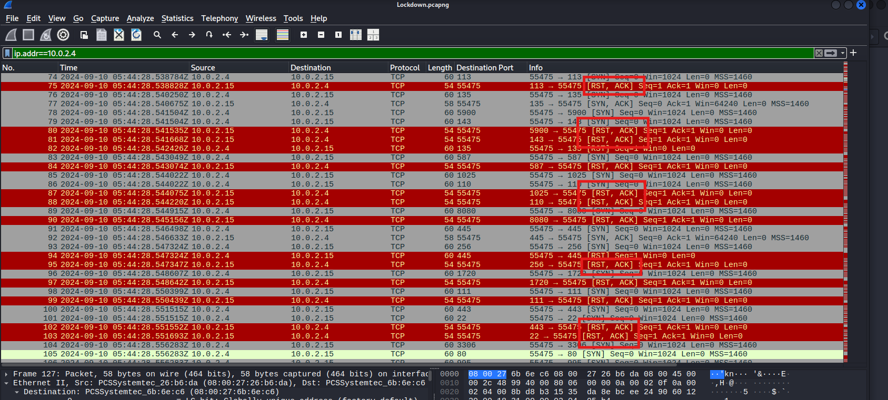
*   **Flag:** `10.0.2.4`

### Q2: The attacker is carrying out targeted enumeration against the HTTP service on the IIS host. Based on the HTTP request headers, which tool is being used?
*   **Approach:** Narrow the scan results down to the ports that responded, then inspect the HTTP traffic exchanged on the open port.
*   **Steps Taken:**
    *   Applied the filter `ip.addr==10.0.2.4 and tcp.flags==0x012` to isolate SYN-ACK responses (the open ports).
    *   Found four open ports on the victim (`135, 445, 80, 139`), with a large volume of traffic exchanged on port 80 from packet #2109 onward.
    *   Applied the filter `ip.addr==10.0.2.4 and http` to inspect the HTTP requests directly.
    *   The HTTP request headers revealed the attacker was running large-scale reconnaissance using **Nmap**, identifiable from its User-Agent/HTTP signature.
*   **Evidence:**
    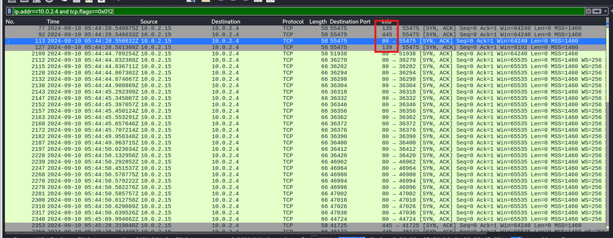
    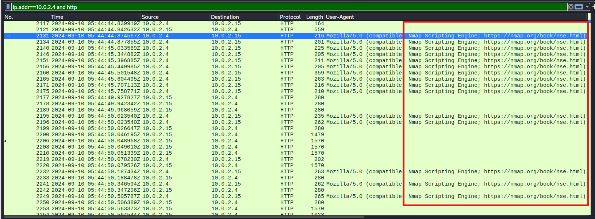
*   **Flag:** `nmap`

### Q3: While reviewing the SMB traffic, you observe two consecutive Tree Connect requests that expose the first shares the intruder probes on the IIS host. Which two full UNC paths are accessed?
*   **Approach:** Filter for SMB2 traffic and walk through the protocol negotiation, authentication, and Tree Connect sequence.
*   **Steps Taken:**
    *   Applied the filter `ip.addr==10.0.2.4 and smb2`.
    *   Observed SMB2 Protocol Negotiation (packets #2388–#2400, #2616–#2619) between `10.0.2.4` and `10.0.2.15`.
    *   Observed NTLM authentication (packets #2622–#2628) using account **WORKGROUP\root**.
    *   Packets #2629–#2630: successful **Tree Connect Request** to the hidden admin share `\\10.0.2.15\IPC$`.
    *   Packets #2631–#2637: opened the `srvsvc` named pipe, bound the **SRVSVC V3.0** RPC interface, and issued a `NetShareEnumAll` request/response — enumerating all shares (visible and hidden) on the host.
    *   Packets #2639–#2671: closed the `IPC$` session, then re-authenticated as `WORKGROUP\root`.
    *   Packets #2674–#2679: queried `FSCTL_DFS_GET_REFERRALS` for `\\10.0.2.15\Documents`, disconnected from `IPC$`, then issued a **Tree Connect Request** to `\\10.0.2.15\Documents`, which succeeded.
    *   Packets #2684–#2696: browsed and enumerated files/directories inside `Documents` (`SMB2_FIND_ID_BOTH_DIRECTORY_INFO`, pattern `*`) and queried free disk space.
*   **Evidence:**
    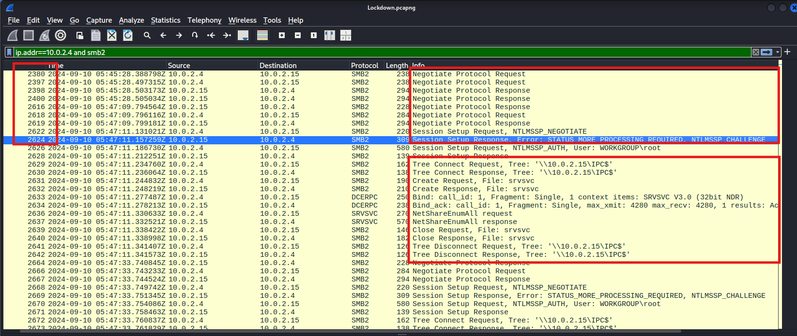
    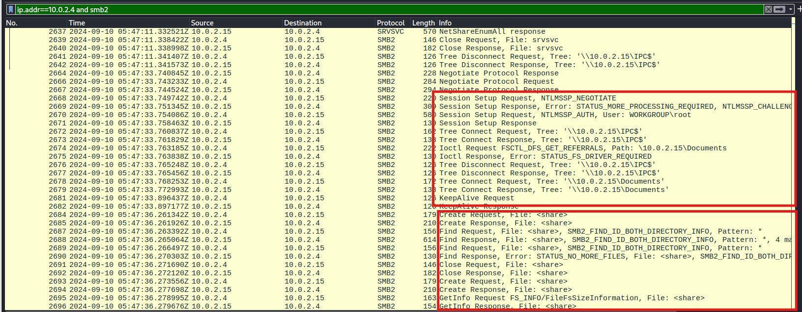
*   **Flag:** `\\10.0.2.15\Documents`, `\\10.0.2.15\IPC$`

### Q4: Inside the share, the attacker plants a web-accessible payload that will grant remote code execution. What is the filename of the malicious file they uploaded?
*   **Approach:** Continue tracing SMB2 traffic past the Tree Connect to find file creation and write operations inside the share.
*   **Steps Taken:**
    *   Continued with the filter `ip.addr==10.0.2.4 and smb2`.
    *   Packet #2783: attacker issues a **Create Request** for a new file named `shell.aspx`, which succeeds.
    *   Packet #3505: attacker writes the payload content into `shell.aspx`, then closes the file handle.
    *   Confirmed this as the malicious ASPX web shell uploaded for remote code execution.
*   **Evidence:**
    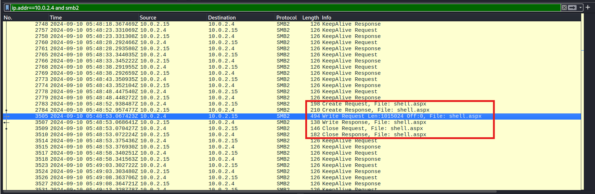
*   **Flag:** `shell.aspx`

### Q5: The newly planted shell calls back to the attacker over an uncommon but firewall-friendly port. Which listening port did the attacker use for the reverse shell?
*   **Approach:** Trace traffic after the shell upload to find when it's accessed and what callback port is used.
*   **Steps Taken:**
    *   Applied the filter `ip.addr==10.0.2.4 and frame.number > 3505` (immediately after the payload write).
    *   Packet #3573: attacker sends an HTTP GET for `shell.aspx`, triggering execution.
    *   From packet #3585 onward, observed a large volume of traffic to/from **port 4443** — the reverse shell listener.
*   **Evidence:**
    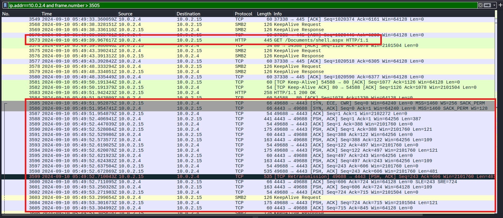
*   **Flag:** `4443`

---

## Memory Dump Analysis

### Q6: Your memory snapshot captures the system's kernel in situ, providing vital context for the breach. What is the kernel base address in the dump?
*   **Approach:** Use Volatility 3's system info plugin to extract kernel metadata from the memory image.
*   **Steps Taken:**
    *   Ran `python3 vol.py -f Lockdown.mem windows.info`.
    *   Extracted the **Kernel Base** value from the plugin output.
*   **Evidence:**
    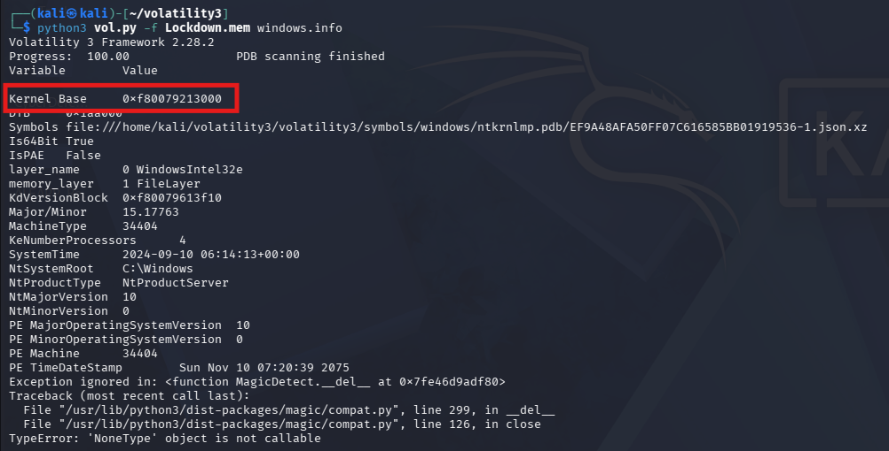
*   **Flag:** `0xf80079213000`

### Q7: A trusted service launches an unfamiliar executable residing outside the usual IIS stack, signalling a persistence implant. What is the final full on-disk path of that executable?
*   **Approach:** Enumerate running processes to find a suspicious child process of the IIS worker process, then confirm its origin via command-line arguments.
*   **Steps Taken:**
    *   Ran `python3 vol.py -f Lockdown.mem windows.pslist`.
    *   Identified `w3wp.exe` (IIS Worker Process, PID 4332) — a process that should never legitimately spawn a standalone `.exe`.
    *   Found that `w3wp.exe` spawned `updatenow.exe` (PID 900), a critical red flag consistent with a web shell invoking `System.Diagnostics.Process.Start()`.
    *   Reconstructed the timeline: `shell.aspx` written via SMB at **05:48:53 UTC** → `w3wp.exe` executes `updatenow.exe` at **06:08:23 UTC** → `FTK Imager.exe` launched at **06:09:42 UTC** to capture memory.
    *   Ran `python3 vol.py -f Lockdown.mem windows.cmdline --pid 900` to confirm the full path of the implant.
    *   The path places the binary inside the **Startup** folder, ensuring it auto-executes on every user logon — a classic persistence technique.
*   **Evidence:**
    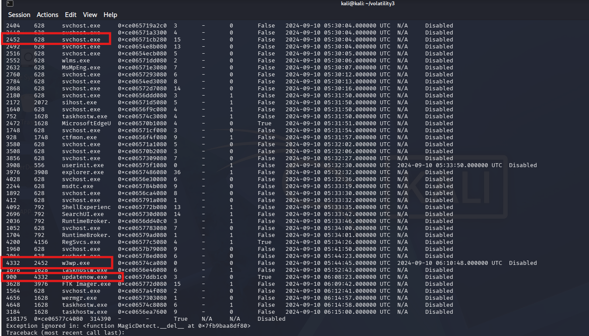
    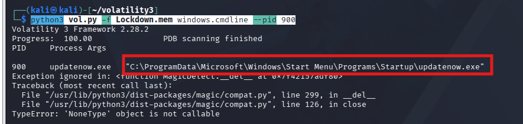
*   **Flag:** `C:\ProgramData\Microsoft\Windows\Start Menu\Programs\Startup\updatenow.exe`

### Q8: The reverse shell's outbound traffic is handled by a built-in Windows process that also spawns the implanted executable. What is the name of this process, and what PID does it run under?
*   **Approach:** Correlate the implant's parent process from the process tree established in Q7.
*   **Steps Taken:**
    *   From Q7, confirmed `updatenow.exe` (PID 900) has a **PPID of 4332**, which corresponds to `w3wp.exe`.
    *   `w3wp.exe` is the legitimate IIS worker process responsible for handling HTTP/HTTPS requests and executing web application code (ASP.NET), and in this case also handled the reverse shell's outbound traffic and spawned the implant.
*   **Evidence:**
    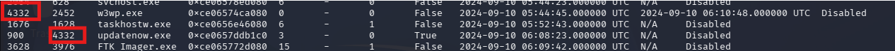
*   **Flag:** `w3wp.exe`, `4332`

---

## Malware Sample Analysis

### Q9: Static inspection reveals the binary has been packed to hinder analysis. Which packer was used to obfuscate it?
*   **Approach:** Run string analysis on the recovered binary to look for packer signatures and section names.
*   **Steps Taken:**
    *   Ran `strings updatenow.exe`.
    *   Identified the characteristic section names **UPX0** and **UPX1**, along with the magic signature **UPX!** and version marker **3.91**.
*   **Evidence:**
    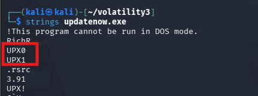
*   **Flag:** `UPX`

### Q10: Threat-intel analysis shows the malware beaconing to its command-and-control host. Which fully qualified domain name (FQDN) does it contact?
*   **Approach:** Submit the malware sample/hash to VirusTotal and inspect its sandboxed network behavior.
*   **Steps Taken:**
    *   Looked up `updatenow.exe` on VirusTotal.
    *   Navigated to the **Relations** tab → **Contacted Domains**.
    *   Identified the C2 FQDN `cp8nl.hyperhost.ua`.
*   **Evidence:**
    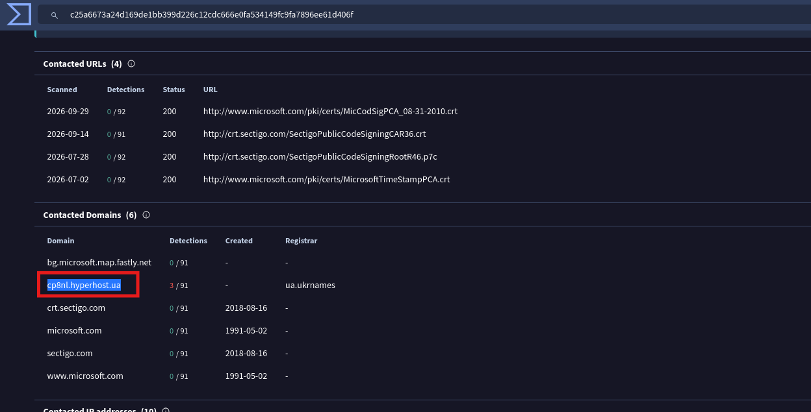
*   **Flag:** `cp8nl.hyperhost.ua`

### Q11: Open-source intel associates that hash with a well-known commodity RAT. To which malware family does the sample belong?
*   **Approach:** Review AV vendor verdicts on VirusTotal's Detection tab to determine the consensus malware family.
*   **Steps Taken:**
    *   Reviewed the **Detection** tab on VirusTotal for `updatenow.exe`.
    *   Multiple AV vendors converged on the same classification: **AgentTesla**.
*   **Evidence:**
    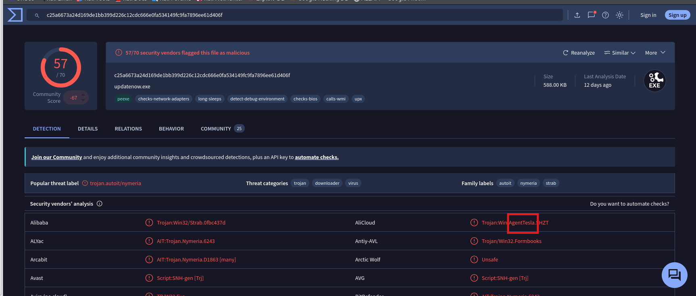
*   **Flag:** `AgentTesla`

---

## Summary / Timeline

1. **Recon:** `10.0.2.4` floods `10.0.2.15` with a TCP SYN scan, then runs targeted Nmap enumeration against HTTP (port 80).
2. **SMB Enumeration:** Authenticates as `WORKGROUP\root`, enumerates shares via `IPC$`/`NetShareEnumAll`, then connects to `\\10.0.2.15\Documents`.
3. **Web Shell Drop:** Uploads `shell.aspx` into the share (webroot) via SMB.
4. **Execution & C2:** Accesses `shell.aspx` over HTTP, establishing a reverse shell that calls back on port **4443**.
5. **Persistence:** The web shell (`w3wp.exe`, PID 4332) spawns `updatenow.exe` (PID 900), planted in the Startup folder for auto-execution on logon.
6. **Malware Analysis:** `updatenow.exe` is a UPX-packed binary that beacons to `cp8nl.hyperhost.ua` and is identified as **AgentTesla**, a well-known commodity infostealer/RAT.
