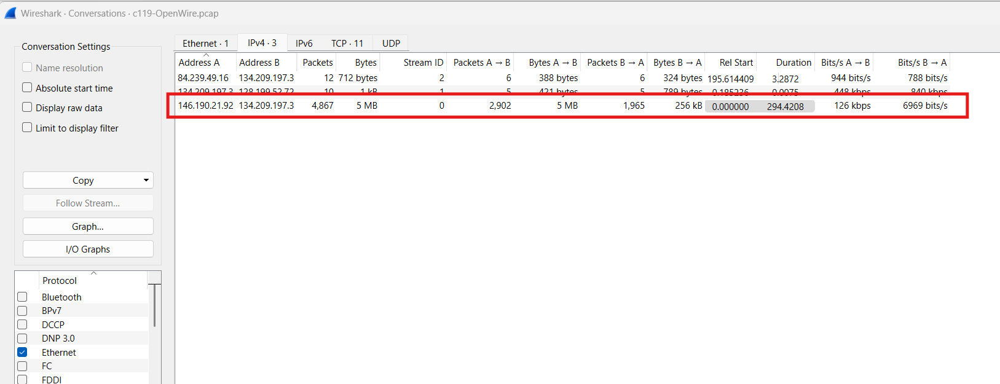
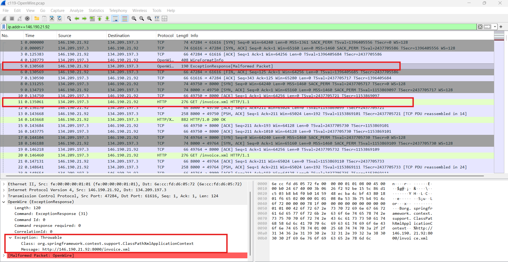
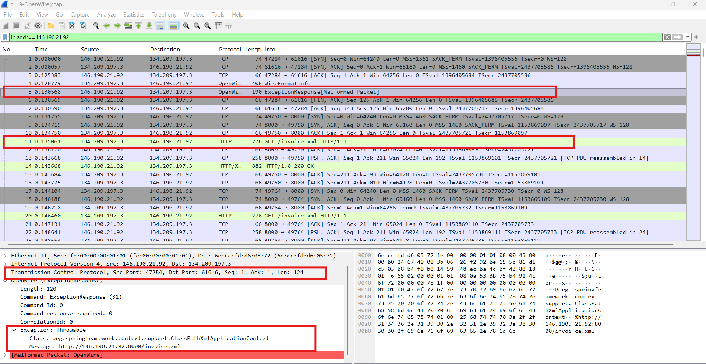
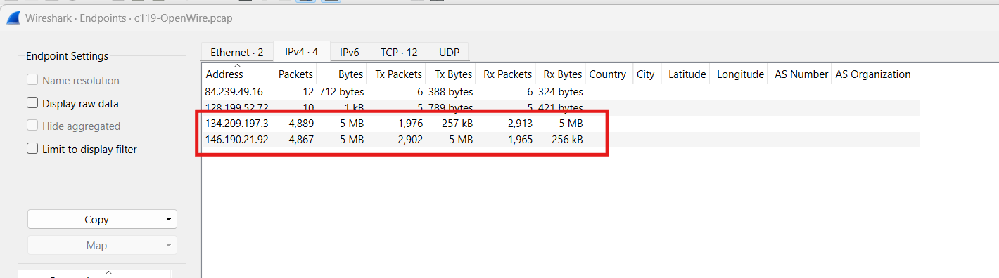
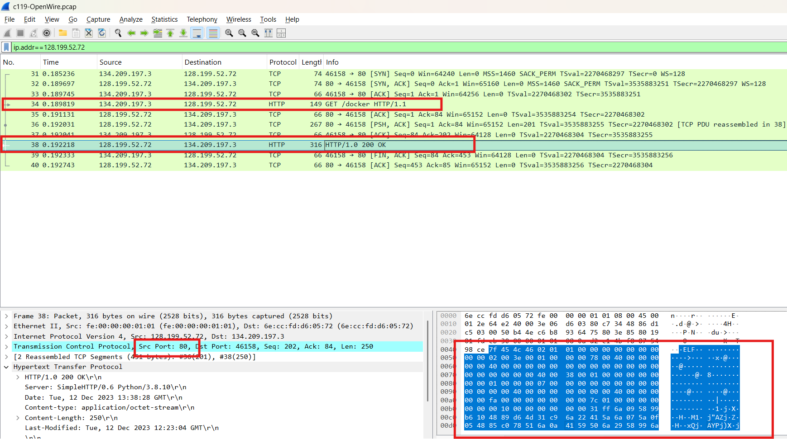
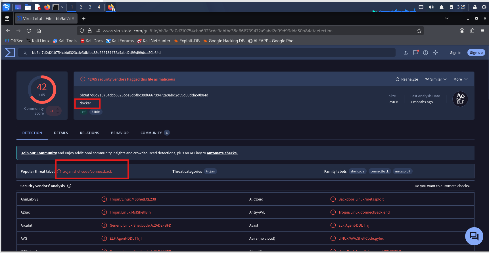
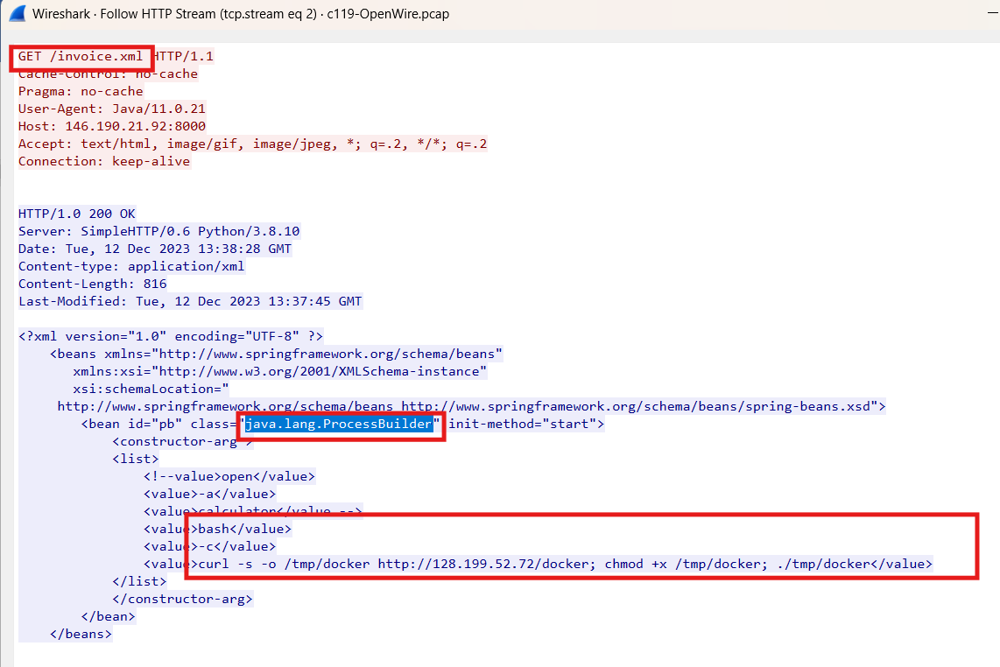
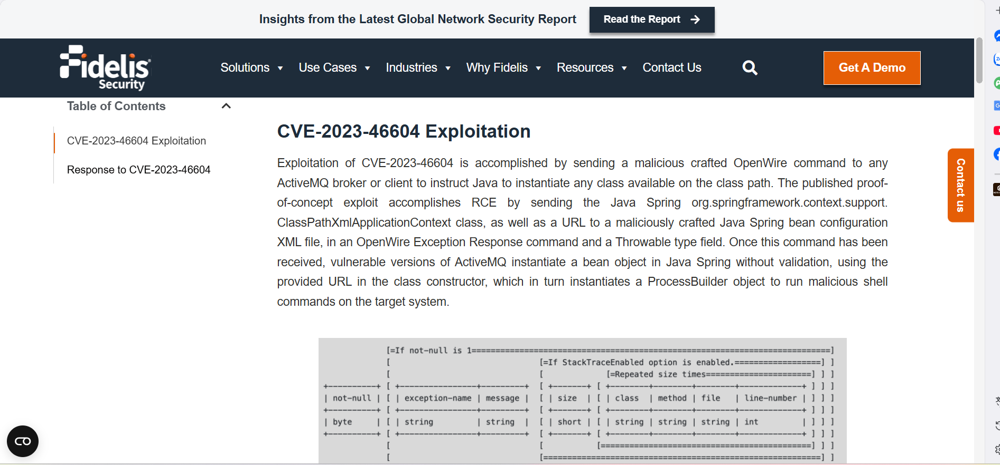
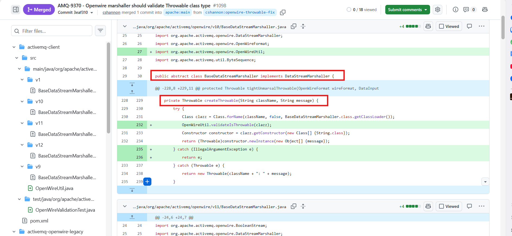

# CyberDefenders Lab: OpenWire Writeup

**Category:** Network Forensics | **Difficulty:** Medium
**Tactics:** Initial Access, Execution, Command and Control
**Tools:** Wireshark, Zui, Network Miner

**Description:** 
This lab focuses on investigating a remote code execution incident stemming from a Java deserialization vulnerability within an Apache ActiveMQ environment.

**Scenario Summary:** 
Stepping into the role of a Tier-2 SOC Analyst, you are tasked with investigating a public-facing server that triggered alerts after communicating with multiple suspicious external IP addresses. Following standard incident response procedures, the server has been isolated to contain the threat and prevent data exfiltration. Your objective is to thoroughly analyze the provided network packet capture (PCAP) to uncover the attacker's footprint, trace the exploitation vectors, and identify the full scope of the malicious activity.

---

### Q1: By identifying the C2 IP, we can block traffic to and from this IP, helping to contain the breach and prevent further data exfiltration or command execution. Can you provide the IP of the C2 server that communicated with our server?

*   **Approach:** Analyze network conversations to identify abnormal traffic patterns and locate the initial Command and Control (C2) server triggering the exploit.
*   **Steps Taken:**
    *   Reviewing the Wireshark Conversations tab reveals a large volume of abnormal traffic between IP `146.190.21.92` and the target server `134.209.197.3`.
    *   Applying the filter `ip.addr==146.190.21.92` shows that the attacker sent an OpenWire Exception Response Command. 
    *   This specific command triggers the exploit to instantiate an object of the `org.springframework.context.support.ClassPathXmlApplicationContext` class. 
    *   The payload forces the server to load a bean object defined by a malicious XML file hosted at `http://146.190.21.92:8000/invoice.xml`.
*   **Evidence:**
    
    
*   **Flag:** `146.190.21.92`

---

### Q2: Initial entry points are critical to trace the attack vector back. What is the port number of the service the adversary exploited?

*   **Approach:** Inspect the targeted destination port of the malicious packets.
*   **Steps Taken:**
    *   Based on Frame 5 from the packet capture, the adversary attempted to exploit the service running on port 61616.
    *   This is the default port utilized by the Apache ActiveMQ service.
*   **Evidence:**
    
*   **Flag:** `61616`

---

### Q3: Following up on the previous question, what is the name of the service found to be vulnerable?

*   **Approach:** Correlate the exploited port number with its default associated service.
*   **Steps Taken:**
    *   As discovered in Q2, the adversary targeted port 61616.
    *   This port is widely known as the default listening port for the Apache ActiveMQ service.
*   **Flag:** `Apache ActiveMQ`

---

### Q4: The attacker's infrastructure often involves multiple components. What is the IP of the second C2 server?

*   **Approach:** Trace the subsequent network requests initiated by the compromised server to identify additional attacker infrastructure.
*   **Steps Taken:**
    *   In the Wireshark Statistics -> Endpoints tab, isolating the known vulnerable server (`134.209.197.3`) and the first C2 server (`146.190.21.92`) reveals a connection to another suspicious IP: `128.199.52.72`.
    *   Applying the filter `ip.addr==128.199.52.72` shows that the compromised server made an HTTP GET request to this new IP for a file named `docker` in Frame 34.
    *   Inspecting the Hex dump of this file reveals it is not related to legitimate Docker software, but is actually an ELF (Executable and Linkable Format) file, which is a standard binary executable format on Linux.
    *   This establishes the attack chain: the hacker exploited Apache ActiveMQ on port 61616, triggered the `invoice.xml` file, and the compromised server automatically sent an unencrypted HTTP GET request over port 80 to the second C2 server (`128.199.52.72`) to fetch the payload.
*   **Evidence:**
    
    
*   **Flag:** `128.199.52.72`

---

### Q5: Attackers usually leave traces on the disk. What is the name of the reverse shell executable dropped on the server?

*   **Approach:** Identify the name of the malicious payload downloaded during the post-exploitation phase.
*   **Steps Taken:**
    *   As established in Q4, the compromised web server initiated a GET request for an ELF binary masquerading under the name `docker`.
    *   Exporting this file from the PCAP and analyzing it on VirusTotal reveals that security vendors flag it as a trojan and a shellcode connectback payload.
    *   This confirms that the file named `docker` is indeed the dropped reverse shell executable.
*   **Evidence:**
    
*   **Flag:** `docker`

---

### Q6: What Java class was invoked by the XML file to run the exploit?

*   **Approach:** Extract and analyze the contents of the malicious XML payload to determine the underlying command execution mechanism.
*   **Steps Taken:**
    *   By following the HTTP Stream of the GET request that fetched the `invoice.xml` file, the plaintext XML configuration is revealed.
    *   The XML file leverages a specific bean configuration to invoke the `java.lang.ProcessBuilder` class, which is used to execute the malicious shell commands on the system.
*   **Evidence:**
    
*   **Flag:** `java.lang.ProcessBuilder`

---

### Q7: To better understand the specific security flaw exploited, can you identify the CVE identifier associated with this vulnerability?

*   **Approach:** Use OSINT and threat intelligence reports to map the observed exploit behavior to a known Common Vulnerabilities and Exposures (CVE) record.
*   **Steps Taken:**
    *   Researching the analyzed behaviors highlights a specific exploit path: sending the `org.springframework.context.support.ClassPathXmlApplicationContext` class alongside a malicious XML URL within an OpenWire Exception Response command.
    *   The vulnerable ActiveMQ version instantiates a Java Spring bean object without validation, passing the URL to the class constructor to invoke a `ProcessBuilder` object for malicious shell command execution (dropping the masqueraded `docker` file).
    *   This precise attack methodology is documented under the identifier CVE-2023-46604.
*   **Evidence:**
    
*   **Flag:** `CVE-2023-46604`

---

### Q8: The vendor addressed the vulnerability by adding a validation step to ensure that only valid Throwable classes can be instantiated, preventing exploitation. In which Java class and method was this validation step added?

*   **Approach:** Examine the official patch and source code commits to identify where the security fix was implemented.
*   **Steps Taken:**
    *   Reviewing the vendor's patch commit for this vulnerability reveals the addition of a strict validation step.
    *   The code fix was applied directly within the `BaseDataStreamMarshaller` class.
    *   Specifically, the validation to accurately verify if the instantiated class is a `Throwable` type was added to the `createThrowable` method.
*   **Evidence:**
    
*   **Flag:** `BaseDataStreamMarshaller.createThrowable`
