# CyberDefenders Lab: PacketMaze Writeup

**Category:** Network Forensics | **Difficulty:** Medium
**Tactic:** Initial Access
**Tools:** Brim, suricatarunner, suricata.rules, NetworkMiner, Wireshark, MAC lookup

**Scenario:** 
A company's internal server has been flagged for unusual network activity, with multiple outbound connections to an unknown external IP. Initial analysis suggests possible data exfiltration. Investigate the provided network logs to determine the source and method of compromise.

---

### Q1: What is the FTP password?
*   **Approach:** FTP (File Transfer Protocol) operates as a client-server model and transmits credentials in plaintext. By filtering the traffic, authentication details can be extracted.
*   **Steps Taken:** 
    *   Applied the `ftp` filter in Wireshark.
    *   Observed an established FTP session where the client requested to log in with the username `kali`.
    *   The subsequent packet revealed the password sent in cleartext.
*   **Evidence:**
    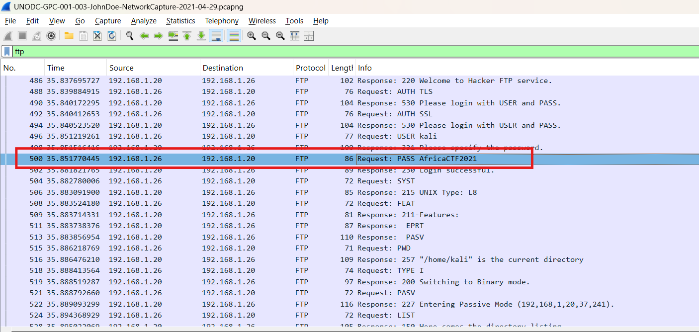
*   **Flag:** `AfricaCTF2021`

### Q2: What is the IPv6 address of the DNS server used by 192.168.1.26?
*   **Approach:** Identify DNS queries originating from the target machine and correlate dual-stack (IPv4 and IPv6) behavior.
*   **Steps Taken:**
    *   Applied the `dns` filter to focus solely on DNS-related packets.
    *   Analyzed packets 464 and 474, noting they occurred almost simultaneously and shared the exact same Transaction ID (`0x6820`).
    *   Verified the Source MAC address for both packets, confirming they originated from the same physical interface. This indicates the host `192.168.1.26` supports dual-stack networking and sent queries over both protocols concurrently.
    *   Extracted the destination IPv6 address from packet 474, which is a Link-Local Address (LLA).
*   **Evidence:**
    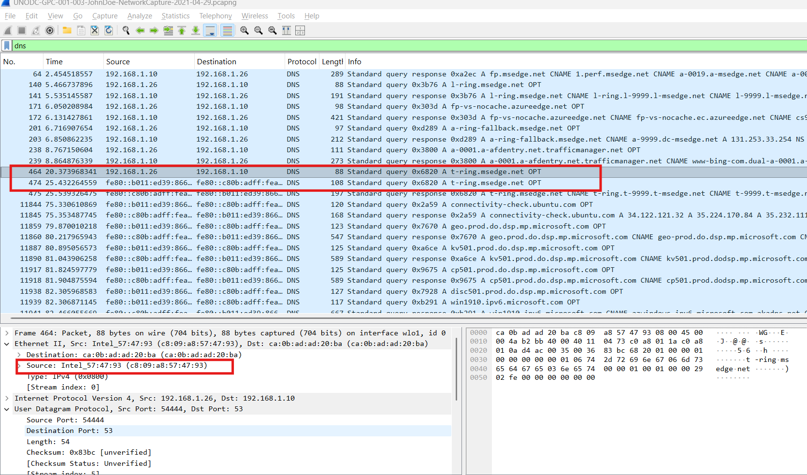
*   **Flag:** `fe80::c80b:adff:feaa:1db7`

### Q3: What domain is the user looking up in packet 15174?
*   **Approach:** Directly inspect the specified frame for DNS query details.
*   **Steps Taken:** Navigated to frame `15174` and observed the domain being queried in the Info column.
*   **Evidence:**
    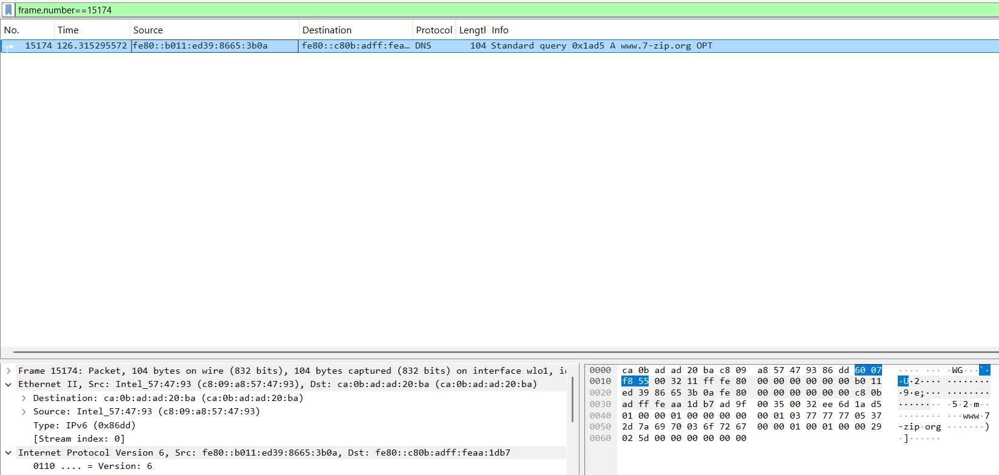
*   **Flag:** `www.7-zip.org`

### Q4: How many UDP packets were sent from 192.168.1.26 to 24.39.217.246?
*   **Approach:** Use logical operators in Wireshark to filter traffic by specific source, destination, and protocol.
*   **Steps Taken:**
    *   Applied the filter: `ip.src==192.168.1.26 and ip.dst==24.39.217.246 and udp`.
    *   Reviewed the output and counted the total number of packets matching these exact conditions.
*   **Evidence:**
    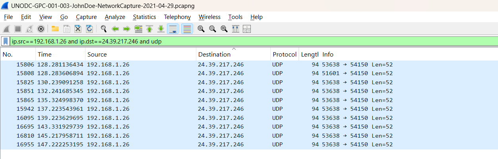
*   **Flag:** `10`

### Q5: What is the MAC address of the system under investigation in the PCAP file?
*   **Approach:** Locate a packet sent by the system under investigation (`192.168.1.26`) and inspect the Ethernet layer.
*   **Steps Taken:**
    *   Applied the filter: `ip.src==192.168.1.26`.
    *   Selected a random frame from the output and expanded the Ethernet II layer to identify the Source MAC address.
*   **Evidence:**
    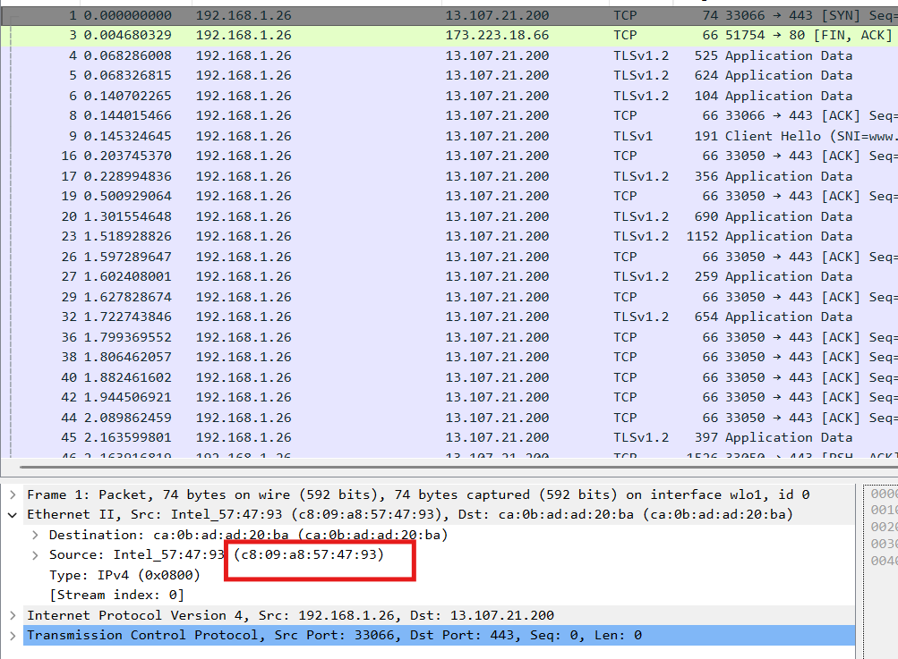
*   **Flag:** `c8:09:a8:57:47:93`

### Q6: What was the camera model name used to take picture 20210429_152157.jpg?
*   **Approach:** Extract the transferred file from the network capture and analyze its EXIF metadata.
*   **Steps Taken:**
    *   Applied the filter `frame contains "20210429_152157.jpg"` to locate the file transfer.
    *   Determined that the `.jpg` file was transferred over FTP.
    *   Used Wireshark's export feature (File -> Export Objects -> FTP) to save the image to the local machine.
    *   Right-clicked the extracted file, navigated to Properties -> Details, and identified the Camera model.
*   **Evidence:**
    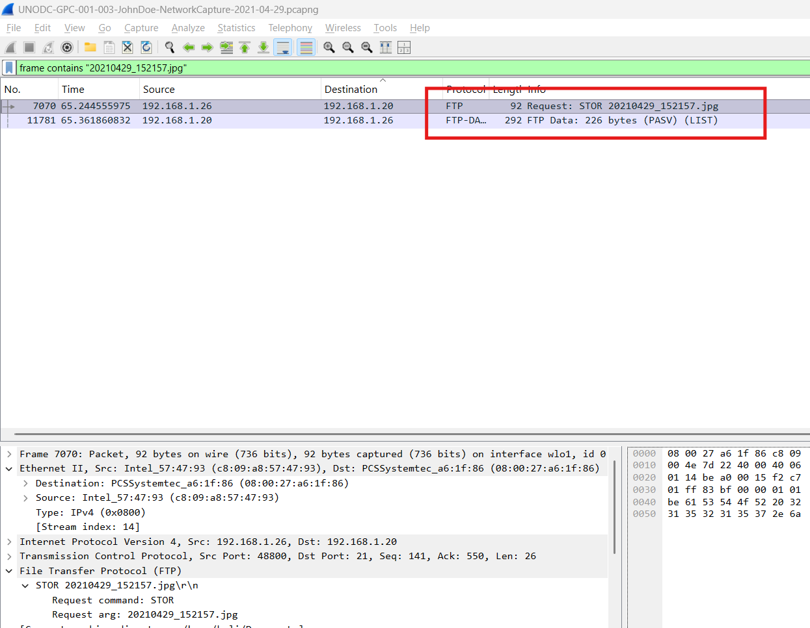
    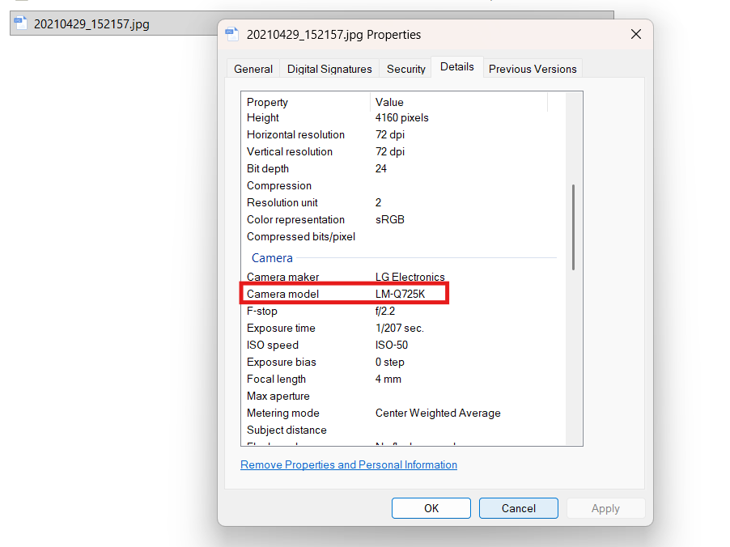
*   **Flag:** `LM-Q725K`

### Q7: What is the ephemeral public key provided by the server during the TLS handshake in the session with the session ID: da4a0000342e4b73459d7360b4bea971cc303ac18d29b99067e46d16cc07f4ff?
*   **Approach:** Filter the traffic for the specific TLS Session ID and inspect the Server Key Exchange packet.
*   **Steps Taken:**
    *   Applied the filter: `tls.handshake.session_id == da4a0000342e4b73459d7360b4bea971cc303ac18d29b99067e46d16cc07f4ff`.
    *   Located frame 26913, which contains the Server Key Exchange parameters.
    *   Expanded the EC Diffie-Hellman Server Params to extract the full Public Key string.
*   **Evidence:**
    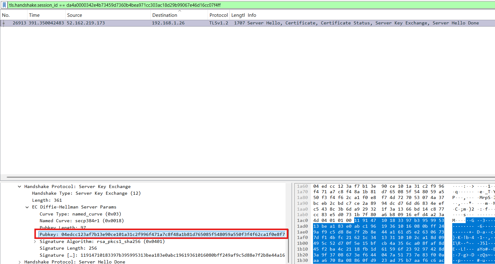
*   **Flag:** `04edcc123af7b13e90ce101a31c2f996f471a7c8f48a1b81d765085f548059a550f3f4f62ca1f0e8f74d727053074a37bceb2cbdc7ce2a8994dcd76dd6834eefc5438c3b6da929321f3a1366bd14c877cc83e5d0731b7f80a6b80916efd4a23a4d`

### Q8: What is the first TLS 1.3 client random that was used to establish a connection with protonmail.com?
*   **Approach:** Find the initial Client Hello packet directed to the target domain.
*   **Steps Taken:**
    *   Applied the filter `frame contains "protonmail.com"` to locate relevant TLS handshakes.
    *   Identified the first Client Hello packet initiating a TLS 1.3 connection to the domain and extracted the Random string from the Handshake Protocol details.
*   **Evidence:**
    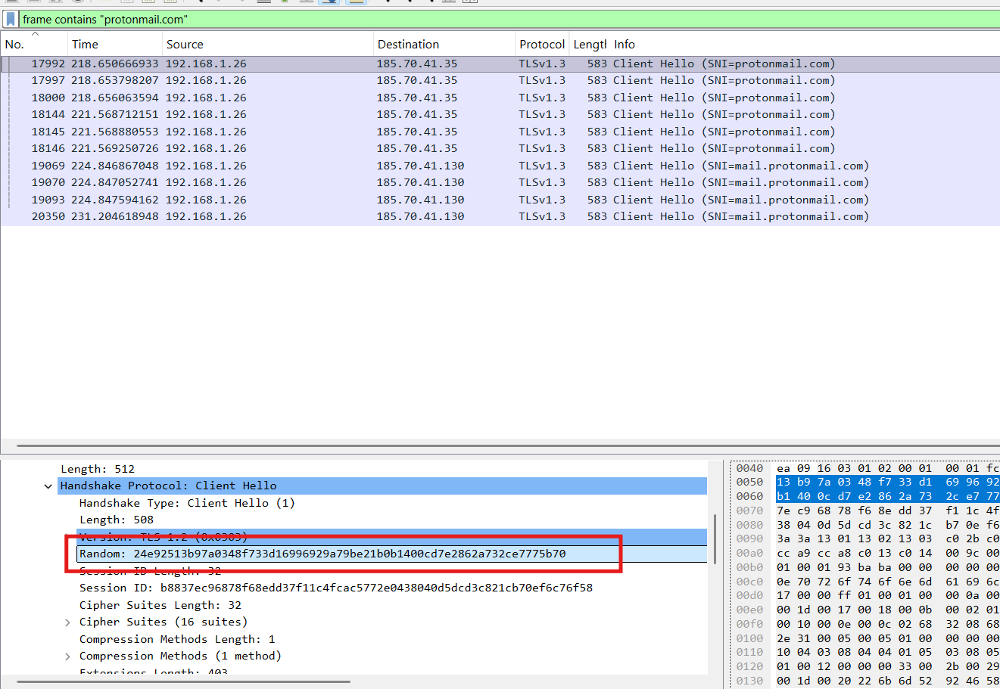
*   **Flag:** `24e92513b97a0348f733d16996929a79be21b0b1400cd7e2862a732ce7775b70`

### Q9: Which country is the manufacturer of the FTP server’s MAC address registered in?
*   **Approach:** Identify the FTP server's MAC address and perform an OSINT MAC vendor lookup.
*   **Steps Taken:**
    *   Using the `ftp` filter, the FTP server's IPv4 address was identified as `192.168.1.20`.
    *   Inspecting the Ethernet layer of packets sent by this server revealed the source MAC address as `08:00:27:a6:1f:86`.
    *   A MAC lookup tool confirmed this prefix belongs to PCS Systemtechnik GmbH, registered in the United States.
*   **Evidence:**
    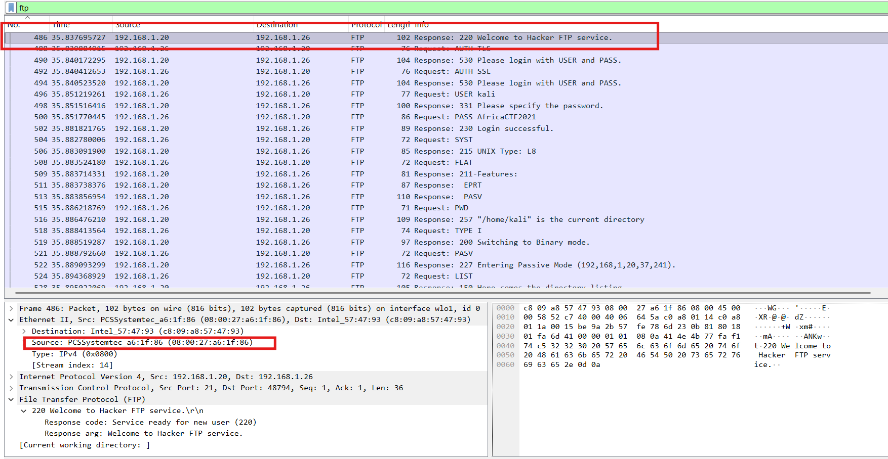
    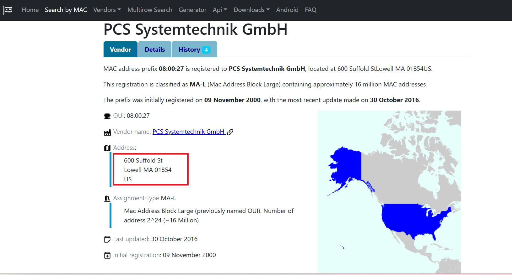
*   **Flag:** `United States`

### Q10: What time was a non-standard folder created on the FTP server on the 20th of April?
*   **Approach:** Analyze the FTP data channel (out-of-band) to view the raw output of directory listing commands.
*   **Steps Taken:**
    *   Initial analysis with the `ftp` filter showed the attacker successfully executed the `LIST` command, but the control channel only logs the command execution, not the output.
    *   Switched the filter to `ftp-data` to capture the payload transmitted over the data channel.
    *   Located the `ftp-data` packet corresponding to the `LIST` command and followed the TCP Stream to view the raw directory structure.
    *   Identified a suspicious folder named `ftp` created on April 20th and extracted its creation timestamp.
*   **Evidence:**
    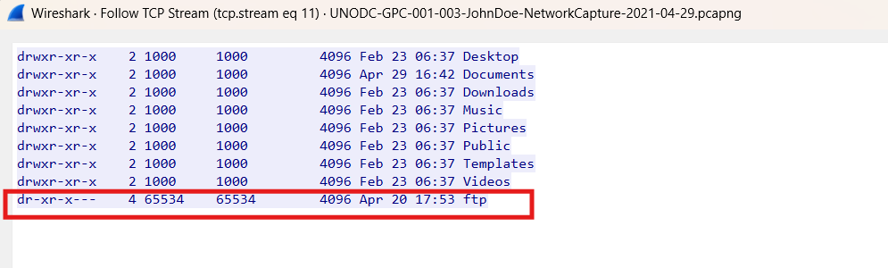
*   **Flag:** `17:53`

### Q11: What URL was visited by the user and connected to the IP address 104.21.89.171?
*   **Approach:** Filter for HTTP traffic directed at the specific IP and reconstruct the URL from the Host header.
*   **Steps Taken:**
    *   Applied the filter: `ip.addr==104.21.89.171 and http`.
    *   Inspecting the HTTP GET request output revealed the requested Host is `dfir.science`.
    *   Combining the protocol, host, and requested path constructs the full URL.
*   **Evidence:**
    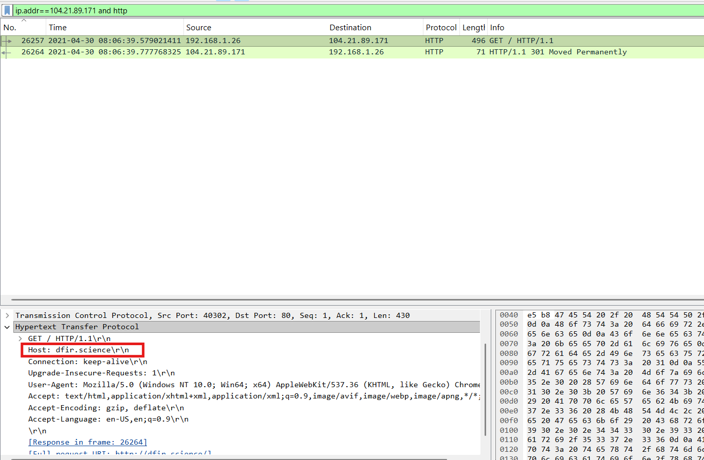
*   **Flag:** `http://dfir.science/`
