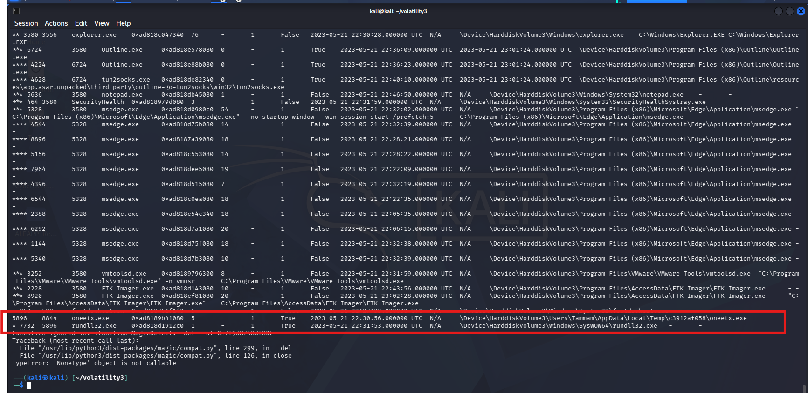
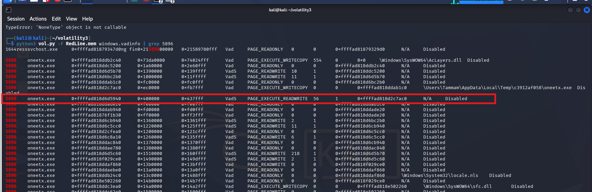
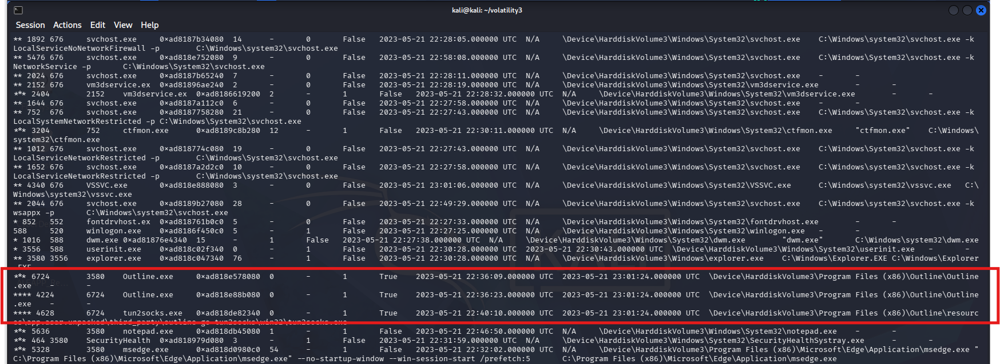
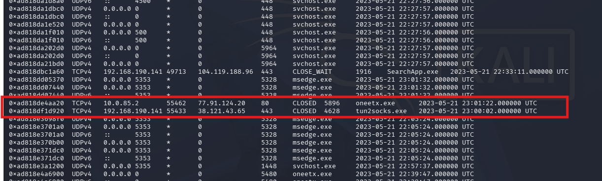
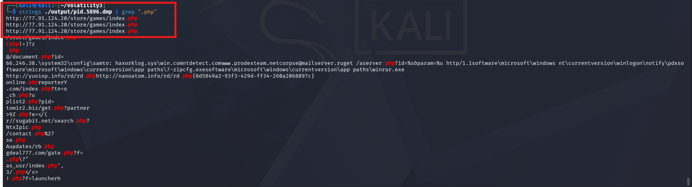
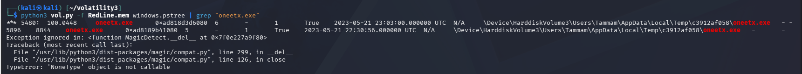

# CyberDefenders Lab: RedLine Writeup

**Category:** Endpoint Forensics | **Difficulty:** Easy | **Tactics:** Privilege Escalation, Stealth, Command and Control | **Tools:** Volatility, Strings

**Scenario:** As a member of the Security Blue team, your assignment is to analyze a memory dump using Redline and Volatility tools. Your goal is to trace the steps taken by the attacker on the compromised machine and determine how they managed to bypass the Network Intrusion Detection System (NIDS). Your investigation will identify the specific malware family employed in the attack and its characteristics. Additionally, your task is to identify and mitigate any traces or footprints left by the attacker.

---

### Q1: What is the name of the suspicious process?
*   **Cách làm:** 
*   **Thao tác thực hiện:** 
*   **Bằng chứng:**
    
*   **Flag:** ``

---

### Q2: What is the child process name of the suspicious process?
*   **Cách làm:** 
*   **Thao tác thực hiện:** 
*   **Bằng chứng:**
    
*   **Flag:** ``

---

### Q3: What is the memory protection applied to the suspicious process memory region?
*   **Cách làm:** 
*   **Thao tác thực hiện:** 
*   **Bằng chứng:**
    
*   **Flag:** ``

---

### Q4: What is the name of the process responsible for the VPN connection?
*   **Cách làm:** 
*   **Thao tác thực hiện:** 
*   **Bằng chứng:**
    
*   **Flag:** ``

---

### Q5: What is the attacker's IP address?
*   **Cách làm:** 
*   **Thao tác thực hiện:** 
*   **Bằng chứng:**
    
*   **Flag:** ``

---

### Q6: What is the full URL of the PHP file that the attacker visited?
*   **Cách làm:** 
*   **Thao tác thực hiện:** 
*   **Bằng chứng:**
    
*   **Flag:** ``

---

### Q7: What is the full path of the malicious executable?
*   **Cách làm:** 
*   **Thao tác thực hiện:** 
*   **Bằng chứng:**
    
*   **Flag:** ``
