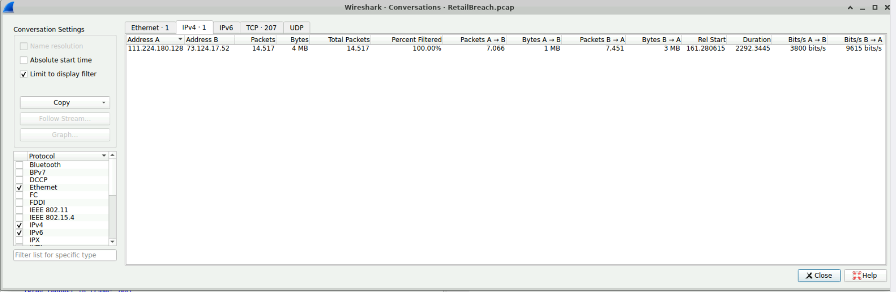
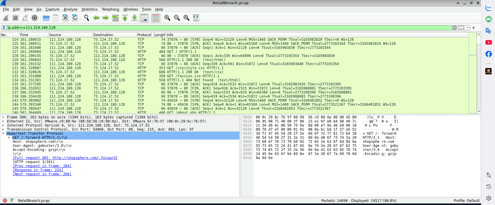
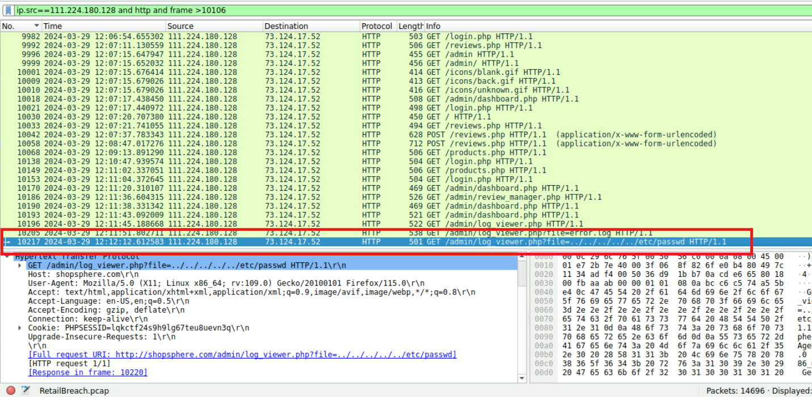
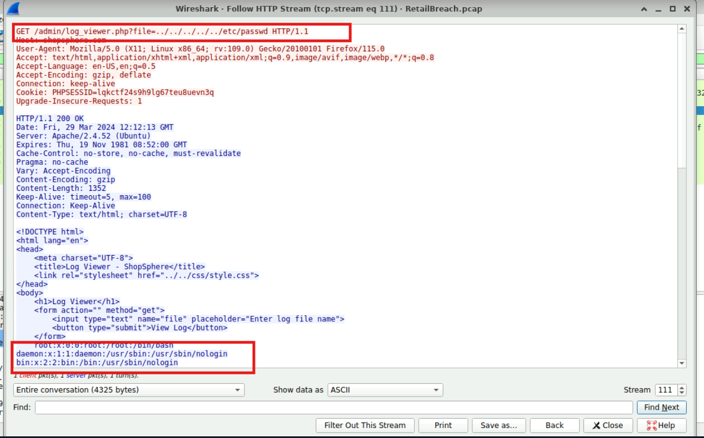

# CyberDefenders Lab: RetailBreach Writeup

**Category:** Network Forensics | **Difficulty:** Easy | **Tactics:** Reconnaissance, Initial Access, Execution, Credential Access, Discovery, Lateral Movement | **Tools:** Wireshark, NetworkMiner, Brim

**Scenario:** In recent days, ShopSphere, a prominent online retail platform, has experienced unusual administrative login activity during late-night hours. These logins coincide with an influx of customer complaints about unexplained account anomalies, raising concerns about a potential security breach. Initial observations suggest unauthorized access to administrative accounts, potentially indicating deeper system compromise.

Your mission is to investigate the captured network traffic to determine the nature and source of the breach. Identifying how the attackers infiltrated the system and pinpointing their methods will be critical to understanding the attack's scope and mitigating its impact.

---

### Q1: What is the attacker's IP address?
*   **Approach:** Analyze traffic statistics by IP address on Wireshark to identify the pair of IPs with abnormal traffic volume.
*   **Steps Taken:** Went to **Statistics → Conversations → IPv4**, and identified a large volume of traffic between two IPs: `111.224.180.128` and `73.124.17.52`. Applied filter `ip.addr==111.224.180.128`, and observed this suspicious IP actively initiating a 3-way handshake with the victim IP (`73.124.17.52`) and continuously sending a barrage of GET requests aimed at probing various paths — behavior typical of reconnaissance/scanning.
*   **Evidence:**
    
    
*   **Flag:** `111.224.180.128`

---

### Q2: Which tool did the attacker use to perform directory brute-forcing?
*   **Approach:** Filter HTTP traffic by the attacker's IP, and check the User-Agent header in the requests.
*   **Steps Taken:** Applied filter `ip.addr==111.224.180.128 and http`. At **Frame 200**, identified the attacker using a tool called **Gobuster** to discover hidden paths — this tool exposes its own name directly in the `User-Agent` header of every request.
*   **Evidence:**
    
*   **Flag:** `Gobuster`

---

### Q3: Can you specify the XSS payload that the attacker used to compromise the integrity of the web application?
*   **Approach:** Filter traffic by the attacker's IP combined with the keyword "script" to locate the injection payload.
*   **Steps Taken:** Applied filter `ip.addr==111.224.180.128 and frame contains "script"`. At **POST Frame 10058**, identified the XSS payload injected by the attacker:
    ``
    This payload leverages JavaScript's `fetch()` function to send the victim's cookie (`document.cookie`) directly to the attacker's server whenever someone loads a page containing this malicious script.
*   **Evidence:**
    
*   **Flag:** ``

---

### Q4: Can you provide the UTC timestamp when the admin user first visited the page containing the injected malicious script?
*   **Approach:** Filter traffic not originating from the attacker's IP, look for requests to the page containing the injected payload (`reviews.php`), then switch the Time column format to UTC to read the exact timestamp.
*   **Steps Taken:** Applied filter `ip.src!=111.224.180.128 and http contains "reviews.php"` — the goal was to check whether any other victim visited the `reviews.php` page (which contains the payload injected in Q3). Identified **Frame 10106** (occurring after Frame 10058 — the moment the attacker first injected the payload) as the exact moment the admin first visited this page. Switched **View → Time Display Format → UTC Date and Time of Day** to read the correct UTC time of the frame.
*   **Evidence:**
    
*   **Flag:** `2024-03-29 12:09`

---

### Q5: Can you provide the session token that the attacker acquired and used for this unauthorized access?
*   **Approach:** Based on the frame identified in Q4, check the Cookie header sent with the request to retrieve the stolen session token.
*   **Steps Taken:** At the same **Frame 10106** identified in Q4 — the moment the admin visited the page and had their cookie leaked to the attacker — checked the request header and found: `Cookie: PHPSESSID=lqkctf24s9h9lg67teu8uevn3q`. This is exactly the session token the attacker stole via the XSS payload from Q3.
*   **Evidence:**
    
*   **Flag:** `lqkctf24s9h9lg67teu8uevn3q`

---

### Q6: What is the name of the script that was exploited by the attacker?
*   **Approach:** Continue filtering traffic after the point where the attacker acquired the session token (Q5), tracking the attacker's subsequent actions.
*   **Steps Taken:** Applied filter `ip.addr==111.224.180.128 and http and frame>10106` (10106 being the frame where the attacker obtained the victim's cookie). At **Frame 10217**, discovered the attacker performing a **Path Traversal** technique targeting the script `log_viewer.php`. Used **Follow HTTP Stream** on Frame 10217, confirming this script is indeed the vulnerable one, and the response returned to the attacker contained a list of sensitive credentials.
*   **Evidence:**
    
    
*   **Flag:** `log_viewer.php`

---

### Q7: Can you identify the specific payload the attacker used to access a sensitive system file?
*   **Approach:** Based on the Path Traversal technique identified in Q6, examine the parameter passed to the `log_viewer.php` script in detail.
*   **Steps Taken:** As identified in Q6, the attacker carried out Path Traversal by passing a parameter containing the path `../../../../../etc/passwd` to the `log_viewer.php` script — the repeated `../` sequence is used to escape the webroot directory and traverse up to the system directory in order to read Linux's sensitive user configuration file (`/etc/passwd`).
*   **Evidence:**
    
*   **Flag:** `../../../../../etc/passwd`
