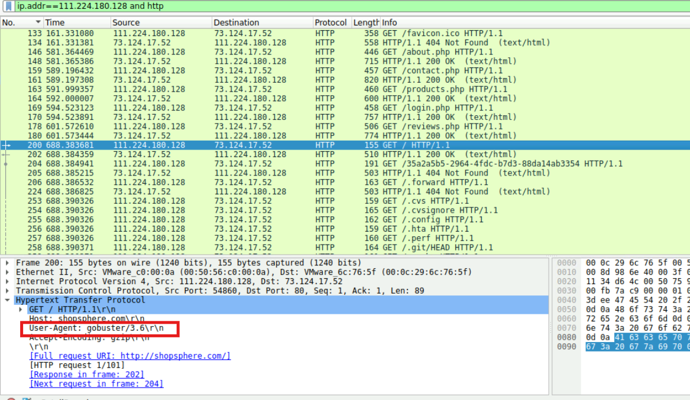
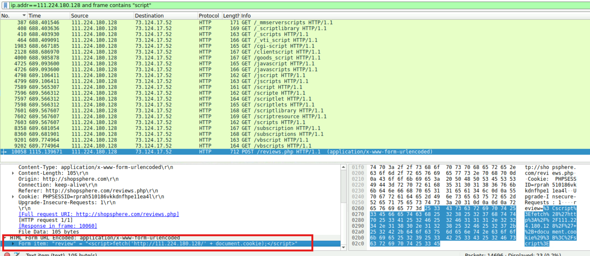
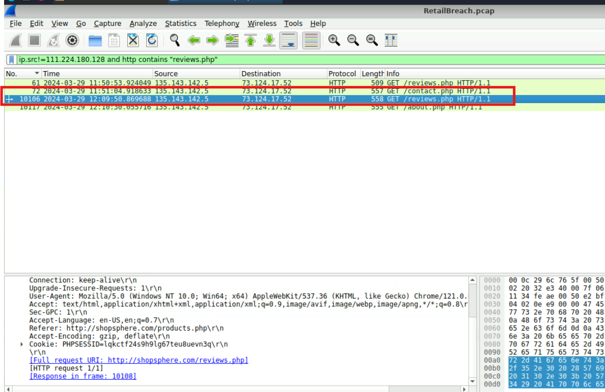
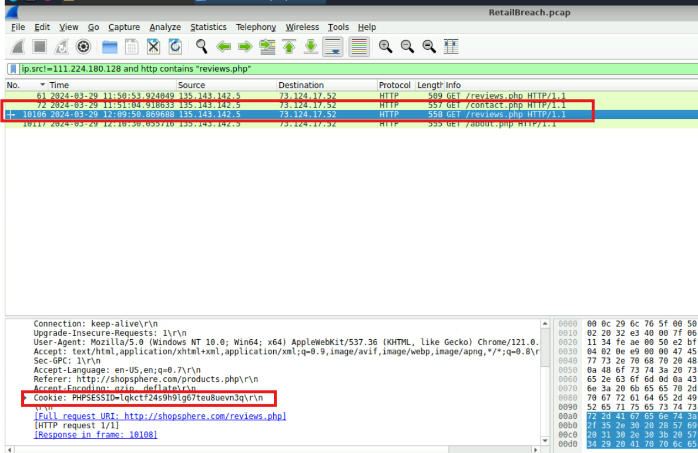
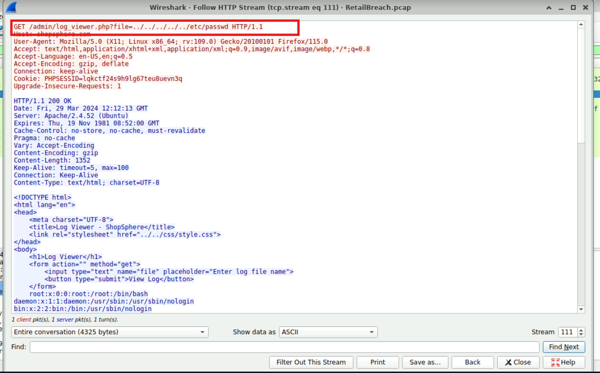

# CyberDefenders Lab: RetailBreach Writeup

**Category:** Network Forensics | **Difficulty:** Easy | **Tactics:** Reconnaissance, Initial Access, Execution, Credential Access, Discovery, Lateral Movement | **Tools:** Wireshark, NetworkMiner, Brim

**Scenario:** In recent days, ShopSphere, a prominent online retail platform, has experienced unusual administrative login activity during late-night hours. These logins coincide with an influx of customer complaints about unexplained account anomalies, raising concerns about a potential security breach. Initial observations suggest unauthorized access to administrative accounts, potentially indicating deeper system compromise.

Your mission is to investigate the captured network traffic to determine the nature and source of the breach. Identifying how the attackers infiltrated the system and pinpointing their methods will be critical to understanding the attack's scope and mitigating its impact.

---

### Q1: What is the attacker's IP address?
*   **Cách làm:** 
*   **Thao tác thực hiện:** 
*   **Bằng chứng:**
    
*   **Flag:** ``

---

### Q2: Which tool did the attacker use to perform directory brute-forcing?
*   **Cách làm:** 
*   **Thao tác thực hiện:** 
*   **Bằng chứng:**
    
*   **Flag:** ``

---

### Q3: Can you specify the XSS payload that the attacker used to compromise the integrity of the web application?
*   **Cách làm:** 
*   **Thao tác thực hiện:** 
*   **Bằng chứng:**
    
*   **Flag:** ``

---

### Q4: Can you provide the UTC timestamp when the admin user first visited the page containing the injected malicious script?
*   **Cách làm:** 
*   **Thao tác thực hiện:** 
*   **Bằng chứng:**
    
*   **Flag:** ``

---

### Q5: Can you provide the session token that the attacker acquired and used for this unauthorized access?
*   **Cách làm:** 
*   **Thao tác thực hiện:** 
*   **Bằng chứng:**
    
*   **Flag:** ``

---

### Q6: What is the name of the script that was exploited by the attacker?
*   **Cách làm:** 
*   **Thao tác thực hiện:** 
*   **Bằng chứng:**
    
*   **Flag:** ``

---

### Q7: Can you identify the specific payload the attacker used to access a sensitive system file?
*   **Cách làm:** 
*   **Thao tác thực hiện:** 
*   **Bằng chứng:**
    
*   **Flag:** ``
