# CyberDefenders: Seized Lab Writeup

**Category:** Endpoint Forensics | **Difficulty:** Medium
**Tactics:** Execution, Persistence, Privilege Escalation, Stealth, Command and Control
**Tools:** Volatility 2, CyberChef, grep

---

## Scenario

Using Volatility, utilize your memory analysis skills as a security blue team analyst to investigate the provided Linux memory snapshots and figure out attack details.

**Instructions:** Use the latest version of Volatility, place the attached Volatility profile "Centos7.3.10.1062.zip" in the following path: `volatility/volatility/plugins/overlays/linux`.

---

### Q1: What is the CentOS version installed on the machine?
*   **Approach:** Use the `linux_banner` plugin to read the kernel version string directly from the memory image.
*   **Steps Taken:**
    *   Ran `python2 vol.py --profile=LinuxCentos7_3_10_1062x64 -f Seized.mem linux_banner`.
    *   The output revealed kernel version **3.10.0-1062.el7.x86_64**, compiled on Wed Aug 7 18:08:02 UTC 2019.
    *   Cross-referenced this kernel version with CentOS release history: kernel 3.10.0-1062 corresponds to **CentOS 7.7-1908** (released September 2019).
*   **Evidence:**
    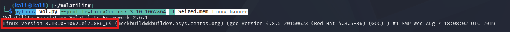
    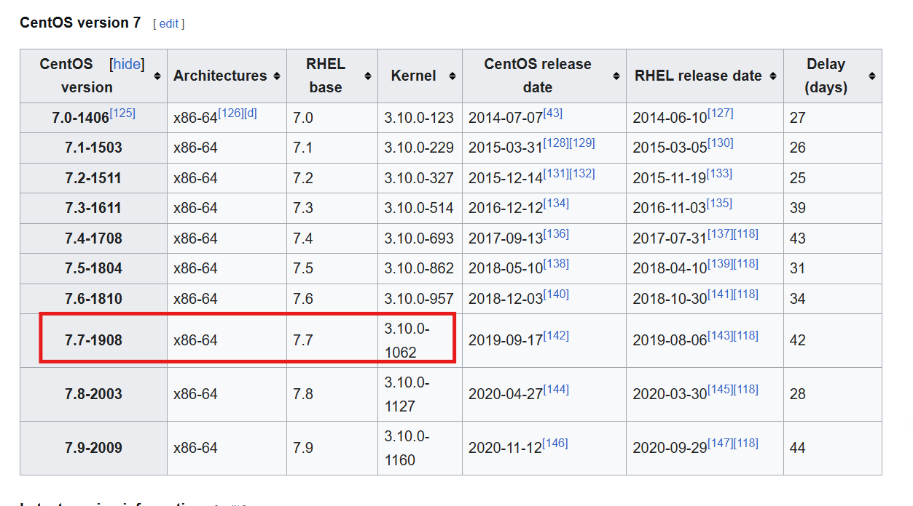
*   **Flag:** `7.7.1908`

### Q2: There is a command containing a strange message in the bash history. Will you be able to read it?
*   **Approach:** Use the `linux_bash` plugin to recover the full bash command history from memory.
*   **Steps Taken:**
    *   Ran `python2 vol.py --profile=LinuxCentos7_3_10_1062x64 -f Seized.mem linux_bash`.
    *   Found a command that writes what appeared to be a Base64 string into a `.txt` file.
    *   Decoded the Base64 string using CyberChef (Recipe: **From Base64**).
*   **Evidence:**
    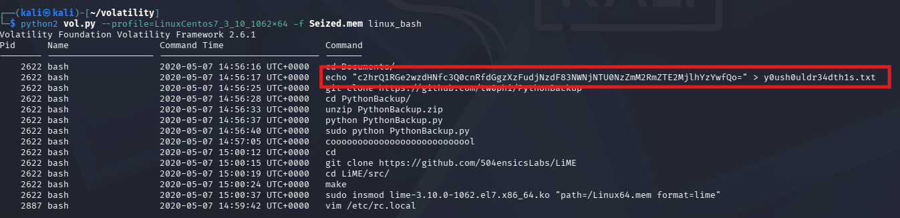
    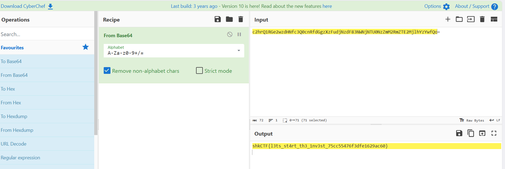
*   **Flag:** `shkCTF{l3ts_st4rt_th3_1nv3st_75cc55476f3dfe1629ac60}`

### Q3: What is the PID of the suspicious process?
*   **Approach:** Use `linux_pstree` to examine parent-child process relationships and spot anomalous execution chains.
*   **Steps Taken:**
    *   Ran `linux_pstree` and identified a highly suspicious process chain:
        1. **`.ncat` (PID 2854)** — Netcat, used to open a network port or establish a reverse shell/backdoor; not something a stock CentOS system would run as a service.
        2. **`..bash` (PID 2876)** — spawned by `ncat`, giving the attacker an interactive shell.
        3. **`...python` (PID 2886)** — the attacker upgrading the shell.
        4. **`....bash` (PID 2887)** — a new interactive shell spawned via Python's PTY trick.
        5. **`.....vim` (PID 3196)** — the attacker editing a file on the system.
    *   The root of this malicious chain is the `ncat` process.
*   **Evidence:**
    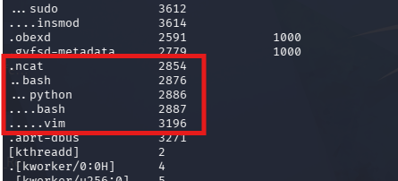
*   **Flag:** `2854`

### Q4: The attacker downloaded a backdoor to gain persistence. What is the hidden message in this backdoor?
*   **Approach:** Trace bash history for the download/execution of a backdoor script, then inspect the referenced source for an encoded payload.
*   **Steps Taken:**
    *   From `linux_bash` output, found the attacker cloning a GitHub repo named **PythonBackup**, unzipping it, and executing `PythonBackup.py`.
    *   Reviewed the repo's `Snapshot.py` file on GitHub, which showed `PythonBackup.py` downloading a script from `https://pastebin.com/raw/nQwMKjtZ`.
    *   Fetched that Pastebin URL and found a Base64-encoded string: `c2hrQ1RGe3RoNHRfdzRzXzRfZHVtYl9iNGNrZDAwcl84NjAzM2MxOWUzZjM5MzE1YzAwZGNhfQo=`.
    *   Decoded it using CyberChef.
*   **Evidence:**
    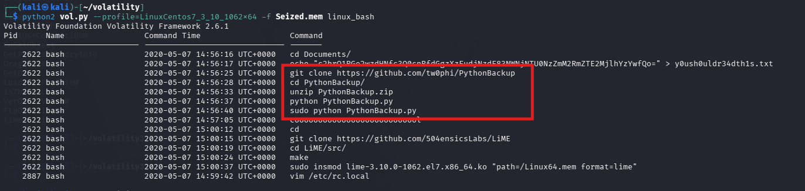
    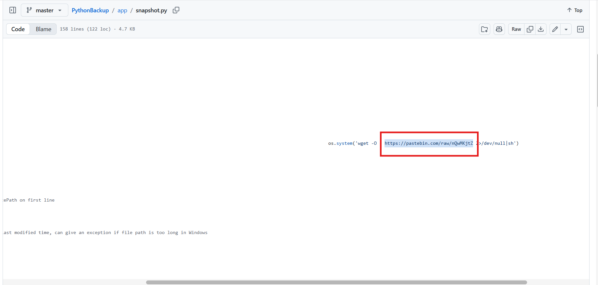
    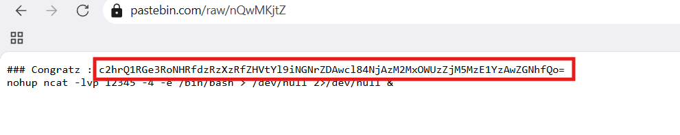
    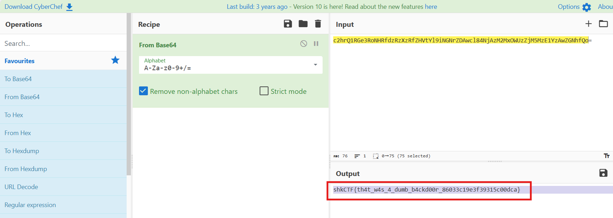
*   **Flag:** `shkCTF{th4t_w4s_4_dumb_b4ckd00r_86033c19e3f39315c00dca}`

### Q5: What are the attacker's IP address and the local port on the targeted machine?
*   **Approach:** Use `linux_netstat` to reconstruct active network sockets at the time of memory capture.
*   **Steps Taken:**
    *   Ran `linux_netstat` with the CentOS profile.
    *   Correlating with the `ncat` backdoor found in Q3/Q4 (listening locally on port 12345), identified the remote attacker IP as **192.168.49.1**, connected to local port **12345**.
*   **Evidence:**
    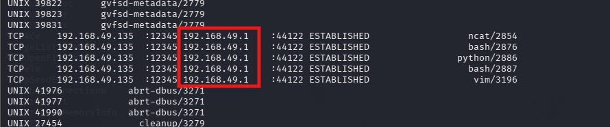
*   **Flag:** `192.168.49.1:12345`

### Q6: What is the first command that the attacker executed?
*   **Approach:** Use `linux_psaux` to recover full command lines (with arguments) of running processes.
*   **Steps Taken:**
    *   Ran `linux_psaux`.
    *   Followed the malicious process chain from `ncat` (PID 2854) → `bash` (PID 2876) → **`python`, PID 2886**.
    *   The Command column showed the PTY-upgrade command the attacker ran to get an interactive shell.
*   **Evidence:**
    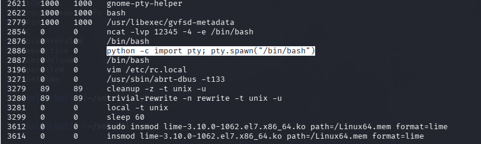
*   **Flag:** `python -c import pty; pty.spawn("/bin/bash")`

### Q7: After changing the user password, we found that the attacker still has access. Can you find out how?
*   **Approach:** Dump the memory region of the attacker's interactive shell process to recover commands not captured elsewhere (e.g., not logged to `.bash_history`).
*   **Steps Taken:**
    *   Identified **PID 2887** (the `bash` spawned via the Python PTY trick) as the attacker's interactive session.
    *   Created a working directory: `mkdir 2887`.
    *   Dumped the process's memory with `linux_dump_map`:
        `python2 vol.py --profile=LinuxCentos7_3_10_1062x64 -f Seized.mem linux_dump_map --pid 2887 -D 2887/`
    *   Extracted readable strings: `strings 2887/* > 2887/strings.txt`.
    *   Searched for the `echo` command with surrounding context: `cat 2887/strings.txt | grep -i "echo" -B 5 -A 5` (extra context needed because long Base64/key strings often wrap across lines).
    *   Found that the attacker overwrote the SSH public key (`ssh-rsa ...`) for account `tw0phi@workstation` into `/home/k3vin/.ssh/authorized_keys`, then reset permissions with `chmod 600`.
    *   **Root cause:** SSH public-key authentication bypasses password checks entirely — as long as the attacker holds the matching private key, they can SSH in regardless of password changes.
    *   Also recovered a Base64 string: `c2hrQ1RGe3JjLmwwYzRsXzFzX2Z1bm55X2JlMjQ3MmNmYWVlZDQ2N2VjOWNhYjViNWEzOGU1ZmEwfQo=`, decoded via CyberChef.
*   **Evidence:**
    
    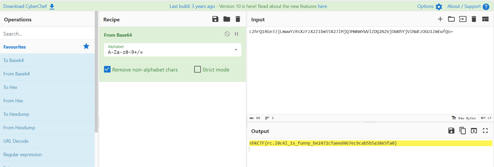
*   **Flag:** `shkCTF{rc.l0c4l_1s_funny_be2472cfaeed467ec9cab5b5a38e5fa0}`

---

## Malware/Rootkit Analysis

### Q8: What is the name of the rootkit that the attacker used?
*   **Approach:** Use `linux_check_syscall` to verify the integrity of the kernel's system call table and detect syscall hooking.
*   **Steps Taken:**
    *   Ran `linux_check_syscall`.
    *   Normal syscall entries pointed into the kernel's static code region (`0xffffffffa8......`).
    *   Syscall index **88** pointed to `0xffffffffc0a12470` — an address range reserved for dynamically loaded **Kernel Modules (LKM)**, not static kernel code.
    *   Volatility flagged this entry as **HOOKED**, redirected to a `syscall_callback` function inside a module named **sysemptyrect**.
*   **Evidence:**
    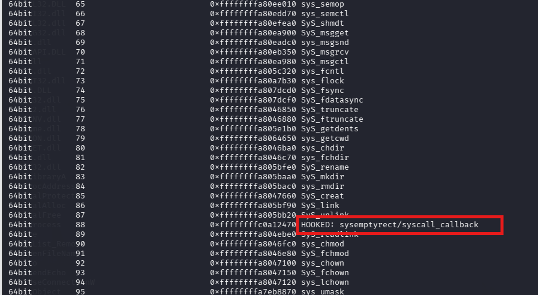
*   **Flag:** `sysemptyrect`

### Q9: The rootkit uses crc65 encryption. What is the key?
*   **Approach:** Use `linux_lsmod` with the `-P` (parameters) flag to extract the loaded kernel module's configuration parameters.
*   **Steps Taken:**
    *   Ran `python2 vol.py --profile=LinuxCentos7_3_10_1062x64 -f Seized.mem linux_lsmod -P | grep -A 6 "sysemptyrect"`.
    *   The `-P` flag forces Volatility to walk the module's `struct kernel_param` entries (set via `module_param()` in the kernel module's source) and dump their live values from RAM — otherwise hidden by a plain `linux_lsmod` run.
    *   The output revealed a key parameter value ending in `bbar`.
*   **Evidence:**
    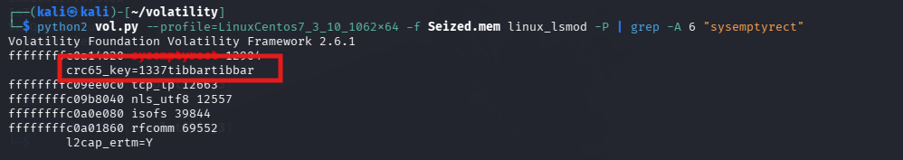
*   **Flag:** `1337tibbartibbar`
