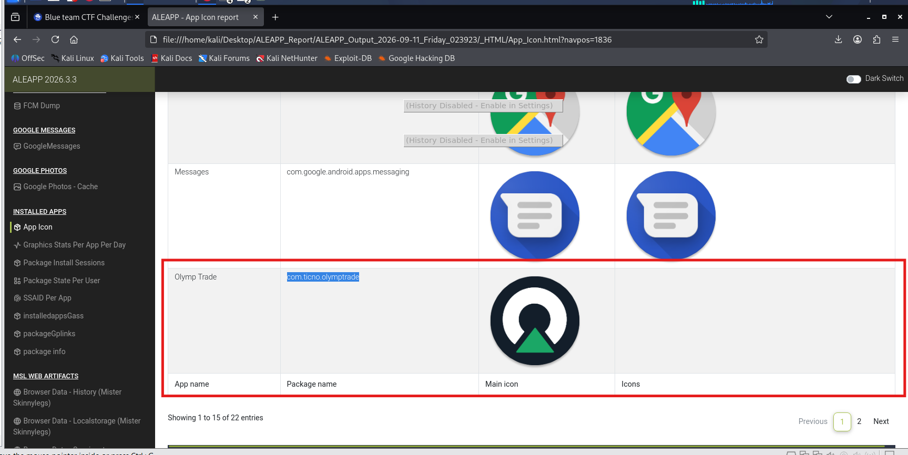
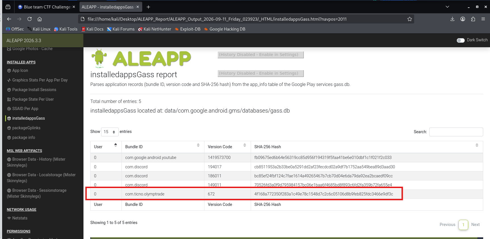
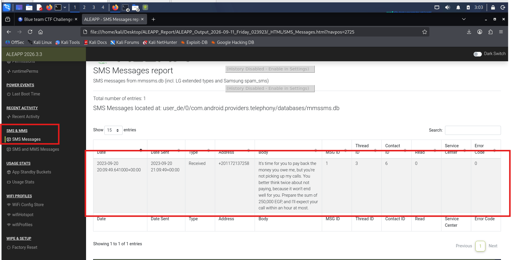
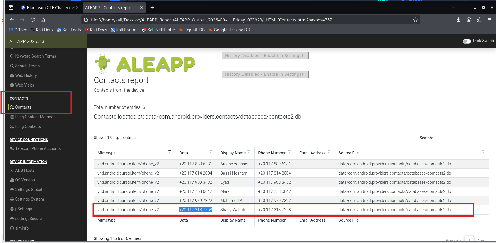
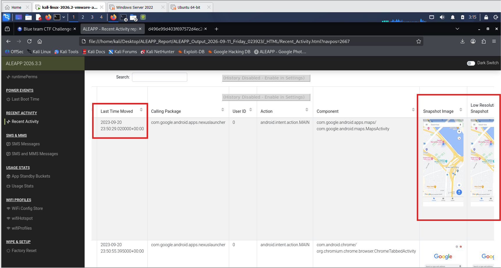
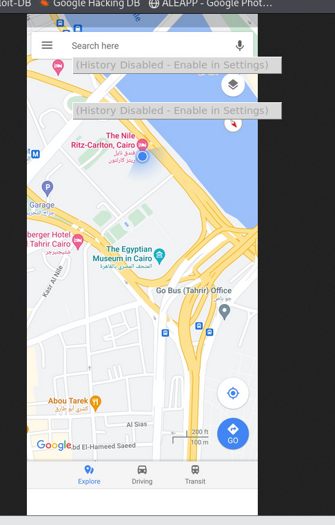
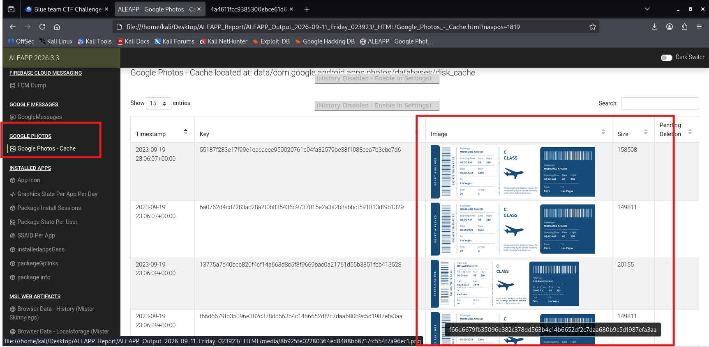
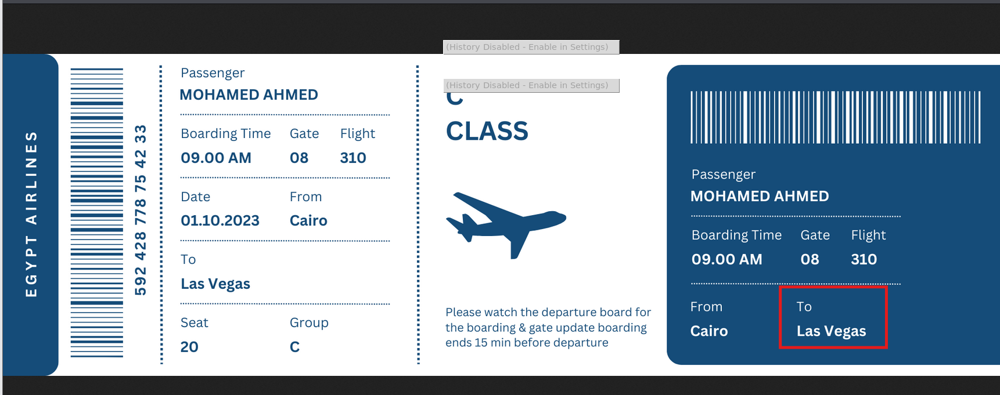
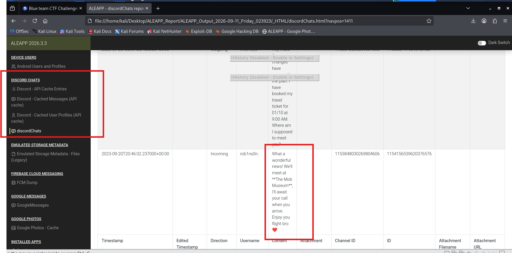

# CyberDefenders Lab: TheCrime Writeup

**Category:** Mobile Forensics | **Tool:** ALEAPP

**Scenario:** A victim has gone missing under mysterious circumstances. Investigators have obtained a full file system extraction of the victim's Android phone. Your task is to analyze the extraction using ALEAPP to piece together the victim's final days — his financial troubles, his contacts, his movements, and his intentions — in order to determine what happened to him.

---

### Q1: Can you identify the SHA256 of the trading application the victim primarily used on his phone?
*   **Approach:** Use ALEAPP to parse the Android data, check the App Icon section to identify the trading app the victim installed, then look up the hash in the installed apps list.
*   **Steps Taken:** In the **App Icon** section of the ALEAPP report, identified the victim had installed an app named **Olymp Trade**, used for trading purposes. Continued checking the **Installed Apps → installedappsGass** section, and identified the SHA256 hash of this application.
*   **Evidence:**
    
    
*   **Flag:** `4f168a772350f283a1c49e78c1548d7c2c6c05106d8b9feb825fdc3466e9df3c`

---

### Q2: According to testimony, the victim owed money to a caller he avoided. How much does the victim owe this person?
*   **Approach:** Check the SMS/MMS section of the ALEAPP report to locate the message related to the debt.
*   **Steps Taken:** In the **SMS & MMS → SMS Messages** section, found a debt-collection message sent to the victim by a creditor. The message content states the victim owes **250,000 EGP** and demands he answer the phone and repay the debt immediately.
*   **Evidence:**
    
*   **Flag:** `250000`

---

### Q3: What is the name of the person to whom the victim owes money?
*   **Approach:** Take the creditor's phone number from the message in Q2, and cross-reference it against Contacts to identify the name.
*   **Steps Taken:** From the debt-collection message in Q2, identified the creditor's phone number as `+20 117 213 7258`. Checked the **Contacts** section of the ALEAPP report, and identified the owner of this phone number as **Shady Wahab**.
*   **Evidence:**
    
*   **Flag:** `Shady Wahab`

---

### Q4: On September 20, 2023, the victim departed without informing anyone. Where was the victim located at that moment?
*   **Approach:** Check the Recent Activity section to determine when the victim left home, then look up the GPS coordinates on Google Maps.
*   **Steps Taken:** In the **Recent Activity** section, identified the victim left home at `23:50:29` on `2023-09-20`. Based on the GPS coordinates recorded at that moment, looked them up on Google Maps and identified the victim's location as **The Nile Ritz-Carlton, Cairo**.
*   **Evidence:**
    
    
*   **Flag:** `The Nile Ritz-carlton`

---

### Q5: The victim reserved the hotel room for 10 days with a flight scheduled thereafter. Where did the victim intend to travel?
*   **Approach:** Check the Google Photos section for a photo of the flight ticket the victim saved.
*   **Steps Taken:** In the **Google Photos** section, found a photo of the flight ticket the victim had purchased. Reading the ticket details, identified the destination as **Las Vegas**.
*   **Evidence:**
    
    
*   **Flag:** `las vegas`

---

### Q6: After examining the victim's Discord conversations, where was he arranged to meet a friend?
*   **Approach:** Check the Discord chats section of the ALEAPP report for the meetup conversation.
*   **Steps Taken:** In the **Discord Chats** section, identified the victim had arranged to meet someone at **The Mob Museum**.
*   **Evidence:**
    
*   **Flag:** `The Mob Museum`
