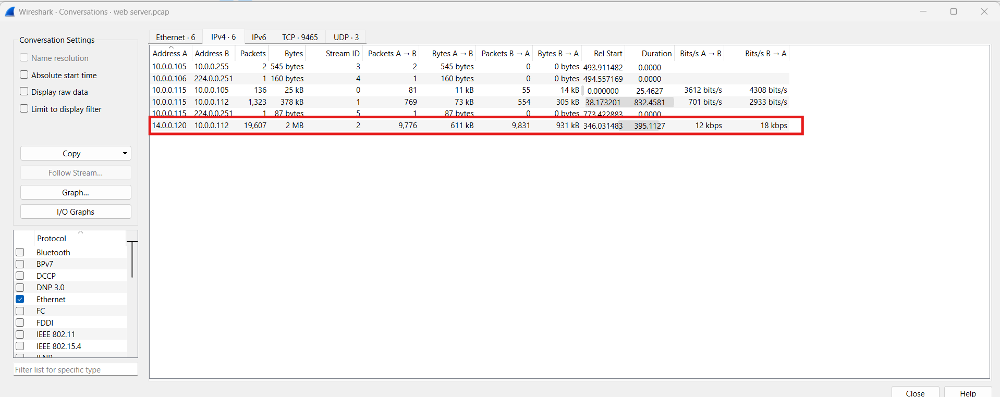
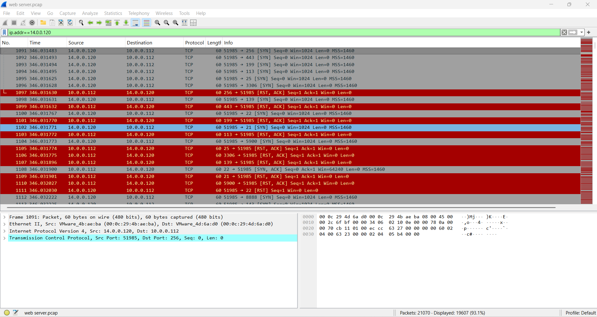

# CyberDefenders Lab: Tomcat Takeover Writeup

**Category:** Network Forensics | **Difficulty:** Easy | **Tactics:** Reconnaissance, Execution, Persistence, Privilege Escalation, Credential Access, Discovery, Command and Control | **Tools:** Wireshark, NetworkMiner

**Scenario:** The SOC team has identified suspicious activity on a web server within the company's intranet. To better understand the situation, they have captured network traffic for analysis. The PCAP file may contain evidence of malicious activities that led to the compromise of the Apache Tomcat web server. Your task is to analyze the PCAP file to understand the scope of the attack.

---

### Q1: Can you identify the source IP address responsible for initiating these requests on our server?
*   **Approach:** In Wireshark, go to **Statistics → Conversations** to identify the pair of IPs with abnormal traffic volume.
*   **Steps Taken:** Identified a large volume of traffic between IP `14.0.0.120` and `10.0.0.112`. Applied filter `ip.addr==14.0.0.120`, and observed the attacker (`14.0.0.120`) performing reconnaissance — sending SYN packets to multiple different ports on the same destination IP.
*   **Evidence:**
    
    
*   **Flag:** `14.0.0.120`

---

### Q2: Can you identify the country from which the attacker's activities originated?
*   **Approach:** Look up the attacker's IP address on a threat intelligence platform.
*   **Steps Taken:** Used **AbuseIPDB** to look up the attacker's IP, and identified this IP address as originating from **China**.
*   **Evidence:**
    
*   **Flag:** `China`

---

### Q3: Which of the open ports provides access to the web server admin panel?
*   **Approach:** Filter HTTP traffic by the attacker's IP to identify which port the attacker successfully accessed the web application on.
*   **Steps Taken:** Applied filter `ip.addr==14.0.0.120 and http`, and identified the attacker successfully accessing port `8080` of the host, `10.0.0.112:8080`, with the attacker successfully retrieving a series of `.png` files and various other file types.
*   **Evidence:**
    
*   **Flag:** `8080`

---

### Q4: Which tools assisted the attacker in the directory/file enumeration process?
*   **Approach:** Continue examining the same filtered HTTP traffic, checking the User-Agent header of the requests.
*   **Steps Taken:** Using the same filter as Q3, identified the attacker using the tool **Gobuster** to test a large number of paths and files.
*   **Evidence:**
    
*   **Flag:** `gobuster`

---

### Q5: Which directory related to the admin panel did the attacker uncover?
*   **Approach:** Continue reviewing the enumeration traffic to find the request/response pair confirming the admin panel path was discovered.
*   **Steps Taken:** At **Frame 20521**, the attacker discovered the path `/manager` (the request is at Frame 20521, with the response at Frame 20522 returning `302 Found`). After confirming this path existed and was accessible, the attacker then proceeded to access a series of related files.
*   **Evidence:**
    
*   **Flag:** `/manager`

---

### Q6: What credentials did the attacker successfully use to brute-force the login?
*   **Approach:** Continue tracking traffic to `/manager` for the login attempt that returned a successful response.
*   **Steps Taken:** At **Frame 20553**, the attacker successfully accessed `/manager/html` using the credentials username: `admin`, password: `tomcat`, with the response at **Frame 20568** returning `200 OK` (Success).
*   **Evidence:**
    
*   **Flag:** `admin:tomcat`

---

### Q7: Can you identify the name of the malicious file uploaded to establish a reverse shell?
*   **Approach:** Filter traffic by the attacker's IP combined with the HTTP POST method to identify the file upload request.
*   **Steps Taken:** Applied filter `ip.addr==14.0.0.120 and http and http.request.method==POST` to identify the file the attacker uploaded, and identified the attacker uploading a file named `JXQOZY.war` via the path `/manager/html/upload`, with the response returning `200 OK`.
*   **Evidence:**
    
*   **Flag:** `JXQOZY.war`

---

### Q8: What is the callback destination in `IP:port` format?
*   **Approach:** Filter traffic where the attacker's IP is the source of a SYN-ACK packet — an event that only occurs once in the entire pcap, at the moment the reverse shell callback connects.
*   **Steps Taken:** Applied filter `ip.src==14.0.0.120 and tcp.flags.syn==0x012`.

    Throughout the pcap, in every earlier stage of the attack (scanning, enumeration, brute-force, webshell upload), the attacker consistently plays the role of the **client** — only ever actively sending SYN packets or HTTP requests, and never sending a SYN-ACK packet itself (since a SYN-ACK is only ever sent by whichever side is acting as the server, in response to an incoming SYN). Therefore, to pinpoint the moment of the reverse shell callback, we leverage this distinction: once the webshell is triggered, it is the **victim server** that actively sends a SYN out to the attacker's machine (reversing the direction of the connection compared to the rest of the attack), and the attacker's machine — which by this point has a listener already running and waiting for a connection (e.g., `nc -lvp <port>`) — automatically responds with a **SYN-ACK** packet. This is the **only point in the entire pcap** where the attacker acts as the server/listener, so the filter `ip.src==<Attacker_IP> && tcp.flags==0x012` (0x012 = the SYN+ACK flags) strips away all the noise from earlier stages and isolates exactly the packet confirming the reverse shell connection succeeded.

    Followed the TCP stream of **Frame 20647**, and identified the reverse shell callback destination on the attacker's machine as `14.0.0.120:443`.
*   **Evidence:**
    
*   **Flag:** `14.0.0.120:443`
