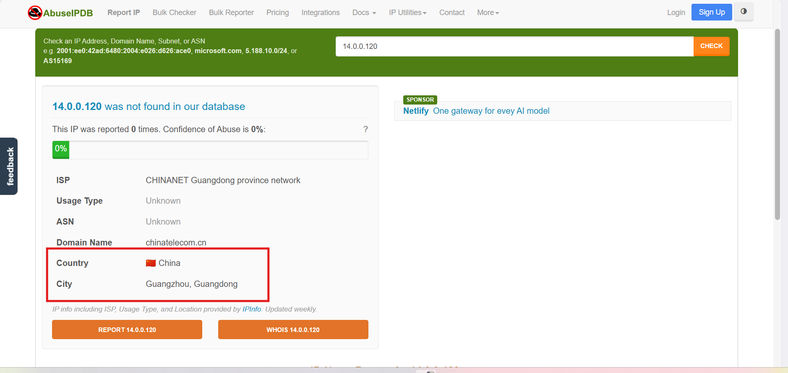
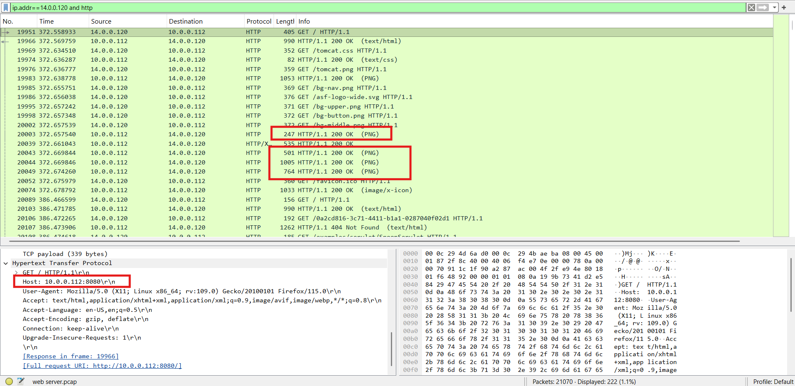
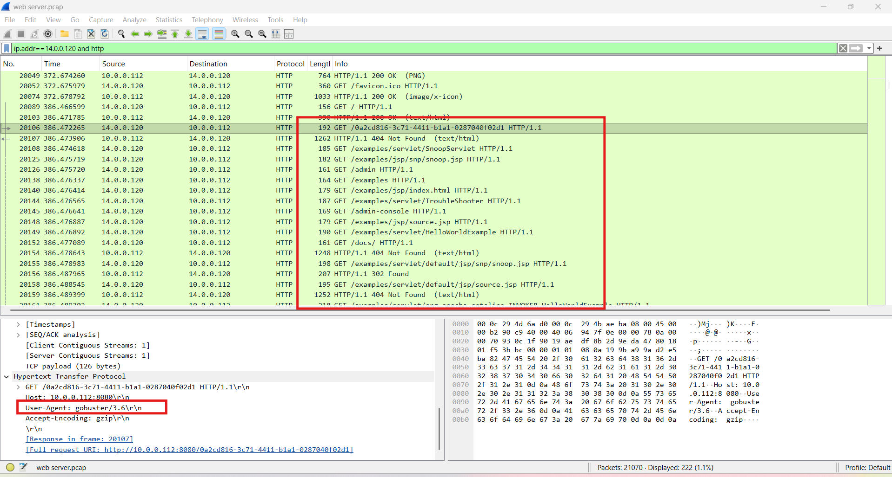
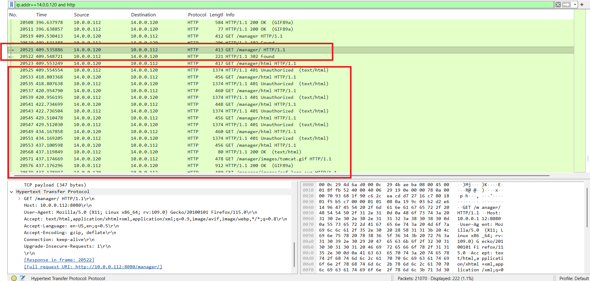
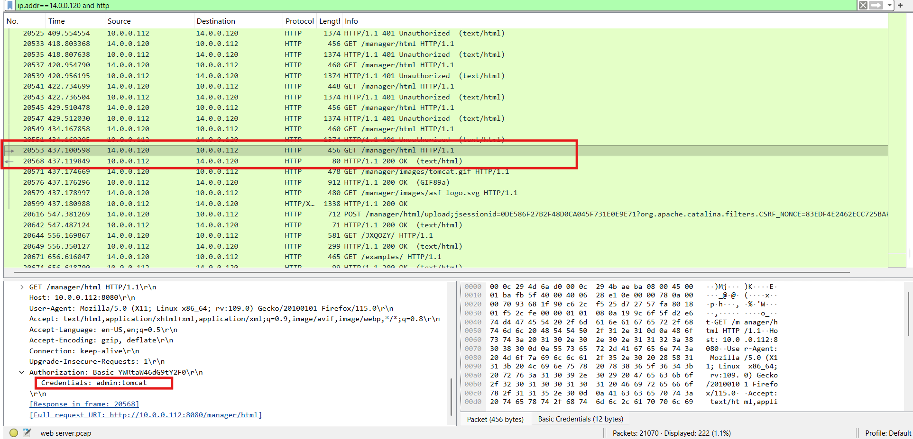
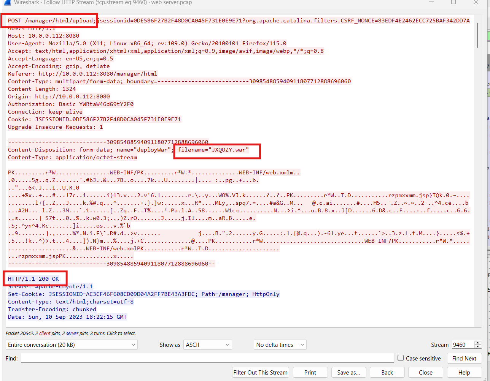
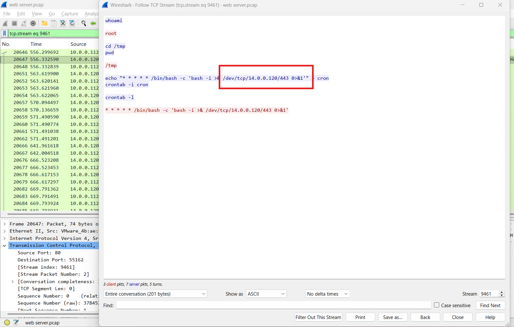

# CyberDefenders Lab: Tomcat Takeover Writeup

**Category:** Network Forensics | **Difficulty:** Easy | **Tactics:** Reconnaissance, Execution, Persistence, Privilege Escalation, Credential Access, Discovery, Command and Control | **Tools:** Wireshark, NetworkMiner

**Scenario:** The SOC team has identified suspicious activity on a web server within the company's intranet. To better understand the situation, they have captured network traffic for analysis. The PCAP file may contain evidence of malicious activities that led to the compromise of the Apache Tomcat web server. Your task is to analyze the PCAP file to understand the scope of the attack.

---

### Q1: Can you identify the source IP address responsible for initiating these requests on our server?
*   **Cách làm:** 
*   **Thao tác thực hiện:** 
*   **Bằng chứng:**
    
*   **Flag:** ``

---

### Q2: Can you identify the country from which the attacker's activities originated?
*   **Cách làm:** 
*   **Thao tác thực hiện:** 
*   **Bằng chứng:**
    
*   **Flag:** ``

---

### Q3: Which of the open ports provides access to the web server admin panel?
*   **Cách làm:** 
*   **Thao tác thực hiện:** 
*   **Bằng chứng:**
    
*   **Flag:** ``

---

### Q4: Which tools assisted the attacker in the directory/file enumeration process?
*   **Cách làm:** 
*   **Thao tác thực hiện:** 
*   **Bằng chứng:**
    
*   **Flag:** ``

---

### Q5: Which directory related to the admin panel did the attacker uncover?
*   **Cách làm:** 
*   **Thao tác thực hiện:** 
*   **Bằng chứng:**
    
*   **Flag:** ``

---

### Q6: What credentials did the attacker successfully use to brute-force the login?
*   **Cách làm:** 
*   **Thao tác thực hiện:** 
*   **Bằng chứng:**
    
*   **Flag:** ``

---

### Q7: Can you identify the name of the malicious file uploaded to establish a reverse shell?
*   **Cách làm:** 
*   **Thao tác thực hiện:** 
*   **Bằng chứng:**
    
*   **Flag:** ``

---

### Q8: What is the callback destination in `IP:port` format?
*   **Cách làm:** 
*   **Thao tác thực hiện:** 
*   **Bằng chứng:**
    
*   **Flag:** ``
