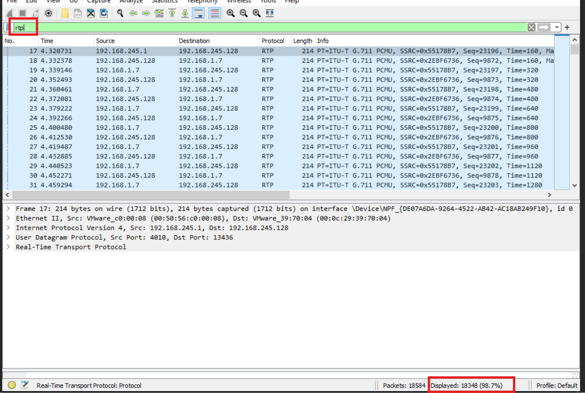
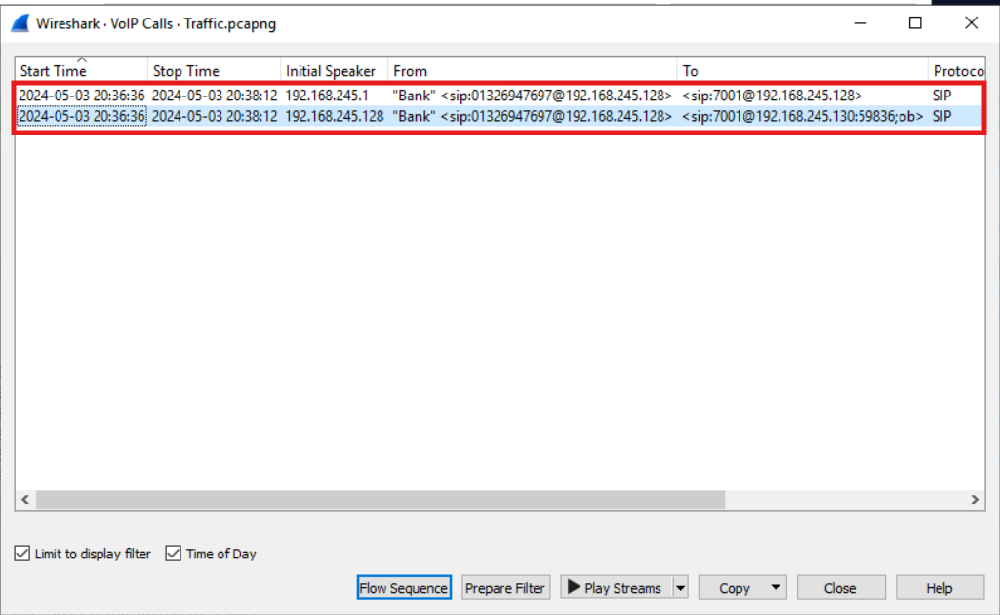
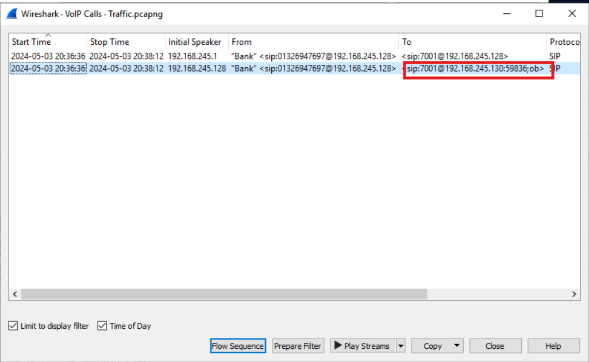
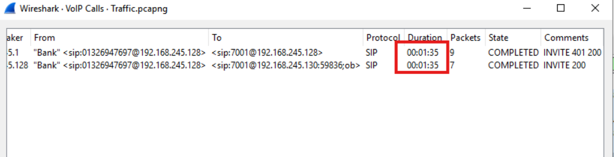
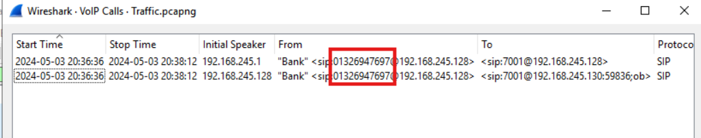
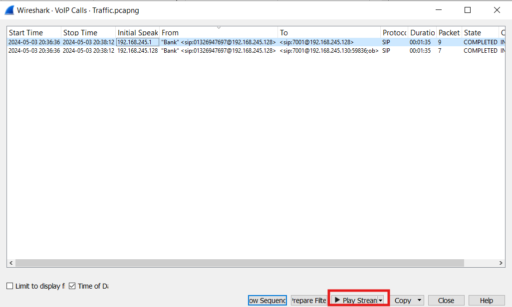
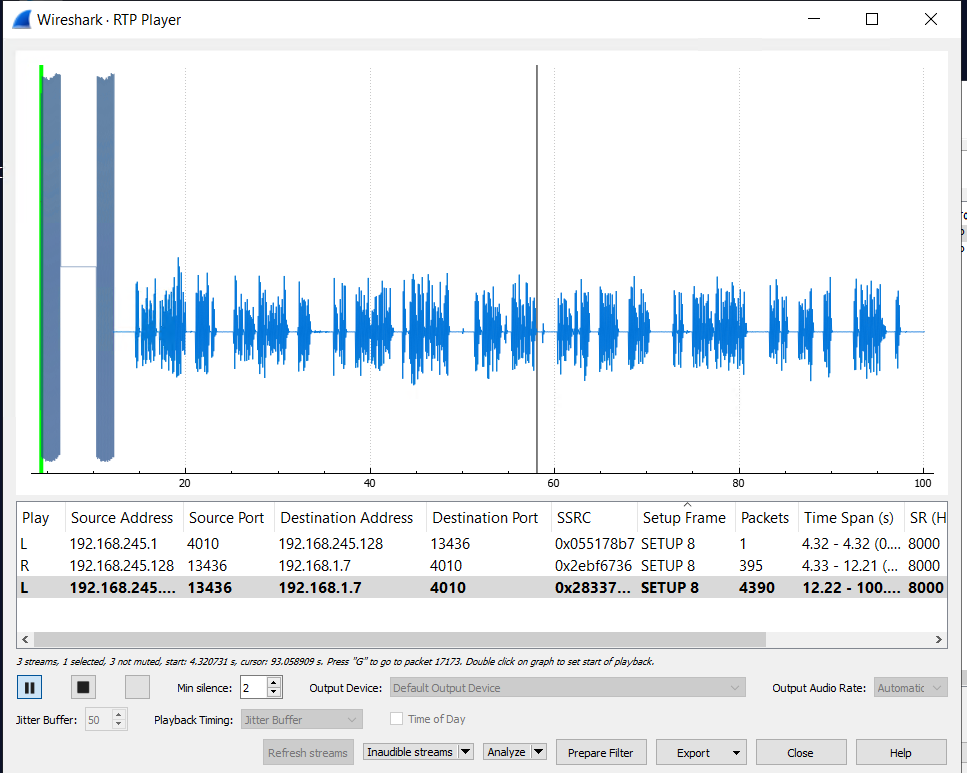

# LetsDefend: VoIP Challenge Writeup

**Category:** Network Forensics (VoIP/Vishing)
**Tool:** Wireshark (Telephony → VoIP Calls / RTP Player)

---

## Scenario

Your close friend James recently received a suspicious phone call from someone claiming to be his bank. The caller asked for sensitive information, making James uneasy. Suspecting a potential Vishing (Voice Phishing) attack, you decide to investigate by capturing and analyzing the VoIP traffic.

**Note:** To listen to the VoIP call, access to the machine via RDP is required.

---

### Q1: How many RTP packets were in the traffic?
*   **Approach:** Apply a display filter for the RTP protocol and count the matching packets.
*   **Steps Taken:**
    *   Applied the filter `rtp` in Wireshark.
    *   The packet list showed a total of **18,348** RTP packets — the audio stream of the call.
*   **Evidence:**
    
*   **Flag:** `18348`

### Q2: When did the fake call with James start?
*   **Approach:** Use Wireshark's Telephony → VoIP Calls feature to reconstruct the call timeline.
*   **Steps Taken:**
    *   Applied the filter `sip`, then opened **Telephony → VoIP Calls**.
    *   Observed the call flow: an initial caller claiming to be "Bank" (IP `192.168.245.1`) placed a call to the PBX (`192.168.245.128`), which then forwarded the call to `192.168.245.130` — the machine believed to belong to James, since the scenario identifies James as the one receiving the suspicious call.
    *   The **Start Time** column showed the call began at **2024-05-03 20:36:36**.
*   **Evidence:**
    
*   **Flag:** `2024-05-03 20:36:36`

### Q3: What is James's phone number?
*   **Approach:** Inspect the second call leg (PBX → James) in the VoIP Calls window.
*   **Steps Taken:**
    *   Examined the forwarded call leg (PBX `192.168.245.128` → `192.168.245.130`).
    *   The **To** field showed extension **7001** as James's destination number.
*   **Evidence:**
    
*   **Flag:** `7001`

### Q4: How long was the call with the bank?
*   **Approach:** Read the Duration column in the VoIP Calls window.
*   **Steps Taken:**
    *   Scrolled the VoIP Calls table to reveal the **Duration** column.
    *   The call lasted **00:01:35** (1 minute 35 seconds), from Start Time 20:36:36 to Stop Time 20:38:12.
*   **Evidence:**
    
*   **Flag:** `00:01:35`

### Q5: What is the phone number of the bank that James received a call from?
*   **Approach:** Read the From field in the VoIP Calls window / SIP header.
*   **Steps Taken:**
    *   The **From** field displayed: `"Bank" <sip:01326947697@192.168.245.128>`.
    *   Extracted the caller's (self-declared) phone number.
*   **Evidence:**
    
*   **Flag:** `01326947697`

### Q6: What is the name of the bank calling?
*   **Approach:** Since the SIP Display Name only showed the generic label "Bank," listen to the actual call audio for the attacker's self-introduction.
*   **Steps Taken:**
    *   Selected the call in **Telephony → VoIP Calls** and clicked **Play Streams** to open the RTP Player.
    *   Played back the reconstructed audio stream and listened to the caller's introduction.
    *   The caller identified themselves as being from **"Bank of Wealth."**
*   **Evidence:**
    
    
*   **Flag:** `Bank of Wealth`

### Q7: What is James's Social Number?
*   **Approach:** Continue listening to the same call audio from Q6 for the sensitive information James disclosed.
*   **Steps Taken:**
    *   While listening to the reconstructed RTP audio stream, identified the Social (Security) Number James read out to the caller: **5678**.
*   **Evidence:** *(same playback session as Q6)*
*   **Flag:** `5678`

---

## Summary

A caller impersonating **"Bank of Wealth"** (self-declared number `01326947697`) placed a vishing call through a PBX system to James (extension `7001`) on **2024-05-03 at 20:36:36**, lasting **1 minute 35 seconds**. During the call — captured in **18,348 RTP packets** — the attacker successfully social-engineered James into disclosing his Social Number (**5678**), demonstrating a classic voice phishing attack reconstructed entirely from VoIP network traffic (SIP signaling + RTP audio).
