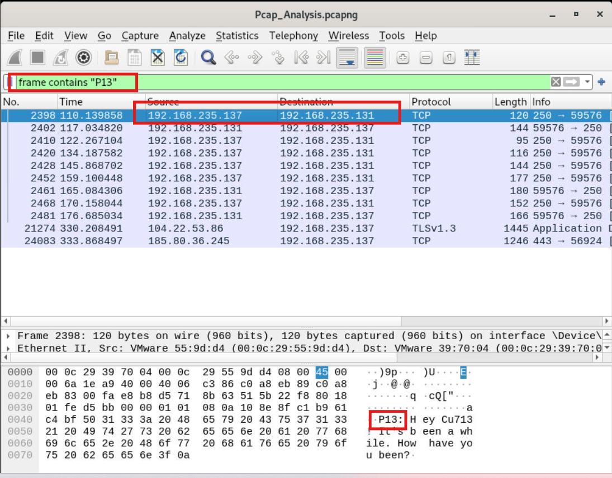
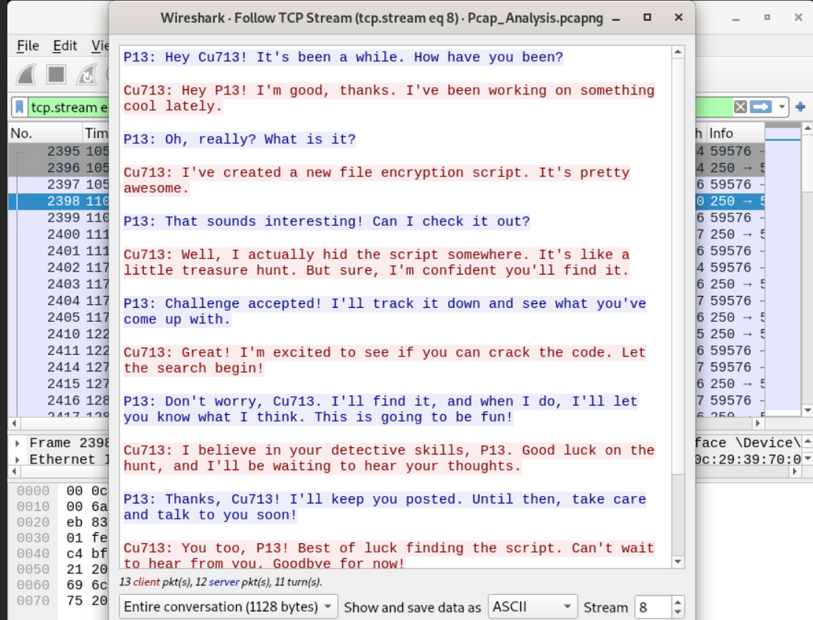
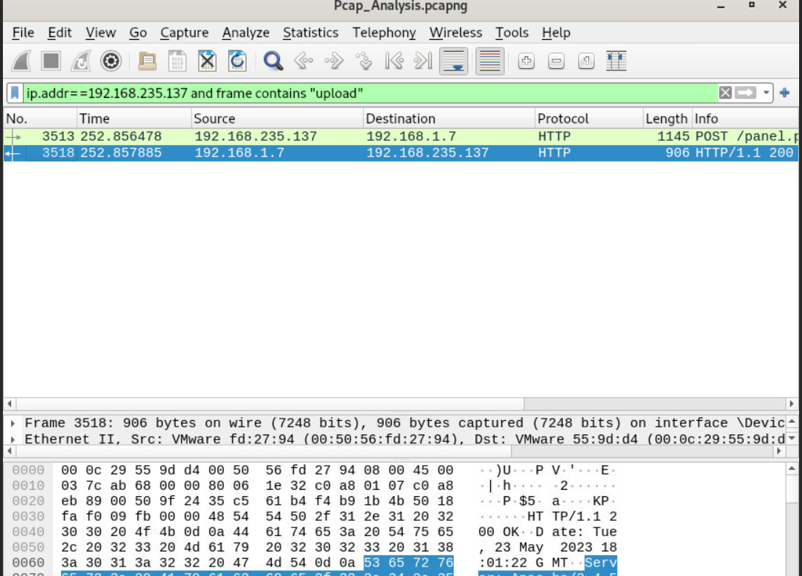
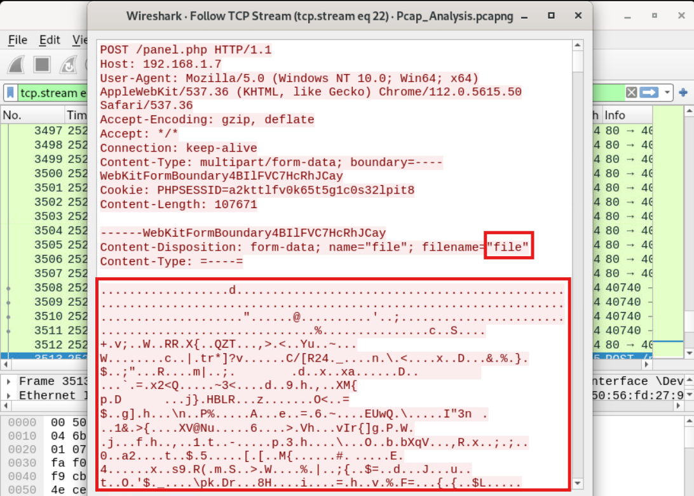
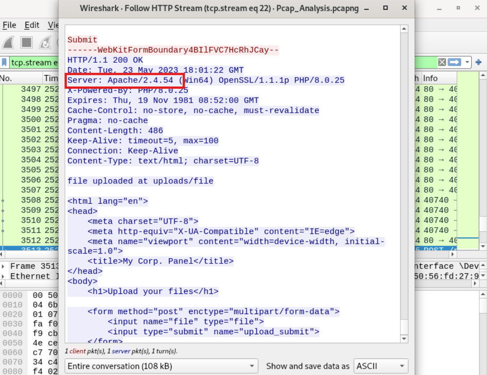
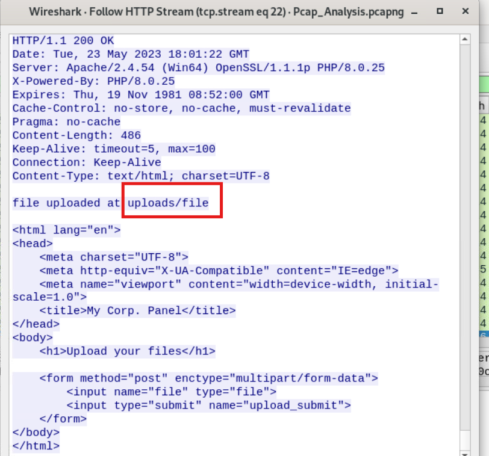
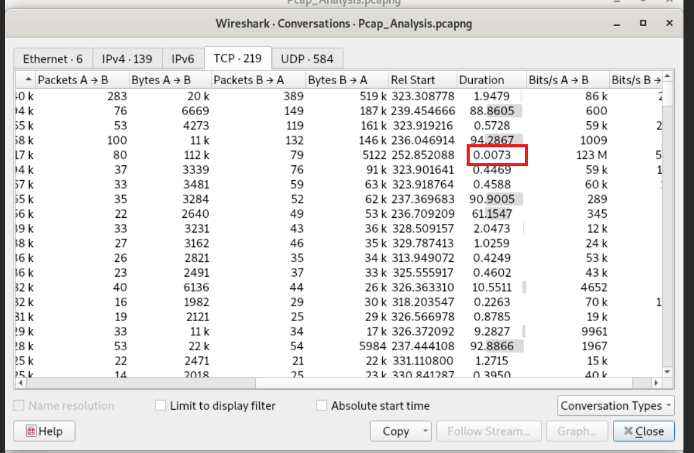

# LetsDefend: PCAP Analysis Writeup

**Category:** Network Forensics / PCAP Analysis
**Lab File:** `/root/Desktop/ChallengeFile/Pcap_Analysis.pcapng`

---

### Q1: In network communication, what are the IP addresses of the sender and receiver?
*   **Approach:** Identify the specific IP addresses by searching for the sender's alias ("P13") within the packet frames.
*   **Steps Taken:**
    *   Applied the display filter `frame contains "P13"` in Wireshark to locate packets associated with the sender.
    *   Followed the TCP Stream of the first matching packet, revealing a plaintext chat conversation between "P13" and "Cu713".
    *   Extracted the Source IP (`192.168.235.137`) for P13 and Destination IP (`192.168.235.131`) from the packet details.
*   **Evidence:**
    
    
*   **Flag:** `192.168.235.137,192.168.235.131`

### Q2: P13 uploaded a file to the web server. What is the IP address of the server?
*   **Approach:** Trace the HTTP upload request originating from P13's known IP address.
*   **Steps Taken:**
    *   Applied the filter `ip.addr==192.168.235.137 and frame contains "upload"` to isolate file transfer activities.
    *   Identified an HTTP POST request sent to the `/panel.php` endpoint.
    *   Extracted the Destination IP (`192.168.1.7`) of this POST request, representing the web server.
*   **Evidence:**
    
*   **Flag:** `192.168.1.7`

### Q3: What is the name of the file that was sent through the network?
*   **Approach:** Inspect the payload of the HTTP POST request to extract the uploaded filename parameter.
*   **Steps Taken:**
    *   Followed the HTTP Stream of the POST packet identified previously.
    *   Examined the `Content-Disposition` header and located the `filename="file"` attribute.
*   **Evidence:**
    
*   **Flag:** `file`

### Q4: What is the name of the web server where the file was uploaded?
*   **Approach:** Analyze the HTTP response headers returned by the web server to identify the underlying server software.
*   **Steps Taken:**
    *   Reviewed the server's HTTP `200 OK` response within the established HTTP Stream.
    *   Located the `Server:` header, which identified the software as `Apache/2.4.54`.
*   **Evidence:**
    
*   **Flag:** `Apache`

### Q5: What directory was the file uploaded to?
*   **Approach:** Check the web server's HTML response body for upload path confirmation messages.
*   **Steps Taken:**
    *   Examined the raw HTML content returned in the server's HTTP response.
    *   Found a confirmation message explicitly stating: `file uploaded at uploads/file`.
*   **Evidence:**
    
*   **Flag:** `uploads`

### Q6: How long did it take the sender to send the encrypted file?
*   **Approach:** Calculate the total duration of the TCP stream responsible for the file transfer session.
*   **Steps Taken:**
    *   Opened the **Statistics -> Conversations** menu in Wireshark and navigated to the **TCP** tab.
    *   Located the relevant conversation flow between P13 (`192.168.235.137`) and the web server (`192.168.1.7`).
    *   Checked the `Duration` column for this stream, indicating an elapsed time of `0.0073` seconds.
*   **Evidence:**
    
*   **Flag:** `0.0073`
